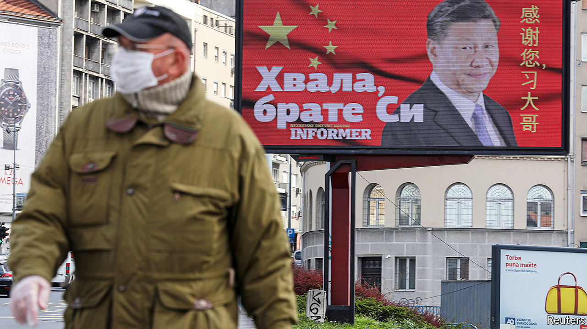
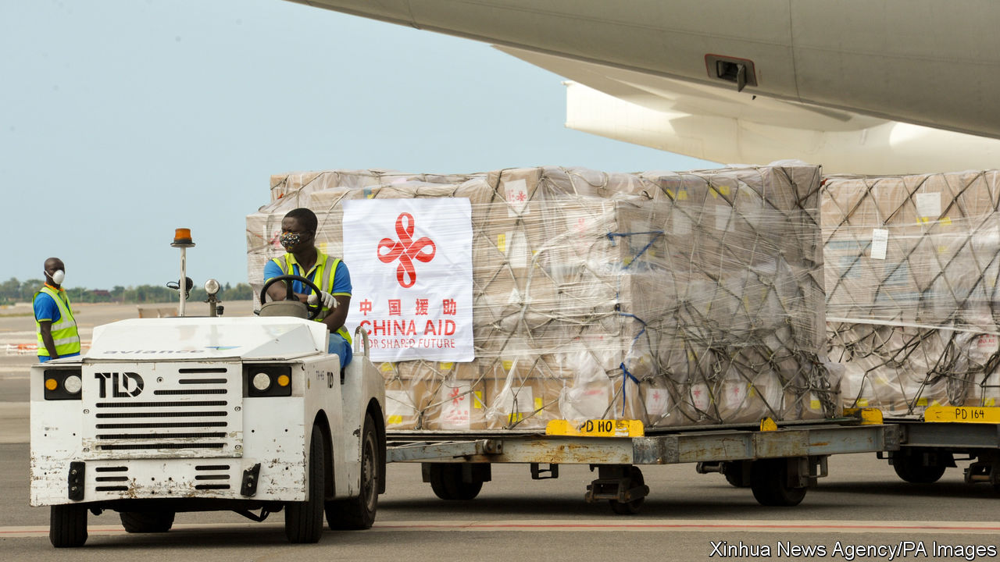
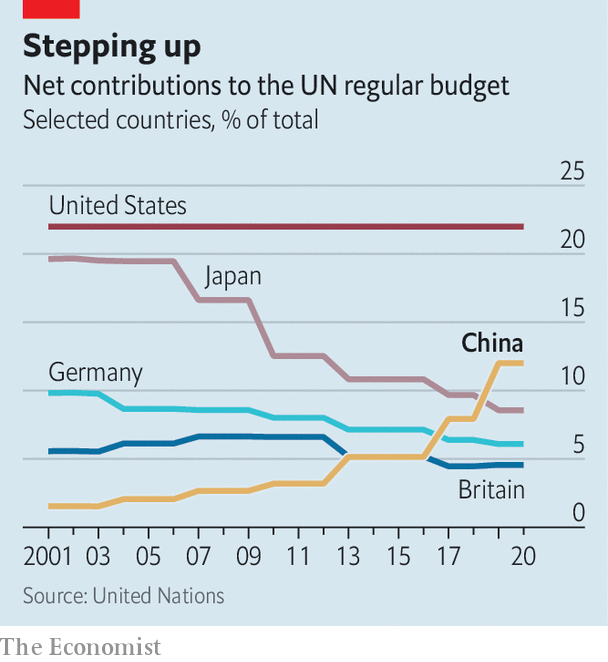
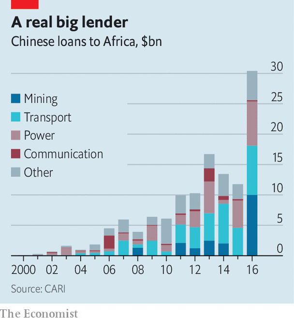

## Thanking big brother

# China’s post-covid propaganda push

> China is handing out medical kit, and making sure the cameras see it

> Apr 16th 2020NEW YORK AND JOHANNESBURG

Editor’s note: The Economist is making some of its most important coverage of the covid-19 pandemic freely available to readers of The Economist Today, our daily newsletter. To receive it, register [here](https://www.economist.com//newslettersignup). For our coronavirus tracker and more coverage, see our [hub](https://www.economist.com//coronavirus)

CHINA CALLS it the biggest emergency-aid operation that it has mounted abroad since 1949, when the Communist Party seized power. Hardly a day goes by without news of Chinese medical supplies, from masks to ventilators, reaching grateful recipients; and of Chinese medical teams flying to foreign countries to help them fight covid-19. Just a few weeks ago China was by far the biggest victim of the new coronavirus, and its government was widely chided for covering up the initial outbreak. Now China is trying to paint a new picture—of itself as a model for taming the disease, and as the world’s saviour.

State media are on hand to trumpet each donation, no matter how small. On March 21st a freight train set off from the eastern Chinese city of Yiwu bound for Madrid, more than 13,000km away. In addition to its cargo of commercial goods were 110,000 masks and nearly 800 protective suits donated by a state-owned firm (they arrived more than two weeks later). The aid was worth less than $50,000. But a state-media website called it a “new turning-point” in the building of a “health silk road”. Among slogans reportedly affixed to the train was one saying: “Come on, matadors!”

It is hardly surprising that China is turning its attention to the plight of other countries. Its covid-related data are of dubious quality, but it has clearly achieved a dramatic reduction in infections at home. Almost all of its newly reported cases involve travellers from abroad. As the world’s biggest producer of much of the medical kit that is most urgently needed globally, and with its own demand for it much reduced, China is well placed to assist. Indeed, in a pandemic, “to help others is also to help oneself”, as a Chinese spokeswoman put it.

China, however, also sees potential political rewards. A big one is enhancing its power abroad. Even before the pandemic China had been jostling with America for global influence. Now it sees America crippled by the coronavirus, and the country’s president, Donald Trump, fumbling in his response to the crisis and unwilling to organise an international effort to fight the disease. At a five-yearly party congress in 2017, President Xi Jinping said his country would become a global leader by mid-century in terms of “international influence”. That goal is evident in China’s descriptions of how the world should evolve in response to covid. In effect, it should have China even more at the centre.

Another political gain that the party may hope to reap is at home. Playing up China’s help for stricken countries, and their desire to learn from China’s success, helps to deflect public criticism of the party’s early response to the disease—its gagging of doctors who shared information about it online and its failure to warn citizens despite evidence of human-to-human transmission. State media insist that China’s battle against covid-19 has shown the “superiority” of Chinese-style socialism, with its “unique” ability to marshal people and resources. Burnishing Mr Xi’s image as a figure of global stature helps to reinforce this message. Any phone call between Mr Xi and a world leader to discuss the crisis makes the headlines of state television’s nightly news, no matter how banal the publicly released content. Mr Xi is the dependable, magnanimous statesman. No prizes for viewers who can guess who, by implication, is not such a politician.

The party’s propaganda about the aid effort is suffused with Mr Xi’s catchphrases. Take the health silk road that the train to Spain symbolically followed. The metaphor was first used by Mr Xi in 2017, when China signed an agreement with the World Health Organisation (WHO) to establish a health-related subset of the Belt and Road Initiative, China’s global infrastructure-building project (to which the WHO was the first UN body to sign up). The belt-and-road idea, and all associated silk-road-branded schemes, are closely linked with Mr Xi. Their content is vague—no clear definition has been offered, for example, of a health silk road. But the intent is clear: to portray China as fundamentally benign. The roads span the globe, but all lead back to China.

In his discussions with world leaders about covid-related aid, Mr Xi likes to use another of his favourite expressions: building a “community with a shared future for mankind”. It sounds harmless enough, but central to this idea is a principle that China holds dear, namely that of respecting other countries regardless of their political systems. Various formulations of this have been used since the days of Mao Zedong (Mao’s favoured term, the “five principles of peaceful coexistence”, remains in use). It means that other countries should swallow any misgivings about the way China is ruled and show it respect.

On March 26th, at an online meeting of G20 leaders, Mr Xi prefaced his offer to share China’s experience of fighting the disease and co-operate in the search for a vaccine by emphasising China’s commitment to “the notion of a community with a shared future for mankind”. The “urgency and importance” of creating such a community had become “even more evident” during the pandemic, he told the president of Kazakhstan, Kassym-Jomart Tokayev, two days earlier.

Some commentators in China say the country’s medical aid could help to strengthen China’s attractive “soft power”, as opposed to the hard kind involving military and economic might. Building such power has been one of the party’s goals since a party congress in 2007. Mr Xi has devoted particular attention to it, beefing up projects such as Confucius Institutes and global broadcasting ventures that aim to convey sanitised news about China to Western audiences, delivered in a disarmingly Western style. During the pandemic, China’s state media as well as the country’s diplomats have been using Twitter and Facebook (which are blocked in China itself) to promote China’s charitable efforts. Experts say that thousands of the Twitter accounts used for this are “sock-puppet” ones set up to spread disinformation.

The propaganda campaign has been helped by America’s virtual absence from the world stage during the pandemic—in part because of Mr Trump’s lack of interest in global leadership, and in part because of the damage caused by covid-19 at home. America has even found itself in the embarrassing position of clawing back aid it was meant to give. In March its Agency for International Development (USAID), which played a crucial role in helping African countries contain Ebola in 2014-16, began cancelling shipments of medical supplies abroad because they were needed in America. And as the Trump administration and American governors and hospitals scour the world for masks, gowns and the like, they are infuriating allies who need the same things. Early this month officials in France and Germany accused America of diverting shipments of medical masks that had been intended for use in their countries. Officials in Washington have denied the reports, but they reinforce the view, held in much of the world, that America is looking out only for itself. Mr Trump’s decision on April 14th to suspend his country’s payments to the WHO because of its handling of the pandemic will strengthen this belief, even though many Western officials sympathise with his view that the WHO failed to challenge China’s early claims about the low risk of transmission among humans (see [article](https://www.economist.com//science-and-technology/2020/04/16/the-world-health-organisation-is-under-fire-from-americas-president)).

However, winning hearts and minds is not proving easy for China, either. It does not help that, for all its propaganda about Chinese generosity, the value of China’s donations is far eclipsed by that of its sales of medical kit (occasionally of low quality, buyers allege) on commercial terms. Between March 1st and April 4th China exported $1.45bn of medical supplies globally. Most of the sales to the rich world have been at market prices. By the time the train arrived in Madrid, Spain had already bought similar equipment from Chinese suppliers worth about 10,000 times as much as the stuff sent by rail.

It may be that China has not worked out an aid strategy, with a clear sense of which countries to target as a priority and how much should be given away free. Indeed, it has been happy to let companies, both state-owned and private, do much of the work. Some of the country’s largest firms have taken up the challenge, but they are relative newcomers to philanthropy. They also have commercial interests at stake in many of the recipient countries.

Jack Ma, the billionaire co-founder of Alibaba, an e-commerce giant, has been at the forefront. Along with Alibaba’s charitable foundation, he has sent planeloads of ventilators, protective kit and covid-19 tests for distribution to all 54 African countries. Huawei, a telecoms firm treated by America as a threat to its security, has already delivered a large share of its pledge of 500,000 masks, 50,000 goggles, 30,000 gowns and 120,000 gloves to hospitals in New York. The company has also donated millions of masks to countries that are pondering whether to allow Huawei into their 5G networks, including Canada and the Netherlands.

In parts of Europe, China’s aid may have won admirers. A large billboard thanking “big brother Xi”, paid for by a pro-government Serbian tabloid, appeared in Serbia’s capital, Belgrade (see picture above,). Lucrezia Poggetti of MERICS, a think-tank in Berlin, says public discontent with the EU and distrust of Mr Trump’s America has worked in China’s favour. This month a poll commissioned by an Italian television station asked people which country they would prefer as an ally outside Europe. Of 800 respondents, 36% favoured China and only 30% chose America.

But to many in the West, China’s propaganda drive sounds cynical, exploitive and forgetful of the aid that the West gave China at its time of need. In early February America and Europe sent 30 tons of medical supplies (much of it privately donated). President Emmanuel Macron of France complained that people talk of Chinese and Russian aid to Europe. “But no one talks about France and Germany delivering 2m masks and tens of thousands of medical gowns to Italy,” he said. The EU’s foreign-policy chief, Josep Borrell, warned about the “politics of generosity”.

In poor countries, China’s charity may prove more effective. In Africa the shipments are urgently needed—a point that China’s extensive media network on the continent is keen to highlight (news outlets across Africa use stories from Xinhua, China’s state news agency). But America is still a far bigger donor on the continent and to the UN. Last year China gave $368m to the UN’s general budget, 55% of America’s contribution (see chart).

China’s image has taken a severe hit in Africa as a result of the recent evictions of some Africans from their residences in the southern Chinese city of Guangzhou after reports that a few of them had been infected by covid-19. Images of Africans forced to sleep on the streets have been widely shared by social media in their native countries. The Daily Nation, a Kenyan newspaper, accused China of “betrayal”. Several Chinese envoys in Africa have been summoned for dressings-down by host governments. China says it will gradually lift health-related restrictions on Africans in Guangzhou, and denies discrimination.

Among developing countries, China is as likely, if not more so, to win support by providing economic help as it is by giving medical aid. In Africa, China is the largest bilateral creditor, having lent more than $140bn since 2000 (see chart). On April 6th Ken Ofori-Atta, Ghana’s finance minister, said China should “come on stronger” by restructuring or writing off some loans, which he said would require $8bn to service this year. The World Bank and the IMF have proposed that creditors co-ordinate to provide debt relief.

On April 15th the G20, which includes China, agreed to allow developing countries to suspend debt payments to its members for the rest of the year. But when it comes to restructuring loans, China may prefer to go it alone rather than work closely with other lenders. In recent years it has been willing to change the terms of its debts, for instance last year those owed by the Republic of Congo. But it likes to act quietly, case-by-case. That way it can maintain the political leverage that its lending provides. Last year China reportedly cancelled $78m owed by Cameroon. A month later Cameroon withdrew its candidate (and the African Union’s choice) for director-general of the Food and Agriculture Organisation, a UN body, clearing the way for China’s candidate to get the job. Some Western critics called this a quid pro quo.

During the pandemic, China has shown readiness to shake its fists as well as woo countries with kindness. Its deployment of “sharp power”, as some call it, has been evident in its response to suggestions that China may have exacerbated the pandemic with its early cover-up. Chinese embassies in several countries have sputtered with outrage when prominent personalities, from the son of Brazil’s president, Jair Bolsonaro, to Mario Vargas Llosa, a Peruvian author, have aired such a heretical thought. China’s embassy in Lima accused Mr Vargas Llosa of making “absurd and baseless criticisms” of China in a column blaming the initial cover-up on China’s dictatorial system. Some Chinese diplomats have even reacted with fury when people point out that the virus originated in China.

Chinese leaders do not offer a clear blueprint for shaping the global order. But back in 2017 Mr Xi gave a hint of China’s long game when he proclaimed that it had taken “a driving seat” in international affairs and would be “moving closer to centre stage and making greater contributions to mankind”. This does not appear to involve converting countries to Chinese-style socialism. China’s aims are often self-defensive, to protect itself from criticism and challenges to its territorial claims. (When Bruce Aylward, an adviser to the WHO, pretended not to hear a reporter’s question about Taiwan, China’s media were delighted.) However, China does try to persuade others to adopt its peculiar view of human rights. It discounts individual freedoms, gives priority to economic development and thinks governments should police the internet as they wish.

Whether China will be able to take advantage of the pandemic to strengthen its global power will depend not least on the politics and economies of China and America post-covid. By stoking its economic growth following the global financial crisis of 2007-09, China gained much clout while the West slumped. It may not be able to replicate that effect this time: another massive dose of stimulus could cripple the country with debt. China is wary of repeating the tactic (see [article](https://www.economist.com//finance-and-economics/2020/04/16/why-has-chinas-stimulus-been-so-stingy)).

As the world emerges from the crisis, the West’s attention is likely to become more focused on China’s early handling of the outbreak, the reliability of its covid-related data and on Western vulnerability to China’s control of vital supply-chains, not least in medical industries. Such issues could fuel anxieties about China’s global influence and make it harder for China to shape the world to its liking. Should he win America’s presidential election in November, Joe Biden may reassert a liberal vision of the world order, including support for multilateral institutions and regional alliances that have been disparaged and neglected by Mr Trump. And China may stumble. Another wave of infections could undermine the party’s claims to superior handling of the disease. Soaring unemployment could exacerbate social tensions at home and deter China’s leaders from engaging in a triumphalist march abroad.

For now, as America flounders, China appears a diffident leader at best. Its hesitancy was on display at the UN last month, when it was China’s turn to act as president of the Security Council. Throughout the month, it did not convene a single session about the pandemic. (On April 9th the council did hold one, but China insisted that the meeting, held by video-conference, be closed to the public.) Envoys to the UN say China did not want to give America a chance to assign blame for the pandemic. “It’s irresponsible,” says a Security Council diplomat. Instead two diehard rivals refuse to lead. One is in retreat; the other is uncertain whether it really wants to take on global responsibility. The world suffers. ■

Dig deeper:For our latest coverage of the covid-19 pandemic, register for The Economist Today, our daily [newsletter](https://www.economist.com//newslettersignup), or visit our [coronavirus tracker and story hub](https://www.economist.com//coronavirus)

## URL

https://www.economist.com/china/2020/04/16/chinas-post-covid-propaganda-push
