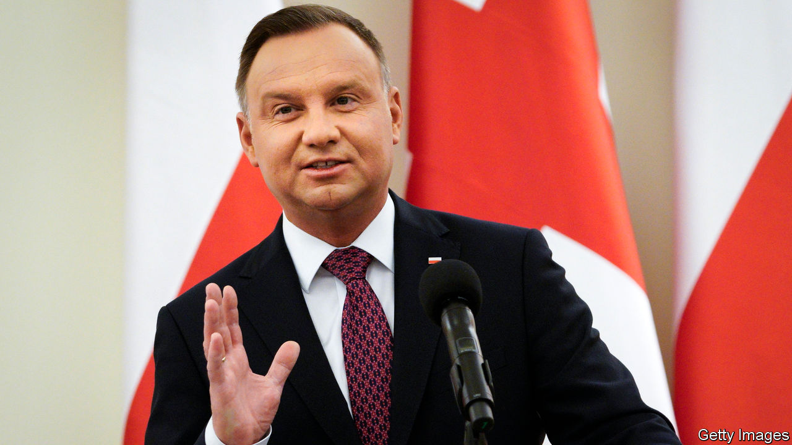

## Epidemocracy

# A postal vote in Poland could entrench populists

> Thanks to covid-19, the opposition can barely campaign

> Apr 16th 2020WARSAW

ALMOST UNNOTICED amid the covid-19 crisis, last week the European Court of Justice (ECJ) took a modest step towards stopping a European Union member from sliding into autocracy. Ever since it won power in 2015, Poland’s populist Law and Justice party (PiS) has been trying to get control of the country’s courts, while independent judges appeal to the EU to block it. On April 9th the ECJ ordered Poland to suspend immediately the disciplinary chamber of its Supreme Court, a body that can punish judges, and to freeze a new law restricting judicial independence. The European court said these violated EU treaties guaranteeing the rule of law.

The government is not giving up. A judge linked to PiS has challenged the order in Poland’s constitutional court, which is currently dominated by government-friendly judges. But that court has no authority in the case: the ECJ is the final arbiter of EU law. Its orders “cannot be questioned on the basis of national constitutions, national law or rulings of national courts”, says a European Commission spokesman. If Poland sets aside the verdict, it will be defying the court, the commission and the structure of the EU.

It is shaping up to be a fateful spring for Polish democracy. As in many European countries, a national lockdown has been in effect since mid-March to prevent the spread of covid-19. But Poland is scheduled to hold a presidential election on May 10th. In some countries opposition parties worry that an election might be suspended; in Poland, they are angry it is going ahead.

Andrzej Duda, the PiS-backed incumbent, faces five main challengers, ranging from the centre-left to the far right. His chief rival is Malgorzata Kidawa-Blonska of the centrist Civic Platform party. Polls put Mr Duda far in the lead, but perhaps short of the 50%-plus needed to win in the first round. The opposition charges that the lockdown’s ban on public events makes it impossible for them to campaign.

That suits Jaroslaw Kaczynski, PiS’s leader, just fine. He wants to hold the election before disenchantment with the crisis can hurt the government’s approval rating. Bills restricting abortion and sex education are moving ahead too, now that the demonstrations that stopped them in 2018 are barred. The government almost split over the public-health risk of staging the election: the leader of Porozumienie, a junior coalition party, called for it to be postponed. Ignored, he resigned on April 6th, but his party stayed in the coalition.

Later that day, PiS passed a bill to shift the entire election to postal voting. Postal unions warn that this is impossible: they would have to handle 30m voting packages, up from 43,000 in the previous presidential election in 2015. They are also leery of the infection risk such a huge operation would pose to their workers. One group is calling for a postal strike on election day if the government goes through with it. A poll last week showed 78% of the public want the voting postponed.

If the election goes ahead, low turnout and voting mishaps are expected. Another problem stems from PiS’s changes to the courts. Besides the disciplinary chamber that the ECJ ordered to be suspended, the government established a chamber of “extraordinary control” whose duties include certifying elections. Critics charge that it, too, is invalid under EU law, rendering the election illegitimate.

Poland’s government may evade these conflicts. The independent-minded president of the Supreme Court, long a thorn in PiS’s side, finishes her term at the end of April, and Mr Duda can appoint a more sympathetic one. That could smooth any trouble over the election. As for the EU, its tools are limited. The ECJ can impose fines if Poland defies its order. Other states could make it clear that Poland will fare less well in the apportionment of pandemic recovery aid and the EU’s multi-year budget. With covid-19 on its mind, Poland may have less appetite for fights over the rule of law. Then again, so may the EU. ■

## URL

https://www.economist.com/europe/2020/04/16/a-postal-vote-in-poland-could-entrench-populists
