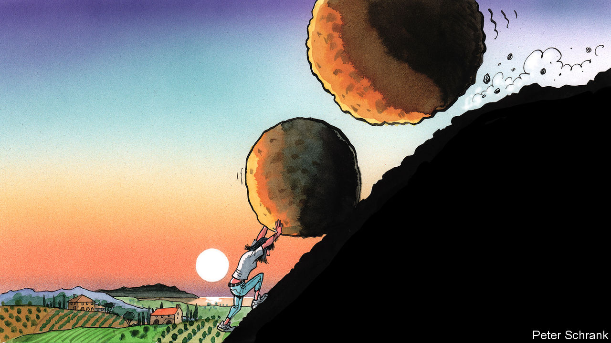

## Charlemagne

# Southern Europe’s millennials suffer two huge crises by their mid-30s

> Will their pain turn them radical?

> Apr 16th 2020

Editor’s note: The Economist is making some of its most important coverage of the covid-19 pandemic freely available to readers of The Economist Today, our daily newsletter. To receive it, register [here](https://www.economist.com//newslettersignup). For our coronavirus tracker and more coverage, see our [hub](https://www.economist.com//coronavirus)

THE YEAR 1985 should have been a good one to be born in Europe. Elisa Zugno, now a 35-year-old copywriter who lives in Milan, was able to benefit from the tailwinds of the 1990s and early 2000s. Economies ticked along and higher education opened up. Various forms of discrimination were outlawed. History had ended. Life was good.

Then in 2008, just as Ms Zugno was graduating from university, history juddered into action again with the financial crisis. The first few years of her career were familiar to any well-educated millennial in southern Europe. Rather than a share of the spoils given to globalisation’s supposed winners—degree-toting multilinguists—Ms Zugno and her ilk were greeted with a mix of unpaid internships and low-paid work.

Instead of a recovery, the financial crisis morphed into the euro-zone crisis, with renewed pain for Europe’s youngsters. Unemployment shot up. Four out of every ten young Italians did not have a job in the middle of the last decade, while half of young workers in Spain were in the same boat. (In contrast, even at the peak of the crisis, only 11% of young Germans were unemployed.) The result: Ms Zugno was 31 before she landed the first permanent contract of her working life. A few years on, after belatedly finding its feet, Ms Zugno’s generation now finds itself pushed to the floor once more, with the second major economic crisis of their short adult lives surrounding them.

In the aftermath of the financial crisis, analysts were quick to split the world into the winners and losers of globalisation. On the one side were those furnished with education, open horizons and language skills, who were supposed to thrive in the new order. On the other were those with no such luck, stuck in careers set to be overtaken by innovation. A third category containing southern Europe’s young must be added: globalisation’s pyrrhic victors. These people fulfilled the requirements of the winners’ club, armed with both the mindset and means—even possessing a passport from the EU, the institution that most embodies 21st-century globalisation. Yet thanks to repeated economic shocks, they have singularly failed to reap the expected benefits.

All generations suffer during a crisis. But the consequences last longer for the young. Economic misery has a tendency to compound. Low wages now beget low wages later, and meagre pensions after that. The prospect of middle-aged drudgery beckons. For older generations, a recession is an unfortunate pot-hole, which most will drive over without even blowing a tyre. But for southern Europe’s younger people, it is an enormous sinkhole from which it will be hard to clamber out. Youth unemployment in Spain and Italy is below its peak, but still stood at about 30% even before covid-19 arrived in Europe. This time, for many, the crisis begins in a far worse place than it did last time.

Coming of age in a crisis has longer-term political consequences. People’s values tend to crystallise in their mid-20s, points out Christian Welzel of Leuphana University of Lüneburg in Germany. When basic needs are taken care of by a growing economy, voters can focus on “post-material” issues—the scholarly jargon for topics like equality, environmentalism and freedom of expression. Young people are supposed to be the vanguard of this shift away from economic concerns towards intangible ones. Values change over generations, typically becoming dominant because generations rise and fall, rather than because people change their minds en masse. Liberal attitudes towards, say, gay rights stick with people throughout their lives.

Instead, millennials in southern Europe have found themselves unceremoniously shoved down the order of priorities. In such circumstances, the economic basics trump more complex issues when it comes to politics; those in northern Europe can still afford to care about other topics. This split is starting to show up electorally. Europe’s Green parties enjoyed their best-ever performance in the 2019 European Parliament elections, nearly doubling their number of MEPs as young voters from across northern Europe flocked to them. Spain, Italy and Greece—about a quarter of the EU’s population—boast a grand total of one Green MEP.

After two big crises at a formative period of their lives, a politicised and traumatised generation will need to be catered for. Emigration was an option for southern Europe’s discontented young last time round; this time all of the EU’s economies are tanking simultaneously, while Britain—a popular destination in the previous crisis—is intent on reducing immigration. There is no ripcord that Europe’s afflicted young can easily pull. Apathy is another potential path. “I would say 80% are just complaining and getting depressed and 20% at least are trying to gather energy,” says Ms Zugno of her peers.

But the anger built up during the previous crisis has not receded. About two-thirds of Spaniards declare themselves dissatisfied with democracy in their country. This provides fertile ground for populist parties, points out Ignacio Jurado, an academic at University Carlos III of Madrid: “People are more interested in politics, but they expect less. They trust less in government. They are more dissatisfied.” In Spain, the result has been straightforward. New parties such as Vox on the right and Podemos on the radical left have flourished, with younger voters in particular constituting their core support. In Italy, just under half of all voters aged between 25 and 34 opted for the Northern League, a hard-right anti-immigration party, or the Five Star Movement, a more leftist populist group, at last year’s European elections. Europe’s mainstream parties will find it hard to win them back. A resurgence of a left-right split on economics could help these established parties. But many voters will feel that the social contract has been so badly breached that they would rather rip it up altogether. ■

Dig deeper:For our latest coverage of the covid-19 pandemic, register for The Economist Today, our daily [newsletter](https://www.economist.com//newslettersignup), or visit our [coronavirus tracker and story hub](https://www.economist.com//coronavirus)