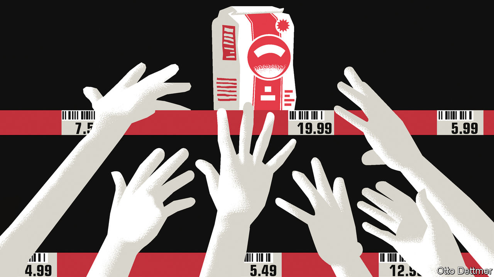

## Free exchange

# Covid-19 could lead to the return of inflation—eventually

> Once the virus is truly beaten, the crisis could weaken structural forces weighing on demand

> Apr 18th 2020

Editor’s note: The Economist is making some of its most important coverage of the covid-19 pandemic freely available to readers of The Economist Today, our daily newsletter. To receive it, register [here](https://www.economist.com//newslettersignup). For our coronavirus tracker and more coverage, see our [hub](https://www.economist.com//coronavirus)

INFLATION IN THE rich world resembles a fairy-tale beast. Older members of society frighten younger ones with stories of the creature’s foul deeds, but few serious people expect to see one and some doubt it ever existed. Although high inflation seemed a fixture of the economic landscape in the 1970s, changes to policy and the structure of the global economy since have ushered in four decades of ever meeker growth in prices. As covid-19 shutters businesses and leaves supermarket shelves bare, some economists fret that the pandemic could lead to inflation making an unwelcome return. Though the future is shrouded in more uncertainty than ever, inflation seems unlikely to rear its head—until, perhaps, the world’s struggle with covid-19 nears its end.

Worries about soaring prices start with the observation that virus-fighting measures choke off production. Crudely put, inflation is the result of too much money chasing too few goods. At present the amount of goods and services available for purchase is tumbling. Many service industries are shut down. The virus is playing havoc with the supply of some products. On April 12th Smithfield Foods, a meat-processing firm, said it would close a plant producing nearly 5% of American pork, after more than 200 workers fell ill; it has since shut down others. Workers involved in the logistics operations for e-commerce platforms, such as Amazon and Instacart, have gone on strike to demand higher pay and safer working conditions. If supply interruptions translate into shortages in shops, then higher prices could follow.

Massive stimulus programmes are another potential source of inflation. Governments around the world are borrowing heavily to finance schemes that support firms and workers. Central banks are flooding economies with newly created money. Over the past month the balance-sheet of the European Central Bank has grown by €550bn ($600bn), or nearly 12%, and that of the Federal Reserve by nearly $2trn, more than 40%. Printing money during the global financial crisis did not spark rapid inflation. Yet its coincidence with a collapse in supply might lead you to expect rocketing prices.

The prices of some goods and services might indeed rise sharply while economies are locked down. Those for some medical equipment in America, for instance, have reportedly risen as state governments compete for scarce supply. But the broad, sustained increases in price levels associated with accelerating inflation are unlikely to materialise in the short run, because lockdowns both interrupt supply and undercut workers’ ability to earn and spend. Closing a restaurant limits food-service supply, but it also means that sacked waiters and kitchen staff have no income. And in some circumstances the drop in demand induced by a supply shock may be larger than the decline in supply—a source of deflationary, rather than inflationary, pressure.

This idea is explored in a new working paper by Veronica Guerrieri of the University of Chicago, Guido Lorenzoni of Northwestern University, Ludwig Straub of Harvard University and Iván Werning of the Massachusetts Institute of Technology. If some sectors of the economy shut down entirely, affected workers will curtail their spending dramatically. Spending by other workers could make up for the shortfall—only if the goods and services that can still be produced are substitutes for those that cannot. The abrupt drop in consumers’ spending on plane tickets or hotel bookings is unlikely to be offset by more purchases of teleworking software instead, for instance. In the absence of good substitutes, say the authors, the economy experiences a “Keynesian supply shock”, where demand falls by more than supply. They provide another useful way to think about this state of the world: that consumption will be much more valuable in the future, as goods and services that cannot be had today become available once more. So it makes sense to spend less now, and more later.

Available figures suggest that fewer goods are indeed being chased by even less spending. In March annual consumer-price inflation slowed in both America and the euro area, compared with rates in February. Much of that reflected tumbling energy costs; but core inflation—which strips out food and energy prices—also decelerated. Financial-market measures of inflation expectations suggest the drop is not a one-off. Expectations for average annual inflation in America over the next decade, as calculated by the Federal Reserve Bank of Cleveland, sank from 1.7% in January to 1.2% in April.

Those expectations could shift as economies reopen. Rehired workers could spend a high share of their incomes; demand from earners whose incomes were unaffected by shutdowns could overwhelm slowly recovering supply. Disinflationary pressures will remain, though. Across rich economies, services account for half or more of the consumption baskets used to calculate consumer-price inflation. For as long as fears of viral contagion linger, many businesses could struggle to attract new custom—and so be forced to offer steep discounts. Technologies adopted during lockdowns could allow companies to serve more customers without hiring many more workers, thus adding more to supply than to demand.

Inflationary effects are most likely to appear once the virus is truly beaten. The crisis could weaken structural forces weighing on demand. Take inequality, for instance, which concentrates income in the hands of the thrifty rich. More generous post-pandemic safety-nets, or progressive taxes enacted to pay down large government debts, could redirect income towards freer spenders, creating inflationary pressure. So could a change in policymaking attitudes. The economic traumas of the early 21st century may push governments and central banks to prefer high economic growth and low unemployment to low and stable inflation, as happened after the second world war. Inflation is not certain to return after covid-19. But its re-emergence seems less fantastic a possibility. ■

Dig deeper:For our latest coverage of the covid-19 pandemic, register for The Economist Today, our daily [newsletter](https://www.economist.com//newslettersignup), or visit our [coronavirus tracker and story hub](https://www.economist.com//coronavirus)