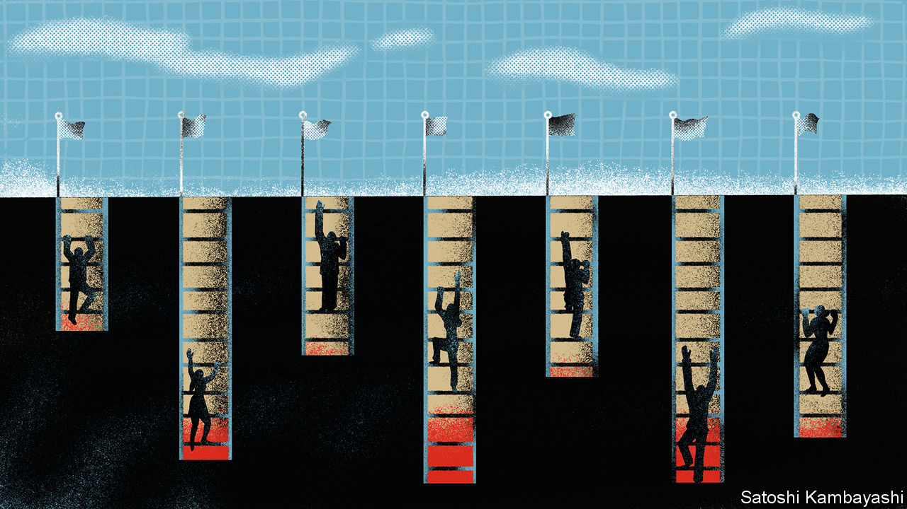
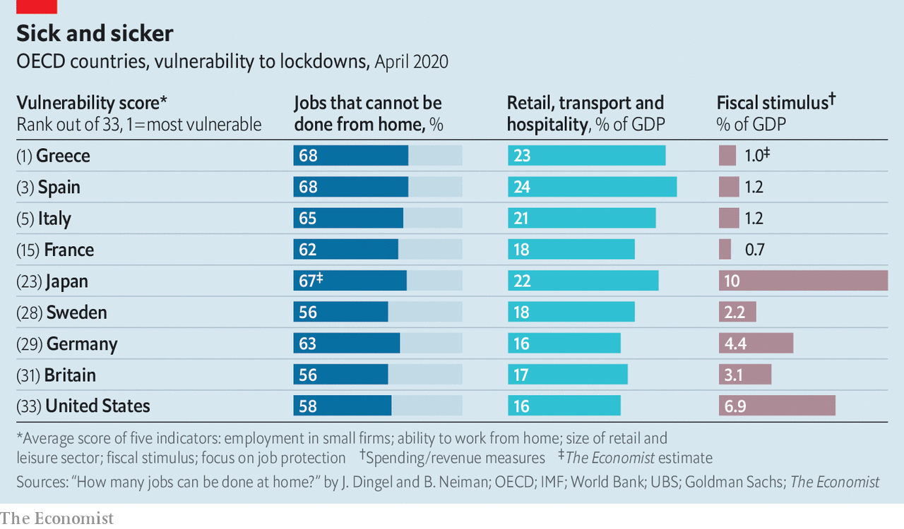

## Picking off the weak

# How deep will downturns in rich countries be?

> Those in central and southern Europe seem most vulnerable

> Apr 16th 2020

Editor’s note: The Economist is making some of its most important coverage of the covid-19 pandemic freely available to readers of The Economist Today, our daily newsletter. To receive it, register [here](https://www.economist.com//newslettersignup). For our coronavirus tracker and more coverage, see our [hub](https://www.economist.com//coronavirus)

AS THE VIRUS upends productive activity across the world, the question now is how bad things will get. On April 14th the IMF warned that the global recession would be the deepest for the best part of a century. But the severity of the pandemic and the uncertainty around the duration of lockdowns are such that economists’ models, trained on business cycles in the post-war era, are of little use. Some companies, such as Starbucks and Dell, have pulled their guidance on annual earnings, declining even to hazard a guess about the future. Amid the fog, however, one thing seems certain: some economies will suffer much more than others.

Economic crises expose and exacerbate structural weaknesses. Analysis by The Economist of five decades of GDP data finds that growth rates in rich countries tend to converge during expansions, as even the weakest economies are pulled along. Yet during downturns performance diverges markedly. In the first half of the 2000s the average annual gap between the GDP growth rates of the best- and worst-performing rich countries was five percentage points. In 2008-12, in the recession that followed the global financial crisis, the gap widened to ten points.

This recession will be no different. Three factors should help separate the bad economic outcomes from the dire ones: a country’s industrial structure; the composition of its corporate sector; and the effectiveness of its fiscal stimulus. The Economist has used indicators of these to rank, roughly, the exposure of 33 rich countries to the downturn. Some, such as those in southern Europe, appear far more vulnerable than America and northern European countries (see chart).

Take industrial structure first. Lockdowns will slam countries that depend on labour-intensive activities. Those with large construction sectors, such as many central European countries, look vulnerable. So do those that rely on tourism—it accounts for one in eight non-financial jobs in southern Europe. Conversely, those with large mining industries, which require less labour, may do better. Here Canada looks relatively insulated.

Industrial structure also influences the share of people who can work from home, and thus dodge the worst disruption of the lockdowns. In a paper published on April 10th Jonathan Dingel and Brent Neiman of the University of Chicago estimate that fully 45% of jobs in Switzerland could plausibly be done from home. Many Swiss work in industries, such as finance, where all they really need to do their job is a laptop. Others elsewhere do not have this luxury. Less than a third of jobs in Slovakia, a big manufacturing hub, can be performed remotely; home working is also difficult in southern Europe. Research by Indeed, a job-search website, and Ireland’s central bank finds that since the pandemic began, countries where home working is less prevalent have seen bigger falls in the number of online job advertisements.

The shape of the corporate sector is the second consideration. Economies with a large share of small firms are more likely to be scarred by long shutdowns. Minnows tend to have few if any cash buffers, making it hard for them to survive a drought in revenues. A survey by researchers at the University of Chicago, Harvard University and the University of Illinois finds that a quarter of small firms in America do not have enough cash on hand to last even a month. Nearly half of Italians and Australians work for firms with fewer than ten employees, compared with a fifth in Britain and an even lower share in America.

A third determinant of the economic pain to come is the nature of fiscal support. Rich countries have deployed stimulus on an unprecedented scale. Even by the most conservative estimate, these packages are more than twice as large as in 2008-09. But the size of the stimulus varies widely across countries. Most tallies find that support in America and Japan is the most generous, as a share of GDP; investors, who see their assets as a haven, are happy to provide the necessary funding. Yet some euro-area governments with high debt levels are more cautious, perhaps constrained by the fear that, as members of a currency union, they enjoy only a partial backstop from the central bank. The average fiscal boost in France, Spain and Italy, as a share of GDP, is about half of that provided in Germany.

The design of the stimulus, though, matters as much as its size. Broadly speaking, rich countries have taken one of two approaches to preserving living standards. Some are concentrating on supplementing household incomes. America is sending cheques to families and making unemployment benefits far more generous; Japan is offering handouts to the needy. By contrast, policy in northern Europe and Australia aims mostly to maintain employment by subsidising wages.

Government pledges to protect jobs are normally a bad idea. They prevent workers moving from failing sectors to up-and-coming ones, slowing the recovery. The coronavirus recession may be different, however. If the lockdowns are lifted soon, some European economies will be able to resume production quickly. Elsewhere workers will have to search for jobs, and bosses to hire them. Some American workers will even do better to stay on benefits than find work; according to Noah Williams of the University of Wisconsin-Madison, benefits in six states could exceed 130% of the average wage. That will mean it takes longer for GDP to recover its pre-pandemic level once the lockdowns lift. Instead of leading to a painful few months, the damage could be much longer-lasting. ■

Dig deeper:For our latest coverage of the covid-19 pandemic, register for The Economist Today, our daily [newsletter](https://www.economist.com//newslettersignup), or visit our [coronavirus tracker and story hub](https://www.economist.com//coronavirus)

## URL

https://www.economist.com/finance-and-economics/2020/04/16/how-deep-will-downturns-in-rich-countries-be
