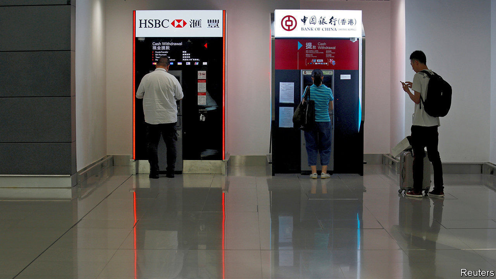
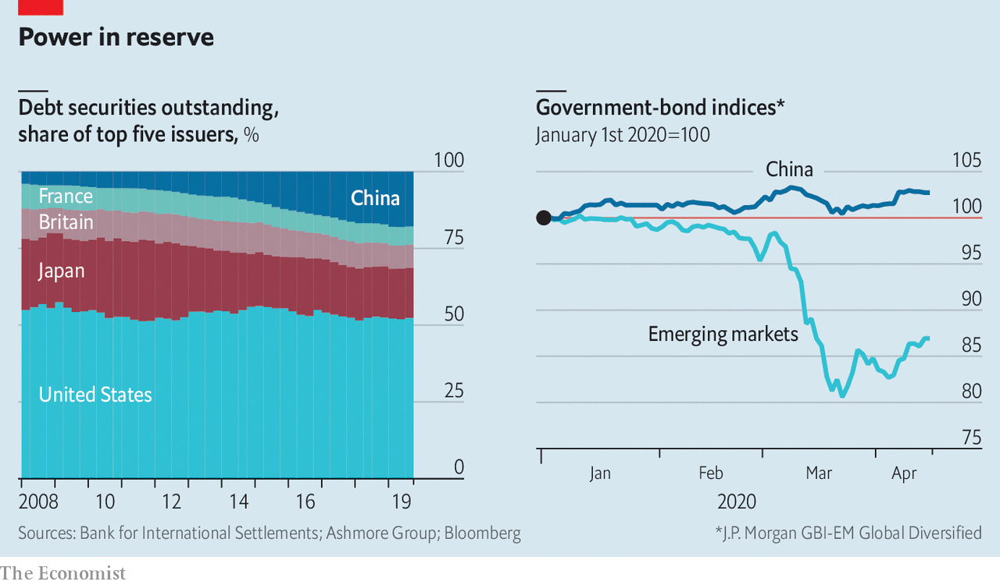

## Bucking the trend

# The dollar’s dominance masks China’s rise in finance

> The pandemic is a fillip for China’s currency and fintech firms

> Apr 16th 2020HONG KONG AND NEW YORK

Editor’s note: The Economist is making some of its most important coverage of the covid-19 pandemic freely available to readers of The Economist Today, our daily newsletter. To receive it, register [here](https://www.economist.com//newslettersignup). For our coronavirus tracker and more coverage, see our [hub](https://www.economist.com//coronavirus)

IN HONG KONG’s deserted airport, two cash machines face each other. One is run by HSBC, a British bank that is one of the territory’s main conduits for accessing American dollars. The other, operated by the Bank of China, dispenses Hong Kong dollars and Chinese yuan. Flashing in the eerie, pandemic-induced silence, they are a metaphor for China’s discreet quest for financial influence.

The dollar is still the king of currencies. It underpins four-fifths of global supply chains and around two-thirds of securities issuance and foreign-exchange reserves. Though China is the world’s second-largest economy, its financial clout lags far behind that of America. But it wants to catch up, and the pandemic could speed its progress.

At first blush, last month’s global rush for dollars might suggest otherwise. The outbreak of covid-19 presaged widespread lockdowns and an intense liquidity crunch. Spooked, investors sold whatever they held. Dollars became highly sought after. Australia’s currency hit its lowest level against the greenback since 2002. The Indian rupee fell to a record low. Even the Japanese yen and Swiss franc, usually havens, tumbled.

Funding markets also hinted at a serious dollar shortage. The three-month “cross-currency basis” swap rate, which tracks the premium traders pay to temporarily exchange euros for dollars, reached its highest point since 2011. The cost of borrowing greenbacks in the interbank market soared. Alarmingly, the value of American Treasury bills started falling, suggesting investors were selling their safest assets to free up cash.

The problem was that covid-19 boosted dollar demand while choking off supply. Trade stalled, leading firms to draw down credit lines. Investors dumped emerging-market assets, causing a record $100bn in portfolio outflows. Redemption requests prevented money-market funds from filling the gap. All this made dollars more expensive. Emerging markets, hurt by crashing commodity prices and bulging debt repayment costs, were the hardest hit.

In order to ease the pressure, the Fed set up swap lines for rich-world central banks and those in some emerging markets, which now cover 14 countries. On March 31st it also created a “repurchase” facility, allowing other central banks to temporarily swap their holdings of American Treasuries for dollars, rather than be forced to sell them into an illiquid market. The measures seem to have worked: the euro-dollar basis touched a 12-year low on April 6th.

This “magnanimity” will only heighten dollar dependence, says Eswar Prasad of Cornell University, as central banks amass yet more American bonds as a buffer for the next crunch. But to some that very prospect is a reason to diversify. The Fed’s “repo” facility does not help nations with few reserve assets. America’s rivals fear being denied access. Others may reckon that reliance on a keystone currency could amplify future shocks. And the fortunes of many economies are now more tightly bound to their best trading buddy—China—than to America.

China cannot yet satisfy them. The yuan makes up just 2% of payments and global reserves. But three factors mean that Beijing could emerge from the current crisis with a stronger hand: the increasing allure of China’s government bonds; its role as a creditor; and its technological clout.

Take bonds first. China is winning kudos as a trusted debtor, which props up the yuan. Even as other markets froze, its government-bond market was undisturbed. The gap between prices at which investors want to buy and sell—the “bid-ask” spread—has stayed low, as has volatility. According to an index compiled by JPMorgan Chase, returns on emerging-market bonds fell by 15.5% in the first quarter, but Chinese debt returned 1.3% (see chart). The bond market also recorded 60bn yuan ($8.5bn) in net foreign inflows. “The Chinese market has proven that it is somewhat independent from other global markets,” says Edmund Goh of Aberdeen Standard Investments, an asset manager.

That makes China’s $13trn bond market, the world’s second-largest, a haven among emerging peers. And it is a more lucrative option than rich-world bonds: China’s five-year treasuries yield 2.24%; American ones, 0.35%. As interest rates stay low in the West, that gap will endure. It should help that China’s bonds are being gradually included in two popular indices. Passive—and sticky—money should stream in.

Another factor in China’s rise is its status as a big creditor. As the world recovers from coronavirus, this could yield strategic benefits—and dilemmas. Its apparent willingness to back a G20 deal to suspend bilateral loan repayments by poor countries for the rest of this year—much of which would have gone to China—will help inspire more faith in its credit and, by extension, the yuan. In the private sector, though, it may be more hard-headed. Since 2008 Chinese banks have become some of the world’s largest lessors of planes and ships. As a halt to trade and travel threatens to push lessees into default, lenders seem to be “playing hardball”, says Richard Skipper of DLA Piper, a law firm. A lack of forgiveness now could alienate future borrowers.

A final factor, and perhaps China’s trump card, is technology. Tencent and Ant Financial, which run “digital wallets” with over 1bn users each, are investing in peers across Asia. OneConnect, an offshoot of Ping An, China’s largest insurer, provides cloud-based services that power financial institutions in 16 countries. All should get a boost as covid-19 forces money and staff to migrate online. Some are already talking to bankers about buying upstarts that investors no longer want to bankroll, says Frank Troise of SoHo Capital, an investment firm. China’s growing influence over the profitable plumbing of Asian finance will in time be hard to ignore.

China will need an open capital account and a trusted legal system for the yuan to become a reserve currency. If its resilient bond market and whizzy tech attract big inflows, officials in Beijing could become more confident about relaxing cross-border controls. For the growing number of countries and companies with reason to ditch the dollar, that would make China a more viable alternative. ■

Dig deeper:For our latest coverage of the covid-19 pandemic, register for The Economist Today, our daily [newsletter](https://www.economist.com//newslettersignup), or visit our [coronavirus tracker and story hub](https://www.economist.com//coronavirus)