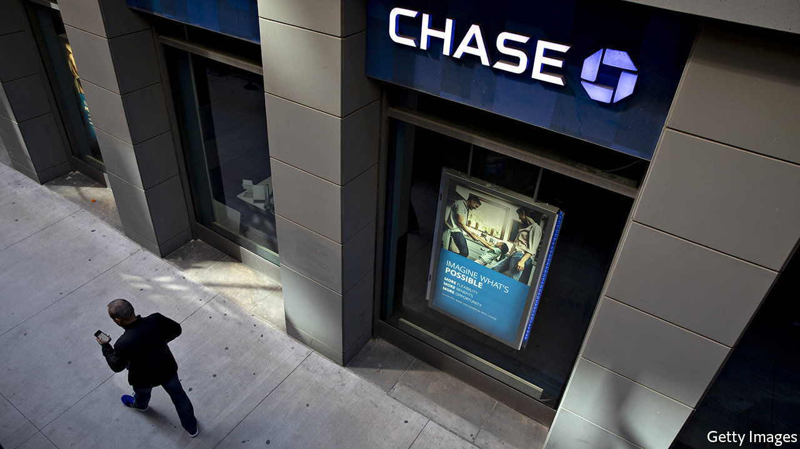
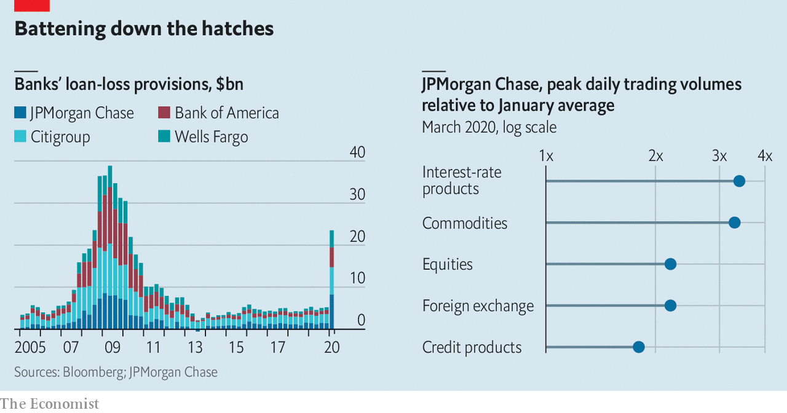

## Dispatch from the front

# Wall Street prepares for a wave of loan losses

> Banks’ first-quarter earnings reveal how customers are coping with the pandemic

> Apr 18th 2020NEW YORK

Editor’s note: The Economist is making some of its most important coverage of the covid-19 pandemic freely available to readers of The Economist Today, our daily newsletter. To receive it, register [here](https://www.economist.com//newslettersignup). For our coronavirus tracker and more coverage, see our [hub](https://www.economist.com//coronavirus)

IF DOCTORS AND nurses are on the front-line of the health crisis caused by the pandemic, then bankers are on the front-line of the economic response. Investors dumping stocks have stuffed the money into bank deposits. Cash-strapped businesses are drawing down credit lines. Laid-off workers are delaying mortgage payments. And governments are stepping in to dole out cash to firms in need, using the banks as their delivery system.

So when American lenders reported their first-quarter earnings on April 14th and 15th, the results revealed how customers are coping with the pandemic. JPMorgan Chase, the country’s largest bank, said that credit-card transaction volumes at supermarkets in March were twice those in March 2019. Bank of America reported that a sixth of its small-business customers have deferred loan payments.

Banks’ balance-sheets have swollen as they have issued loans to firms, creating new deposits. Loans outstanding at JPMorgan, Bank of America, Citigroup, Goldman Sachs and Wells Fargo grew from $3.8trn to $4.0trn between the end of last year and March 31st. (America’s other big beast, Morgan Stanley, was due to report results as The Economist went to press.) A torrent of trading in financial markets pushed transaction volumes to new highs. As a result, trading revenues were up by 32% at JPMorgan and 28% at Goldman Sachs, compared with the same period in 2019.

But the worst is yet to come. The frenetic pace of trading activity is unlikely to last. Lower interest rates will eat into interest margins. And banks are bracing for loan losses. America’s four large lenders booked $24.1bn in provisions for credit losses, an increase of $18.7bn compared with the first quarter of 2019. That dragged down profits: the same banks reported a total of $10.1bn in net earnings in the first quarter, down from $27.1bn in the same period a year ago.

The question is how much more the banks need to set aside. Provisions in the first quarter amounted to around 0.6% of their loan portfolios. In their calls with investors bank executives across Wall Street were asked whether provisions would have to climb further in the second quarter. Most point to the 2007-09 global financial crisis, or the scenarios they must model under the Federal Reserve’s annual stress tests, as possible worst cases. These would mean JPMorgan, which booked an extra $6.9bn in credit provisions in the first quarter, could end up bearing loan losses of up to $45bn.

Bank bosses suggested that the bill for loan losses would grow, but they also admitted they did not know by how much. “There are no models that have dealt with GDP down 40% and unemployment growing this rapidly,” noted Jamie Dimon, JPMorgan’s boss. Nor have banks had to deal with the type and scale of government intervention being undertaken. As with health care, the pandemic has dropped lenders into uncharted territory.■

Dig deeper:For our latest coverage of the covid-19 pandemic, register for The Economist Today, our daily [newsletter](https://www.economist.com//newslettersignup), or visit our [coronavirus tracker and story hub](https://www.economist.com//coronavirus)

## URL

https://www.economist.com/finance-and-economics/2020/04/18/wall-street-prepares-for-a-wave-of-loan-losses
