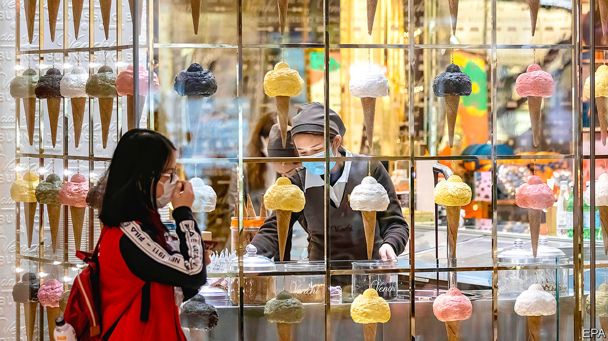
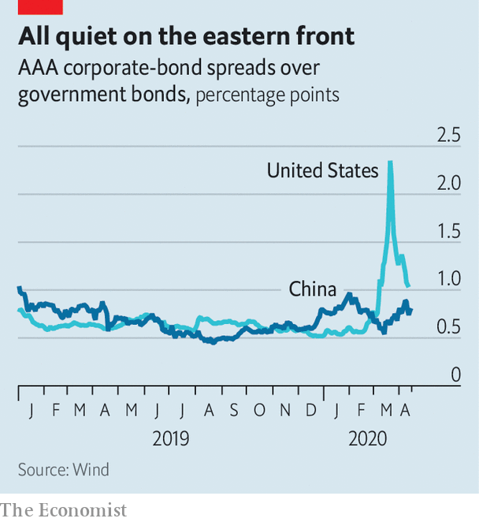

## Fighting with shadows

# Why has China’s stimulus been so stingy?

> The lingering threat of covid-19 forestalls a bigger stimulus

> Apr 16th 2020NANJING

Editor’s note: On April 17th China announced that GDP fell by 6.8% in the first quarter of 2019, compared with the same period last year, and that retail sales fell by 16% in March, again compared with the year before

GOLDEN EAGLE WORLD is a glistening monument to commerce, a nine-storey mall with endless stores and restaurants, virtual-reality arcades and spas, even a zoo. But it is now trying something more basic, setting up food stalls outside to drum up business. Although China is back to work, customers have been slow to return. The giant mall in the eastern city of Nanjing has used giveaways and promotions, all to limited effect. “We’ve got to be prepared for a protracted war,” says one of its executives.

Most in China would recognise the term “protracted war”. It is a reference to Mao’s strategy for fighting Japan’s invading army in the 1930s: be patient and, little by little, wear the enemy down. It also happens to be a good description for the government’s approach to bringing the economy back from the coronavirus shutdown. It is shaping up to be a long, grinding battle, not a rapid victory.

Growth in the first quarter compared with the prior year, reported after The Economist went to press, was expected to be negative—China’s first official contraction in more than four decades. In the past this would have guaranteed a big stimulus. Yet this time its response has been more restrained. Other countries have announced huge spending packages. Why has China been so stingy?

There are two critical things to note. First, appearances are somewhat deceptive; a closer look reveals similarities between China’s economic policy response and those of other countries. Second, China would like to do more, but the lingering covid-19 threat is holding it back.

Start with the obvious contrasts between China’s actions and those of other governments. Japan’s fiscal stimulus, for instance, is around 10% of its GDP, and rises to twice that when loans and loan guarantees are included. China, meanwhile, has made no special announcement, instead rolling out a hodgepodge of policies that, added up, reach perhaps 3% of its GDP.

Many governments are using new tools to help struggling businesses. Corporate bail-outs have been a core element. America has earmarked $850bn for loans to companies. Britain set aside £330bn ($412bn) for loan guarantees. China, by comparison, does not need such fiscal parachutes. They are built into the system: as much as 80% of corporate loans go to state firms and hence already enjoy implicit guarantees.

China, without any fanfare, is in fact leaning on state-owned banks. The total amount of new credit issued last month was equivalent to 5% of last year’s GDP—the highest for any month since 2010, the tail-end of a giant stimulus. Arrangements are often discreet. The Golden Eagle executive says that in late February a group of bankers came to the mall to determine which tenants they could prop up.

With such backstops in place, the financial fallout from the outbreak has been limited so far. The peak-to-trough drop in China’s stockmarket was 16%, less than half of America’s plunge. Credit spreads exploded in Western bond markets; in China they have barely widened (see chart). Defaults have been rare. In the past two months just four companies missed bond payments in China for the first time, less than half as many as during the same period last year. “In the bad times you see more advantages of the system,” says Yu Yongding, a former adviser to China’s central bank.

But make no mistake. This is still a major departure from China’s customary largesse. A typical stimulus policy—variations of which were seen in 2009, 2012 and 2016—would involve some combination of a surge in infrastructure spending, incentives to spur consumption, and loosened restrictions on the property market. All have been conspicuously absent so far.

In part this reflects a newfound prudence. Given China’s heavy debt load, economic authorities have fought to rein in leverage and snuff out financial risks over the past few years. They are loth to see their progress undone. But there is also a more important reason for restraint. Many economists in China have come to the conclusion that it is simply too soon for an all-out push to revive growth.

Peng Wensheng, chief economist with Everbright Securities, a brokerage, wrote in a recent essay that the unknowns of covid-19 mean that policy is sure to be wrong. If the government is overly optimistic about the pandemic, it will stoke the economy too soon, forcing it to backtrack. If overly pessimistic, it will wait too long to ease curbs, requiring more stimulus later on. The risks, he concluded, were asymmetric: it would be far better to defer the rebound than to reimpose lockdowns. Mr Yu puts it more bluntly. “Until the pandemic is under control, the main objective is survival,” he says. Zhong Zhengsheng, chief economist of CEBM, an advisory firm, adds that stimulus will be more effective when global supply chains are up and running—an argument that no country, not even one as big as China, can get too far ahead of the rest of the world.

In practice China’s economy is undergoing a daily stress test. The authorities are letting more activity resume, probing the limits of what is safe and how comfortable people feel. At Golden Eagle World, managers had hoped for a full recovery by now. Instead, business is still as much as 20% below normal, a gloomy portent for the economy. Such are the uncertainties that China’s leaders have not yet declared an economic-growth target for this year, a figure that normally serves as a lodestar for officials up and down the country.

The uncertainty touches even basic matters, such as whether to eat in restaurants. Last month Nanjing launched a campaign to encourage residents to leave their homes, handing out 318m yuan ($45m) in shopping vouchers. But signs around the city still admonish people to avoid crowds and stay in well-ventilated spaces. The pandemic descended on China and the world suddenly—but its shadow will take much longer to disappear. ■

Dig deeper:For our latest coverage of the covid-19 pandemic, register for The Economist Today, our daily [newsletter](https://www.economist.com//newslettersignup), or visit our [coronavirus tracker and story hub](https://www.economist.com//coronavirus)

## URL

https://www.economist.com/finance-and-economics/2020/04/16/why-has-chinas-stimulus-been-so-stingy
