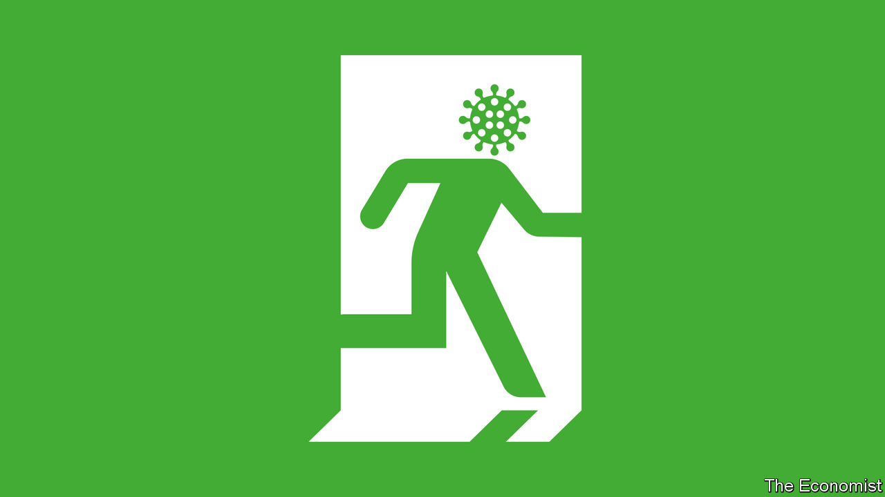
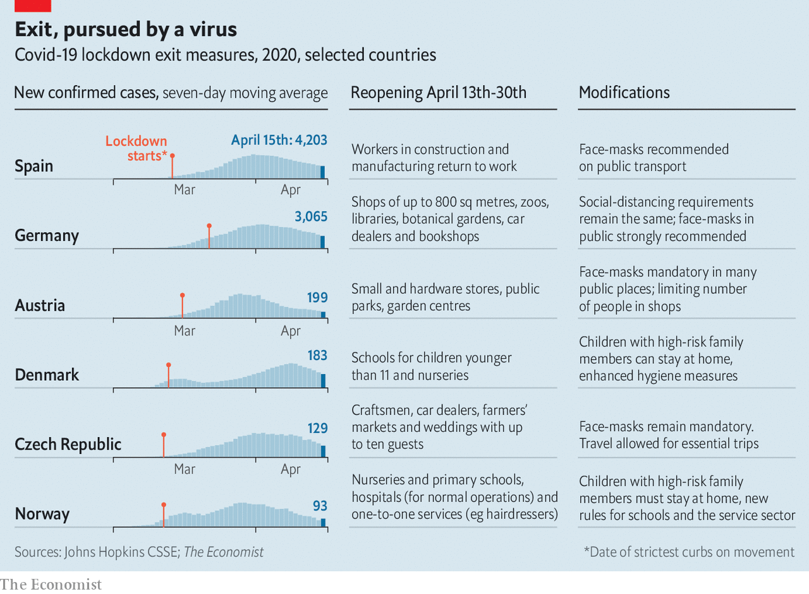
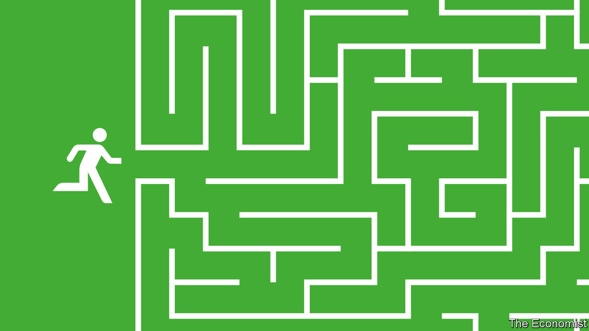

## Emergency exit

# Governments are starting to ease restrictions

> Gradually, cautiously and with only a hazy idea of what works

> Apr 16th 2020BEIJING, BERLIN, MADRID AND SEOUL

Editor’s note: The Economist is making some of its most important coverage of the covid-19 pandemic freely available to readers of The Economist Today, our daily newsletter. To receive it, register [here](https://www.economist.com//newslettersignup). For our coronavirus tracker and more coverage, see our [hub](https://www.economist.com//coronavirus)

AFTER SPENDING the long Easter break cooped up at home some Spaniards went back to work this week. They were greeted at transport hubs by police officers and Red Cross volunteers handing out face-masks. Though reported as a “relaxing” of the lockdown imposed a month ago, the government insists that it is not. Only those who cannot work from home are allowed to go back to their workplaces. Most shops remain closed, as do schools, bars, restaurants and hotels. Outdoor exercise is still banned and enforcement is tight: between March 14th and April 6th the police arrested 3,267 people and levied 340,000 fines for breaking the lockdown.

Spain seems to have turned a corner in one of the worst outbreaks of covid-19. The daily number of cases has begun to fall, compared with a daily increase of around 30% a month ago. Hospitals which were overwhelmed a fortnight ago now have some spare capacity. But Pedro Sánchez, the prime minister, was clear. “We aren’t even beginning the second phase,” he said on April 12th. “De-escalation will begin in a fortnight at the earliest, and it will be gradual and cautious,” Mr Sánchez insisted.

Governments around the world are trying to work out how to exit their covid-19 lockdowns. Several other European countries, including Austria, Germany, Norway and the Czech Republic, are reopening nurseries, schools and shops as their efforts to stop the spread of covid-19 start, as in Spain, to pay off (see table). In various American states discussions of exit strategies are gaining traction. In New York state, where covid-19 has killed more than 10,000 people in just a month, the total number of cases in hospitals is starting to plateau. On April 13th, along with five other states on the east coast, it disclosed it was working on a strategy for reopening the region’s economy. On the same day three states on the west coast, including California, announced a similar project.

The big unknown is whether any of the exit strategies being considered or implemented will avoid a second wave of infections. Researchers at Imperial College London estimate that, even when the many infections that were never registered are added to the total, just 1-15% of people in Europe had some immunity to covid-19 at the end of March. Until a vaccine is available, governments will need to keep sufficient numbers of infected people tightly quarantined to prevent new outbreaks that would overwhelm their health systems. But most failed to do this during the early days of covid-19. That is why the epidemics grew so bad that they needed to implement full lockdowns to save hospitals from disaster. It is not yet clear that they will do well enough the second time around to prevent a resurgence of the disease.

Governments in countries that are already past the peak of the first wave of their epidemics have some breathing space to plan for their post-lockdown future. More important, they have better data. They have a clearer sense of how their hospitals will cope with a certain number of cases of covid-19. They no longer need to rely on data from China to make educated guesses about how their populations and health systems might fare. Such experience matters for all sorts of reasons. For example, the spread of the disease among the close-knit intergenerational households in southern Europe is different from the paths it takes in the insular societies of northern Europe where a large share of old people live alone or in care homes.

Even with these data, however, government planners do not know which restrictions they should begin to ease and when. “There are no absolutes here,” says Mike Ryan of the World Health Organisation (WHO); the evidence that when countries reach a specific number of cases they should take particular actions does not yet exist. The accepted wisdom is that countries can begin to consider easing restrictions when the number of new cases is tapering off, and their hospitals have free beds—in other words, when they can accommodate a surge in infections that could follow the easing of a lockdown.

Those easing lockdowns are using one principle: the epidemic must be under control. Austria was the first European country to announce a comprehensive plan detailing when various sectors would be allowed to reopen. In the first week of April tests of a random sample of about 1,600 people found that fewer than 1% had active covid-19 infections. Norway decided to begin reopening kindergartens from April 20th after scientists advising the government reported that the epidemic’s reproduction rate—the number of new infections generated by each case—had fallen to 0.7. If the reproduction rate of a contagion is lower than one then an epidemic will die down over time. Spain’s health ministry plans to test a sample of at least 30,000 families around the country over the next three weeks to get a sense of the real scale of the outbreak and the extent to which the population has acquired any immunity.

Harder than the decision about when to lift restrictions is choosing which to lift first. The reasoning varies from country to country, but the conclusions are often the same. Norway’s commission, which assessed the long-term costs to society of various combinations of restrictions, found that closing primary schools and nurseries were among the costliest policies. In Denmark, too, nurseries and primary schools opened first on April 15th; older children may be allowed back to school a month later. (Not all parents were impressed; 40,000 Danes have joined a Facebook group called “My kid is not going to be a Guinea Pig for Covid-19”.) And in Germany, which outlined an exit strategy on April 15th, schools will start to reopen on May 4th, but only for those children facing exams. “Emergency” services for the parents of younger children will be expanded.

Nowhere, however, is the slow lifting of lockdowns a return to business as usual. Europeans going back to shops, trains and offices will have to follow new hygiene and social-distancing rules—some of which were introduced during the lockdowns. Austrians and Czechs are already required to wear face-masks in public spaces, including at work; Spain is considering a similar requirement. Shops in many countries will have to limit the number of customers in at any one time. Norway’s guidelines, released on April 15th, say that children in nurseries must be split into smaller cohorts, with three-year-olds in groups of three and older children in groups of six; each group will be assigned one adult. Changes to the cohorts will be permitted no more than once a week.

Like the lockdowns themselves, many of these new rules are transplants from China, which has, its government says, avoided a second wave of infections. In Beijing employers must keep their employees separated, so many firms have only a fraction of their workers on-site each day, with the rest working at home where possible. Restaurants must limit the number of customers to keep them apart. Chinese schools which have welcomed back their students have introduced measures to minimise infections: constant ventilation of classrooms; extra spacing between desks; frequent cleaning and disinfecting; the reduction of the size of classes; staggered dismissal times, to avoid crowding; assigned seating and installation of partitions in dining areas. The list goes on and on. And officials stress that they will pull back and make adjustments if they see signs of a second wave.

There is no solid evidence that any one of these measures alone is particularly effective in reducing the transmission of the new coronavirus. The hope is that in combination they could work reasonably well. In China, however, the easing of lockdown has been accompanied by stringent efforts to identify and quarantine those infected and their close contacts. In some areas restaurants must sign in every customer—and if any later test positive to notify those who visited at the same time. China’s strategy suggests that Europe and America’s plans to stop infections after they lift their lockdowns with masks, good hygiene and social distancing may not be enough.

Instead post-lockdown life might more closely resemble that in South Korea, a democracy with a population similar in size to England’s, throughout its covid-19 outbreak. Unlike America and much of Europe, South Korea has never instituted a complete lockdown. Even at the height of the outbreak people remained mostly free to go about their lives thanks to extensive testing, tracing and isolation of infections. In only 10% of cases have public-health investigators been unable to determine the source of infection. New daily infections are now below 30.

Despite the pandemic on April 15th South Korea held legislative elections. But schools, universities, museums and many churches have been closed for weeks, and there are no plans to reopen them. Travellers returning from abroad must quarantine themselves for two weeks, either at home or in government-provided facilities. Breaking quarantine can lead to fines, jail or, for foreigners, deportation. The government advice still discourages leaving home for non-essential reasons, especially socialising in groups.

Compliance with social-distancing recommendations, however, is flagging. Using data gathered from mobile-phone masts, South Korea’s disaster-response agency estimates that people moved around about 16% more in the last week of March compared with the last week of February, which was the height of the outbreak. That number is likely to have ticked up further in recent days. Seoul’s restaurants are filling up again. Hiking trails teemed with people over the weekend.

And yet of the roughly 57,000 people currently in strict self-isolation, just over 100 have been caught violating it. After various groups voiced concerns about privacy, the government abandoned a plan to issue electronic wristbands to everyone in quarantine. Instead, it will now provide them only to those who have broken their quarantine and even then only with the person’s consent. The public supports the idea either way; in a poll conducted by the culture ministry, more than 80% said the wristbands were a good idea.

South Korea’s experience has prompted some European countries and a few American states to begin ramping up their contact-tracing capacity as they prepare to lift their lockdowns. That requires expanding public-health departments; calling everyone an infected person has been in close contact with—and checking on them regularly during their 14-day quarantine—is hugely labour-intensive.

It is not a highly skilled job; anyone with a secondary-school education can be trained in a day. But with a disease that spreads as easily as covid-19, enormous numbers of workers are needed. Public-health departments in America are currently doing this sort of work for outbreaks of sexually transmitted diseases, tuberculosis and the occasional measles outbreak. But the numbers involved are minuscule compared with a respiratory bug like covid-19. Calculating on the basis of the number of contact-tracers used to contain the outbreak in Wuhan, the Chinese city hit hardest by the country’s epidemic, public-health experts recently convened by Johns Hopkins University estimated that more than 260,000 new hires would be needed at local and state public-health departments in America—up from just 2,200 at present. To make a start, they recommend that America recruits 100,000 such new hires dedicated to covid-19. Their salaries for a year would add up to $3.6bn—a rounding error on the cost of shutting down the American economy.

Massachusetts has begun hiring 1,000 additional contact-tracers and social workers who would support people under quarantine by shopping for food and collecting medications, for example. American universities are developing crash training courses for contact-tracers. Similar efforts are starting to appear in Europe. In March Germany’s public-health institute put out a job advertisement aimed at students for “containment scouts” to do contact-tracing; 10,000 applied. Germany plans to have at least one five-person team per 20,000 inhabitants to help with contact-tracing. In badly affected areas the army and other personnel will be called in. The Czech Republic may also use army recruits.

Apps that will help health officials track where hotspots of covid-19 may be emerging and trace the contacts of infected people are being developed (see [article](https://www.economist.com//science-and-technology/2020/04/16/app-based-contact-tracing-may-help-countries-get-out-of-lockdown)). Such apps are already widely used in China. They can make contact-tracing more efficient, says Anita Cicero of Johns Hopkins University, but they cannot replace the traditional methods of contact-tracing—nor the humans who do it. The European Commission, which on April 15th unveiled a “road map” to ensure that EU member-states co-ordinate the lifting of their restrictions, wants them to agree on a common framework for such an app; at the moment, many countries are forging ahead with their own plans.

Many experts doubt that such apps, which people will have to install voluntarily, would be popular. “I don’t think Americans are going to go for that,” says Michael Fraser of the Association of State and Territorial Health Officials in America. “I’ve been surprised before, though,” he concedes. If the alternative is being cooped up at home, lots may opt in. Almost two-thirds of Germans told one survey they would forgo the privacy of their data to protect the lives of others; a separate poll found that 70% of respondents would be happy to install a contact-tracing app.

But organising quarantines on the scale required by covid-19 would require more than just manpower and technology, notes Mr Fraser. Most of the new contact-tracers can work from home, by phone or using other technologies. Some, however, would need to go to people’s homes. For that, they would need face-masks and gloves to protect them—which are in short supply globally. At a local level, isolation facilities are needed for people who cannot isolate themselves at home. These must be safe, private and comfortable.

Above all, every country that wants to contain a second wave will need to test everyone suspected of being infected with covid-19 and their contacts. This will have to be rapid diagnostic testing, says Ms Cicero, where people get the results in less than an hour. Testing sites would need to be set up in every health-care facility. The way things are now in America, people often wait for their results for several days—too long for a virus that they can spread before they develop symptoms.

Testing capacity everywhere has been growing. But at its current pace America will take months to attain the level needed for effective contact-tracing, says Mr Fraser. In many countries, the crimped global supply of materials, including reagents (chemicals necessary for tests), means that testing is reserved primarily for those hospitalised with covid-19 and health-care workers. The dearth of reagents means that Austria may not be able to increase its testing as planned, even though it has the capacity to carry out ten times the number of tests it conducts now.

Reagents are not the only thing in short supply. Swabs to take samples from patients, glass tubes, machines and trained technicians with protective masks and gloves are also scarce. With so many different inputs, bottlenecks can easily occur. And when every single country in the world needs enormous supplies, it will be a while before there is no shortage of them.

Every plan and guideline for what a country must have in place before it lifts its lockdown puts expanded testing near the top of the list, but few outline how to do this fast. For countries hoping to be rid of both their lockdowns and a runaway covid-19 epidemic, no problem is as urgent.■

Dig deeper:For our latest coverage of the covid-19 pandemic, register for The Economist Today, our daily [newsletter](https://www.economist.com//newslettersignup), or visit our [coronavirus tracker and story hub](https://www.economist.com//coronavirus)

## URL

https://www.economist.com/international/2020/04/16/governments-are-starting-to-ease-restrictions
