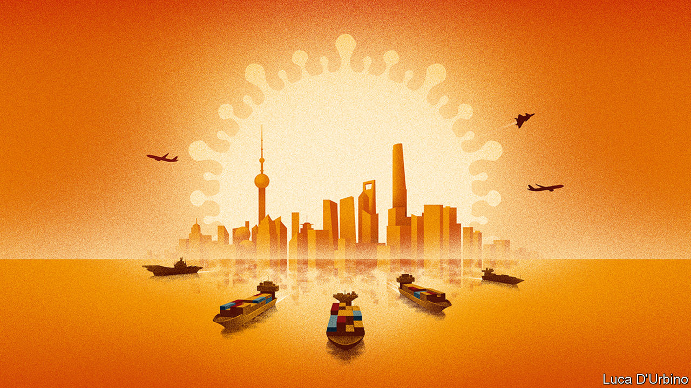

## Pandemic geopolitics

# Is China winning?

> The geopolitical consequences of covid-19 will be subtle, but unfortunate

> Apr 16th 2020

Editor’s note: The Economist is making some of its most important coverage of the covid-19 pandemic freely available to readers of The Economist Today, our daily newsletter. To receive it, register [here](https://www.economist.com//newslettersignup). For our coronavirus tracker and more coverage, see our [hub](https://www.economist.com//coronavirus)

THIS YEAR started horribly for China. When a respiratory virus spread in Wuhan, Communist Party officials’ instinct was to hush it up. Some predicted that this might be China’s “Chernobyl”—a reference to how the Kremlin’s lies over a nuclear accident hastened the collapse of the Soviet Union. They were wrong. After its initial bungling, China’s ruling party swiftly imposed a quarantine of breathtaking scope and severity. The lockdown seems to have worked. The number of newly reported cases of covid-19 has slowed to a trickle. Factories in China are reopening. Researchers there are rushing candidate vaccines into trials (see [Briefing](https://www.economist.com//briefing/2020/04/16/can-the-world-find-a-good-covid-19-vaccine-quickly-enough)). Meanwhile, the official death toll has been far exceeded by Britain, France, Spain, Italy and America.

China hails this as a triumph. A vast propaganda campaign explains that China brought its epidemic under control thanks to strong one-party rule. The country is now showing its benevolence, it says, by supplying the world with medical kit, including nearly 4bn masks between March 1st and April 4th (see [article](https://www.economist.com//china/2020/04/16/chinas-post-covid-propaganda-push)). Its sacrifices bought time for the rest of the world to prepare. If some Western democracies squandered it, that shows how their system of government is inferior to China’s own.

Some, including nervous foreign-policy watchers in the West, have concluded that China will be the winner from the covid catastrophe. They warn that the pandemic will be remembered not only as a human disaster, but also as a geopolitical turning-point away from America.

That view has taken root partly by default. President Donald Trump seems to have no interest in leading the global response to the virus. Previous American presidents led campaigns against HIV/AIDS and Ebola. Mr Trump has vowed to defund the World Health Organisation (WHO) for its alleged pro-China bias (see [article](https://www.economist.com//science-and-technology/2020/04/16/the-world-health-organisation-is-under-fire-from-americas-president)). With the man in the White House claiming “absolute power” but saying “I don’t take responsibility at all”, China has a chance to enhance its sway.

Even so, it may not succeed. For one thing, there is no way to know whether China’s record in dealing with covid-19 is as impressive as it claims—let alone as good as the records of competent democracies such as South Korea or Taiwan. Outsiders cannot check if China’s secretive officials have been candid about the number of coronavirus cases and deaths. An authoritarian regime can tell factories to start up, but it cannot force consumers to buy their products (see [article](https://www.economist.com//finance-and-economics/2020/04/16/how-deep-will-downturns-in-rich-countries-be)). For as long as the pandemic rages, it is too soon to know whether people will end up crediting China for suppressing the disease or blaming it for suppressing the doctors in Wuhan who first raised the alarm.

Another obstacle is that China’s propaganda is often crass and unpleasant. China’s mouthpieces do not merely praise their own leaders; some also gloat over America’s dysfunction or promote wild conspiracy theories about the virus being an American bioweapon. For some days Africans in Guangzhou were being evicted en masse from their homes, barred from hotels and then harassed for sleeping in the streets, apparently because local officials feared they might be infected. Their plight has generated angry headlines and diplomatic rebukes all over Africa.

And rich countries are suspicious of China’s motives. Margrethe Vestager, the EU’s competition chief, urges governments to buy stakes in strategic firms to stop China from taking advantage of market turmoil to snap them up cheaply. More broadly, the pandemic has fed arguments that countries should not rely on China for crucial goods and services, from ventilators to 5G networks. The World Trade Organisation expects global merchandise trade to shrink by 13-32% in the short run. If this turns into a long-term retreat from globalisation—which was already a worry before covid-19—it will harm China as much as anywhere.

More fundamental than whether other countries are willing to see China supplant America is whether it intends to. Certainly, China is not about to attempt to reproduce America’s strengths: a vast web of alliances and legions of private actors with global soft power, from Google and Netflix to Harvard and the Gates Foundation. It shows no sign of wanting to take on the sort of leadership that means it will be sucked into crises all across the planet, as America has been since the second world war.

A test of China’s ambitions will be how it acts in the race for a vaccine. Should it get there first, success could be used as a national triumph and a platform for global co-operation. Another test is debt relief for poor countries. On April 15th the G20, including China, agreed to let indebted nations suspend debt payments to its members for eight months. In the past China has haggled over debt behind closed doors and bilaterally, dragon to mouse, to extract political concessions. If the G20’s decision means the government in Beijing is now willing to co-ordinate with other creditors and be more generous, that would be a sign it is ready to spend money to acquire a new role.

Perhaps, though, China is less interested in running the world than in ensuring that other powers cannot or dare not attempt to thwart it. It aims to chip away at the dollar’s status as a reserve currency (see [article](https://www.economist.com//finance-and-economics/2020/04/16/the-dollars-dominance-masks-chinas-rise-in-finance)). And it is working hard to place its diplomats in influential jobs in multilateral bodies, so that they will be in a position to shape the global rules, over human rights, say, or internet governance. One reason Mr Trump’s broadside against the WHO is bad for America is that it makes China appear more worthy of such positions.

China’s rulers combine vast ambitions with a caution born from the huge task they have in governing a country of 1.4bn people. They do not need to create a new rules-based international order from scratch. They might prefer to keep pushing on the wobbly pillars of the order built by America after the second world war, so that a rising China is not constrained.

That is not a comforting prospect. The best way to deal with the pandemic and its economic consequences is globally. So, too, problems like organised crime and climate change. The 1920s showed what happens when great powers turn selfish and rush to take advantage of the troubles of others. The covid-19 outbreak has so far sparked as much jostling for advantage as far-sighted magnanimity. Mr Trump bears a lot of blame for that. For China to reinforce such bleak visions of superpower behaviour would be not a triumph but a tragedy. ■

Dig deeper:For our latest coverage of the covid-19 pandemic, register for The Economist Today, our daily [newsletter](https://www.economist.com//newslettersignup), or visit our [coronavirus tracker and story hub](https://www.economist.com//coronavirus)