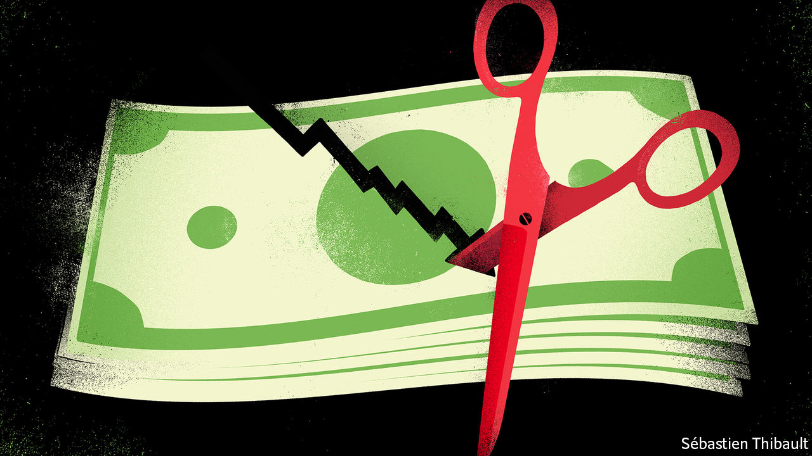

## Payouts in a pandemic

# Which firms should pay dividends?

> Dividends are a healthy part of capitalism. In the covid era, many firms should cut them

> Apr 16th 2020

Editor’s note: The Economist is making some of its most important coverage of the covid-19 pandemic freely available to readers of The Economist Today, our daily newsletter. To receive it, register [here](https://www.economist.com//newslettersignup). For our coronavirus tracker and more coverage, see our [hub](https://www.economist.com//coronavirus)

OVER THE next month the toll that lockdowns are inflicting on businesses will become more visible as big Western companies report their first-quarter results and start to give investors a steer on what to expect for the rest of 2020. For some, bankruptcy beckons—this week America’s banks warned of a surge in bad debts as households and firms go bust (see [article](https://www.economist.com//finance-and-economics/2020/04/18/wall-street-prepares-for-a-wave-of-loan-losses)). Most companies will remain going concerns, but face a collapse in profits. As a result a fraught debate is taking place in boardrooms all over the world about whether firms should cut their dividends, the recurring payments they make to their owners.

That may sound like a technicality but it is not. Dividends and share buy-backs (another way of returning money to a company’s owners) amounted to $2.2trn last year for listed firms worldwide. A necessary feature of a market economy, they get a bad rap from those who think plutocratic shareholders are the outsized beneficiaries of modern capitalism. But retirement schemes depend on a steady stream of income from dividends to honour their commitments; if dividends are cut they may instead have to sell shares at exactly the wrong time, during a stockmarket slump. And when mature or cash-rich companies distribute excess cash it can be recycled into funding young companies or to firms whose balance-sheets need repair.

Companies are loth to make sudden, big changes to their dividend payments. Yet analysts reckon the total amount paid to shareholders could drop by 30% or more this year. The pressure to cut comes because lower profits make payouts less affordable; because governments, reasonably, want some firms to preserve their cash and capital buffers; and because many bosses, haunted by the public backlash against bank bail-outs in 2008-10, worry about being seen to be paying out billions during a crisis.

What to do? The dividend debate can be solved by sorting companies into three buckets. In the first are systemically important firms where cuts should be required by governments. Any firm that receives a bespoke or disproportionately large taxpayer bail-out should automatically fall into this category: airlines, for example. Taxpayers should be repaid before investors are entitled to a reward. This does not mean, however, that companies that have taken advantage of stimulus measures available to all firms—such as furlough schemes or central-bank liquidity—should be made to cut payouts. There is no need to disrupt the economy more than is already the case.

Banks also belong in the first category, because the money they pay out could instead be used to support more lending. Regulators in the euro area and Britain have already enforced dividend bans. American banks have stopped share buy-backs but nearly all are sticking with paying dividends, which amount to about $55bn a year. The Federal Reserve, which regulates lenders, should nip this corporate bravado in the bud. Although banks are a lot better capitalised than in the past the crisis will be a strain. One of the biggest American lenders, Wells Fargo, has just reported that its profits dropped by 99% in the first quarter compared with a year earlier. Remember that taxpayers are on the hook should the financial system totter.

In the second bucket are firms that are stretched but feel that keeping up reliable dividends sends an important signal. The danger here is that they rack up debts in order to do so. That strategy might sound mad but could in fact become common. Roughly a quarter of big listed European and American firms are forecast to make lower profits in the next quarter than needed to sustain their dividends. Several of the oil supermajors may end up choosing to borrow in order to pay dividends. Boards should think twice. The cash payments they promised their firms’ owners were implicitly predicated on business-as-usual—and can surely wait until business does indeed return to usual.

In the third bucket are a group of businesses that have strong balance-sheets and are operating near full tilt, for example tech firms and other utilities. They should pay dividends, rather than hoard cash, even if it provokes ill-judged grumbles from some quarters. That money can help maintain the incomes of pensioners and other savers. And investors can use the cash they receive to recapitalise companies whose finances have been shattered by the covid-19 crisis. There will be a lot of them. ■

Dig deeper:For our latest coverage of the covid-19 pandemic, register for The Economist Today, our daily [newsletter](https://www.economist.com//newslettersignup), or visit our [coronavirus tracker and story hub](https://www.economist.com//coronavirus)