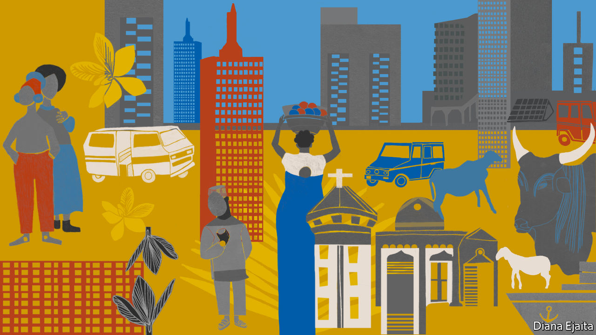
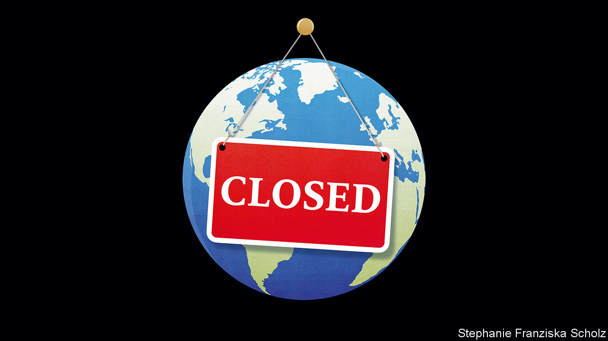

## On Africa, covid-19, Mount Everest, Dutch swear words, podiums, exacting

# Letters to the editor

> A selection of correspondence

> Apr 18th 2020

Africa’s population is indeed large, young and rapidly increasing ([Special report on the African century](https://www.economist.com//special-report/2020/03/26/africa-is-changing-so-rapidly-it-is-becoming-hard-to-ignore), March 28th). But it is the ratio of working-age people to dependents that is important, and that ratio is not increasing. At low levels of development the ratio boosts economic growth, given the contribution that a growing labour pool makes to national productivity. The ratio reduces in importance once countries become middle- and high-income economies.

Because of its extraordinarily young population, Africa will get to its demographic dividend—1.7 working-age people to every dependent—only at mid-century. Until then Africa’s very large number of children actually serves as a drag on development. The large demand for education means that governments have to focus on building more schools and associated infrastructure. As a result, there is little ability to improve the quality or quantity of teaching provided to those already in the system. In fact, the gap in schooling between Africa and the rest of the world has not narrowed but is as concerning now as it was 30 or 50 years ago.

Advancing Africa’s demographic dividend is key. This can be achieved mainly through the empowerment of women, providing education (secondary schooling in particular) and rolling out access to modern contraceptives.

JAKKIE CILLIERSHead of African futures and innovationInstitute for Security StudiesPretoria, South Africa

According to the World Bank GDP per person (at PPP) crept up from $2,000 to $4,000 in sub-Saharan Africa over the past 30 years. During the same period GDP per person rose from $15,000 to $43,000 in the European Union. However, the EU’s population is set to drop over the rest of this century. Sub-Saharan Africa’s population is expected to explode, to about 4bn people. It is difficult to put a positive economic spin on this.

JOHN HOLLAWAYAshford, Surrey

I am a huge fan of The Economist. As we all navigate this pandemic, I would like to urge world leaders to keep their cool and do the right thing (“[The politics of pandemics](https://www.economist.com//leaders/2020/03/12/the-politics-of-pandemics)”, March 14th). We all make mistakes, so let’s be more forgiving. Let’s keep perspective and stick to the facts. Let’s avoid sensationalist headlines that promote fear. What is the point of could have, would have, should have? It doesn’t matter. We are doing it now. More than 90% of those who are infected fully recover and they are the source of a cure or vaccine. The saddest aspect is the worry that increasing surveillance will breed distrust among friends, neighbours and family. We all know what fear does to a community. The increased stress and anxiety can cause long-lasting crippling effects.

Please, let’s not get sidetracked from the goal at hand.

JIHYUN CHOHong Kong

The crowding and environmental damage on Everest, both on the mountain and throughout the Khumbu region, are contrary to the commitments each country has made in accepting the area’s World Heritage status (“[High and climbing](https://www.economist.com//asia/2020/03/12/new-rules-to-limit-numbers-on-everest-are-delayed)”, March 14th). “Because it is there” has lost its original meaning of almost a century ago. A few years before his death, Sir Edmund Hillary urged the Nepalese government to close Everest to climbing for a number of years, but he was ignored. Any death on the mountain that is caused by overcrowding rather than by the natural hazards of this formidable challenge is unacceptable. The waste being deposited, including dangerous drugs, is deplorable. Some splendid clean-up work is being carried out by joint teams of Nepalese and overseas climbers. Most encouraging is the Mount Everest Biogas Project, spearheaded by Dan Mazur and Garry Porter. If sufficiently funded their solar-powered composting facility could alleviate the cultural, health and aesthetic problems caused by human waste on and around this sacred peak.

Everest is off limits now because of covid-19, but closing it completely is not the answer for a country heavily dependent on tourism.

JACK IVESFormer directorUnited Nations University Mountain Project, 1978-2002Ottawa, Canada

Your intriguing article on why so many Dutch swear words relate to disease instead of sex made me wonder why in Belgium, where most people speak the same language, people do not use the same curses (“[Dutch disease](https://www.economist.com//europe/2020/03/26/why-dutch-swear-words-are-so-poxy)”, March 28th). In the 16th century, after the Calvinist revolt and the separation of the Netherlands, our histories diverged and the south experienced a vigorous counter-reform under the Spanish monarchy.

As a result, swearing in Dutch-speaking Belgium relates to the Catholic religion: loop naar de duivel (go to the devil), Godverdomme (Goddamn), and so on. But of late, youngsters in both countries use the same American street English they pick up from television, cinema, festivals, etc. So that after so many centuries they are once again united, at least in swearing.

ANDRÉ MONTEYNEFormer liberal MPBrussels

Ironically, that English four-letter word starting with an f may well have originated from the Dutch fok, meaning to breed. It was re-adopted with an interesting twist. Instead of using the English word literally, Dutch youths domesticated it into their native fok. A fine example of how modernisation can sometimes marry the old fashioned.

FREDERIK OEGEMADeventer, Netherlands

On your suggestion that one day we will have coronalijer doing the rounds in Dutch playgrounds, I would like to add “corona train wreck”. This could apply to the performance of our finance minister during the pandemic, such as when he called for an investigation into countries without the financial ability to weather the crisis. This combination of pettiness and poor timing torpedoed an excellent opportunity to promote the spirit of the EU and pull together.

WYNAND HOOGERBRUGGESotogrande, Spain

Taking a stand

Et tu The Economist, that you don’t know the difference between a podium and a lectern. Joe Biden was not “standing behind a podium” at his home to deliver a message to supporters (“[Electoral distancing](https://www.economist.com//united-states/2020/03/19/joe-biden-builds-an-insurmountable-lead)”, March 21st). You stand on a podium and behind a lectern. Signed: a fusspot.

EBERHARD NEUTZLaguna Beach, California

Your recent leader on paying for the pandemic said that such measures will still not prevent the coronavirus from “extracting a heavy toll” (“[Closed](https://www.economist.com//leaders/2020/03/19/paying-to-stop-the-pandemic)”, March 21st). The correct expression should be “exacting” a heavy toll. “Extracting a toll” is an eggcorn, a misheard word or phrase that retains its original meaning. Thanos, a supervillain, said “this day extracts a heavy toll” in “Avengers: Infinity War”. So I guess now we are stuck with it.

MARTHA GROVESLos Angeles

## URL

https://www.economist.com/letters/2020/04/18/letters-to-the-editor
