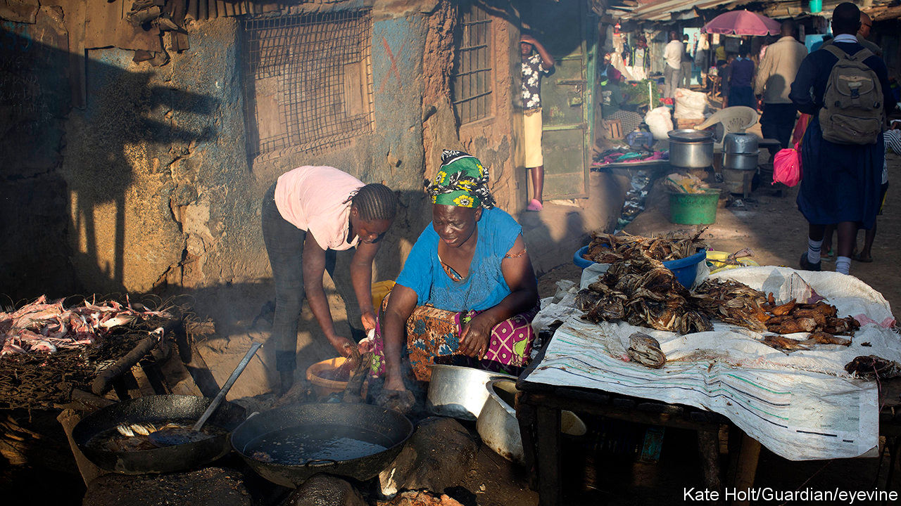
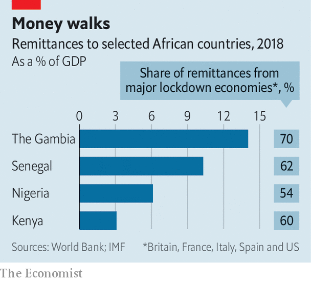

## A cash cow dries up

# Covid stops many migrants sending money home

> Red tape makes matters worse

> Apr 16th 2020KAMPALA

Editor’s note: The Economist is making some of its most important coverage of the covid-19 pandemic freely available to readers of The Economist Today, our daily newsletter. To receive it, register [here](https://www.economist.com//newslettersignup). For our coronavirus tracker and more coverage, see our [hub](https://www.economist.com//coronavirus)

WHEN A VIRUS spreads, so does hardship. A partial lockdown in Uganda has forced Barbara Nakyewa to close her hair salon in Kampala, the capital. Half a world away, in Philadelphia, her husband’s work as a lorry driver has dried up. He used to send home about $80 a month. Now he has not a cent to spare. Each morning Ms Nakyewa cooks porridge for her five children from a dwindling bag of maize, hoping for a government food handout.

Remittances are falling sharply across Africa. At one payments company, transfers from Britain to east Africa may have fallen by 80%. Another has seen flows from Italy to Africa drop by 90%. The effects are painful. Remittances bring much-needed cash directly to millions of families. They are also one of the continent’s main sources of foreign currency. In 2018 officially recorded remittances were worth $46bn in sub-Saharan Africa, far more than foreign direct investment of $32bn that year. The OECD, a club of mostly rich countries, reckons undeclared remittances could be worth another $16bn-35bn a year.

Some countries are particularly exposed (see chart). In Lesotho remittances are worth almost 16% of GDP. In Senegal they amount to 10% of GDP. Half of that comes from France, Spain and Italy, where nearly everyone is locked down. In Nigeria, where they are usually worth 6% of GDP, inflows dropped by half in February, says the central bank.

The virus and the global economic shutdown are hitting remittances with multiple blows. Migrants’ incomes have plummeted. Many work in industries that have almost completely shut down, such as construction, restaurants and hotels. They are often ineligible for welfare or stimulus payments. Many are sent packing if they lose their jobs—or sometimes just because they are African. Saudi Arabia has been deporting thousands of Ethiopians.

Sending money has been made tougher, too. Most payments still begin with cash being dropped off in person, often at a corner shop that doubles as a money agent. Many of these shops are now closed. Picking up the cash in Africa is harder because of lockdowns there. Mobile and online payments are standing up better, but they make up only about 15-20% of remittances; switching to digital is not always easy, since opening an account can require identity documents, proof of address, and in many European countries a work permit or residence visa.

The virus causes trouble in other surprising ways. Many money-transfer firms routinely fly stacks of banknotes via the Middle East to their African agents. They cannot send the money through the banking system since many Western banks refuse to transact with African remittance firms because of onerous American anti-money-laundering regulations. This is one reason why remittances to Africa are more expensive than elsewhere, with fees of about 9% of the transaction against 5% globally. That adds up: getting the price of remittances to Africa down to the average might save $1.8bn a year.

With planes grounded, bundles of banknotes are piling up in remittance shops around the rich world. One operator says that he will have to suspend his business if planes do not soon start flying again. Empty skies also mean informal remittance flows, often carried by passengers, are shrivelling. Bankers in Somalia, where remittances are worth 23% of GDP, say they are running out of notes.

How far remittances fall depends chiefly on the severity of the downturn. Before the global financial crisis they were rising by about 10% a year, but in 2009 they slumped by 5%. The plunge this year will probably be far worse. Remittance flows normally go up when African economies are slumping, because migrants hear more urgent pleas for help from relatives back home. Now they are dropping at the same time as African economies are stumbling. This week the IMF forecast a 1.6% fall in GDP across sub-Saharan Africa. (Annual population growth is over 2%.)

Rich countries are trying to soften covid-19’s impact on poor countries by offering debt relief. But there are other steps they could take that would cost nothing and would make it easier for migrants to help their families back home. Money-laundering regulations could be relaxed to let operators wire money instead of flying it, and make it easier for people to open digital accounts. And how about classifying money agents everywhere as essential services, allowing them to stay open? ■

Dig deeper:For our latest coverage of the covid-19 pandemic, register for The Economist Today, our daily [newsletter](https://www.economist.com//newslettersignup), or visit our [coronavirus tracker and story hub](https://www.economist.com//coronavirus)

## URL

https://www.economist.com/middle-east-and-africa/2020/04/16/covid-stops-many-migrants-sending-money-home
