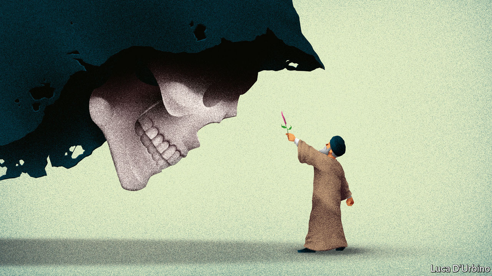

## Quackery in Iran

# Desperate Iranians are getting bad medical advice

> Perfumes and fruit juice are not a cure for covid-19

> Apr 18th 2020

Editor’s note: The Economist is making some of its most important coverage of the covid-19 pandemic freely available to readers of The Economist Today, our daily newsletter. To receive it, register [here](https://www.economist.com//newslettersignup). For our coronavirus tracker and more coverage, see our [hub](https://www.economist.com//coronavirus)

“DRENCH COTTON wool in violet oil before bedtime,” instructs Abbas Tabrizian, then “insert into your anus.” Not only will you smell flowery, you will ward off covid-19, says the Iranian ayatollah, who runs a popular online shop called the Islamic Medical Centre. Hossein Ravazadeh, another prominent quack, recommends bitter gourd oil dropped into the ears twice a day. If those remedies sound a little too uncomfortable, one could dab an ointment called the “Prophet’s perfume” under the nose, or drink a concoction of fruit juices.

None of this works, of course. There is as yet no cure for covid-19. But as the death toll mounts in Iran, home to one of the world’s worst outbreaks, desperate people are turning to alternative medicine. The country’s 15,000 attaris, or Islamic apothecaries, report a roaring trade. Their medicinal herbs and spices are an affordable substitute for scarce and costly drugs, which are difficult to import because of American sanctions. Palliatives such as peppermint arak are cheaper than aspirin—and work just as well, suggest some of Iran’s leaders.

Ayatollah Ali Khamenei, the supreme leader, says covid-19 might be the work of jinns (evil spirits) working with America. He champions alternative medicine as zealously as he spurns Western imports. His most trusted adviser, Ali Akbar Velayati, heads the Traditional and Islamic Medicine Group at the Academy of Medical Sciences in Iran. Both extol Avicenna, a Persian physician from the 11th century who attributed illness to an imbalance in bodily fluids, and prescribed herbs for relief. Under their leadership, Iran’s best medical schools have opened departments of homeopathy. The health ministry requires apothecaries to study it for a year before getting a licence.

All this quackery gives the virus a free pass. Several top clerics have died after relying on herbal remedies. They include Mahmoud Hashemi-Shahroudi, an ayatollah who was tipped to succeed Mr Khamenei, and Mohyeddin Haeri-Shirazi, another firebrand. In March a junior cleric, Morteza Kohansal, posted a video of himself in a hospital ward, not wearing any protective gear, applying the Prophet’s perfume to covid-19 patients. Hundreds of Iranians have died from drinking high-proof alcohol, which is wrongly believed to kill the virus. Mr Velayati went into self-isolation after showing symptoms of covid-19.

The more rational parts of Iran’s leadership are speaking out, denouncing charlatans and scams. Unauthorised clerics are “engaging in the darkness of superstition and ignorance”, said the health ministry. Police have raided Mr Tabrizian’s warehouses. On April 4th they arrested Mr Kohansal, who has since been released. Many quacks are still out there, peddling bad medicine in the name of Islam. ■

Dig deeper:For our latest coverage of the covid-19 pandemic, register for The Economist Today, our daily [newsletter](https://www.economist.com//newslettersignup), or visit our [coronavirus tracker and story hub](https://www.economist.com//coronavirus)

## URL

https://www.economist.com/middle-east-and-africa/2020/04/18/desperate-iranians-are-getting-bad-medical-advice
