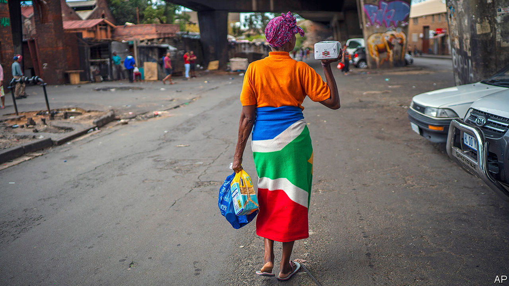
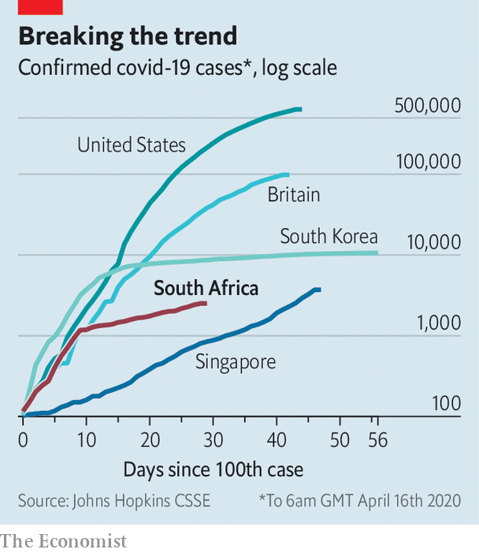

## Don’t trust the internet

# What South Africa learned from AIDS

> Experience of a previous pandemic informs the fight against covid-19

> Apr 16th 2020JOHANNESBURG

Editor’s note: The Economist is making some of its most important coverage of the covid-19 pandemic freely available to readers of The Economist Today, our daily newsletter. To receive it, register [here](https://www.economist.com//newslettersignup). For our coronavirus tracker and more coverage, see our [hub](https://www.economist.com//coronavirus)

IN ALMOST EVERY year of the past two decades more than a third of deaths in South Africa have been AIDS-related. Thabo Mbeki, the president from 1999 to 2008, swallowed a crank theory he found online that the human immunodeficiency virus (HIV) does not cause AIDS, which it does. He delayed life-saving treatment, cutting short hundreds of thousands of lives. The pandemic struck down adults in their productive prime, leaving grandmothers to raise orphans. Today South Africa still has more people infected with HIV than any other country.

Yet that pandemic has given South Africa vast knowledge of how—and how not— to tackle infectious diseases. “HIV/AIDS was a training ground for what we’re doing,” says Salim Abdool Karim, an epidemiologist who leads a group of doctors advising the government on the covid-19 pandemic. As a result of its tragic past, South Africa is deploying a unique strategy in the present—one that, if successful, may prove influential in other countries.

HIV has shaped South Africa’s response in two main ways, says Professor Karim. The first was to convince politicians to listen to medical experts and act quickly. The current president, Cyril Ramaphosa, has done just that. Social-distancing measures were introduced on March 15th, followed by a national lockdown on March 27th. “I failed miserably” to convince Mr Mbeki of the seriousness of HIV, reflects Professor Karim. “This government is much easier to work with.”

Restrictions seem to have had an effect. In the week to March 28th the number of confirmed cases quadrupled. But it took 17 days for the reported tally to double after that date. What looked at first like a Britain-style trajectory has come to appear more like South Korea’s (see chart). Confirmed cases depend on the number of tests, but Mr Karim believes that the deceleration reflects reality and that it is mostly due to the government’s measures.

To keep flattening the curve will require applying the second lesson from the HIV epidemic, he says. “You need to go house to house, be in the community.” Once South Africa stopped waiting for people to show up at hospitals with AIDS and sought to prevent or treat HIV, it slowed that pandemic. To screen, test and trace people with covid-19, South Africa has recruited about 30,000 community health workers. Many were already working in projects to prevent HIV or trace the contacts of people who are infected with tuberculosis.

Hundreds are being sent out in the Cape Flats, sprawling townships on the outskirts of Cape Town. In these poor, dense areas “self-isolation is just not feasible,” says Neal David, the doctor in charge of screening. Once a positive result for covid-19 is identified, his teams help the resident with medical care and, if necessary, quarantine. Those living in surrounding homes will be screened and potentially tested.

The results of the programme will help determine whether the lockdown is eased after April 30th, its provisional end date. The government wants to screen 10% of South Africa’s population, almost 6m people, before then. Such screening will need to be coupled with more testing. After a slow start the government aims to increase testing in its own laboratories to 10,000 per day by the end of the month, in addition to the thousands of tests that are being done in private facilities.

The doctors advising the government recognise that South Africa can only delay, rather than avoid, an eventual escalation in cases. But their aim is to buy the country time, so it can add critical-care beds, prepare quarantine facilities and build field hospitals. “We can’t pretend we are going to dodge the bullet,” says Dr David. “That would be naive.”

The public-health measures should also give South Africa time to organise an economic response. Before the pandemic the country was in its second recession in two years and unemployment was close to 30%. Things are now even worse. The central bank has slashed interest rates. But the rest of the government has been missing in action. There has been little financial help for those most in need.

This is not for a lack of options. The Democratic Alliance, the main opposition party, has proposed a 300bn rand ($16bn) stimulus package that would include 50bn rand in direct cash payments to the poorest South Africans via the social-grant system. Most of this would be funded by new borrowing from institutions such as the IMF. Tito Mboweni, the finance minister, says that he has been in discussions with international lenders. But he is reluctant to borrow if the money comes with strings attached, reflecting concerns in the ruling African National Congress (ANC) that this would dilute the country’s sovereignty.

The slow economic response could jeopardise the impressive public-health work. Parts of the Cape Flats have seen violent protests, with residents demanding food parcels. There are many reports of beatings by police and soldiers in townships. Those pushed deeper into poverty may not take kindly to the state knocking on their doors.

Across the world covid-19 has held up a mirror to societies, revealing their virtues and their flaws. South Africa has world-class scientists and doctors, many of whom won their spurs fighting AIDS. It has vibrant NGOs, full of community activists keen to help where the state has failed. But it has shocking levels of poverty and violence—legacies of apartheid and, more recently, misrule by the ANC. In responding to covid-19 South Africa is drawing on its past. It is also battling it. ■

Dig deeper:For our latest coverage of the covid-19 pandemic, register for The Economist Today, our daily [newsletter](https://www.economist.com//newslettersignup), or visit our [coronavirus tracker and story hub](https://www.economist.com//coronavirus)

## URL

https://www.economist.com/middle-east-and-africa/2020/04/16/what-south-africa-learned-from-aids
