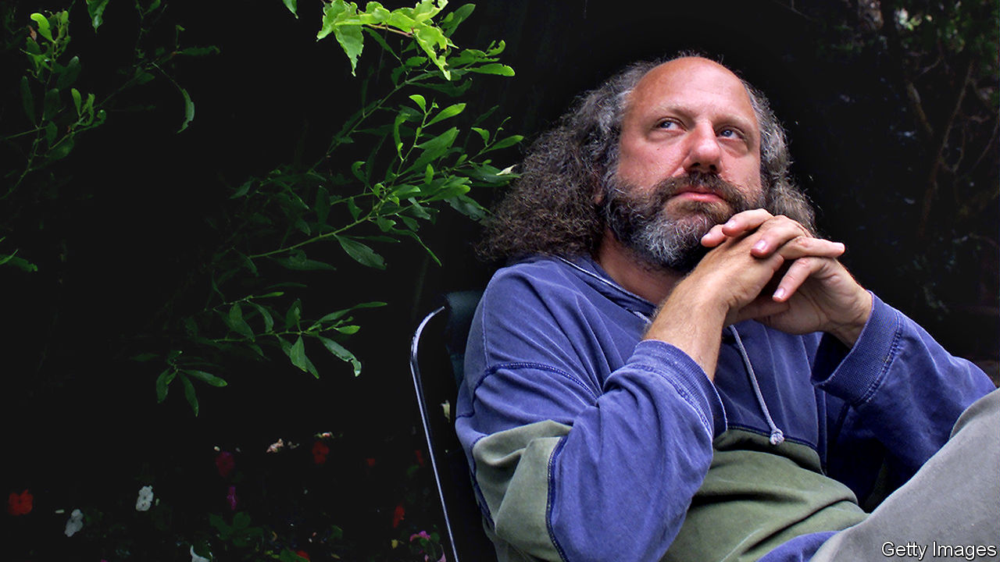

## Mr Music Man

# Hal Willner died on April 7th

> The music producer was 64

> Apr 16th 2020

NEVER MIND that he was too young ever to have seen anything like it, he’d never heard anything like it either. The fans shrieking, the popping flash bulbs, the mics swimming with feedback. More than 50 years later, he told a reporter that hardly a fortnight went by without him recalling that Beatles gig in Philadelphia’s Convention Hall in 1964. “Well, shake it up baby. Twist and shout. Come on, come on, come on now...” For the eight-year-old nerd who’d been offered a ticket to the concert by a customer in his father’s deli, shaking it up was not just an affirmation of life, it became a talisman against dying.

Death played a big part in the making of Hal Willner. His father, Carl, who was born in Poland in 1923 and is still alive, survived two ghettoes, four labour camps and three death camps—Auschwitz, Buchenwald and Dachau. An SS guard tattooed the number on his arm. After the war Carl and his younger brother, Chiel, emigrated to America. Carl had just $2 in his pocket. The brothers went on to open Hymie’s delicatessen (named after their father) in Philadelphia. That 80 other members of the Willner family did not make it became a fixture in the carousel of family memories. It explained everything, Hal later said. He retreated into records, drawing cartoons, locking himself in his room and talking to himself.

In 1974, just as his father was thinking of selling Hymie’s to become a stockbroker, the 18-year-old record fiend started college in New York. He got a part-time job as assistant to Joel Dorn, who had produced popular albums for Bette Midler and Roberta Flack. The city then was bubbling with experimental comedy and the beginnings of punk. This was just as it was heading towards financial crisis and before the beautiful people with their shiny teeth were being photographed every night at Studio 54. New York was rough, he liked to say. It had a smell about it. The block he lived on had a gay bathhouse and the small midtown recording studio he rented soon filled up with posters of Laurel and Hardy, Pop-Eye puppets, Holocaust memories and a music box that played Karlheinz Stockhausen, a gift from Frank Zappa. Mr Willner, who had a mind like a reliquary, revered the music of T Rex as much as he favoured Kurt Weill, Lou Reed and Thelonious Monk.

Since the mid-20th century the music producer has become an iconic figure in the cultural world, as much impresario as director, bringing together singer and songwriter and conjuring up the character of an album as a living entity. The producer is the ship’s captain, magician and masterchef all rolled into one. As one friend of his liked to say: “The producer is in charge of everything.”

The first big project he dreamed up, aged 24, was to reimagine the music Nino Rota had composed for the films of Federico Fellini. He signed up Blondie’s Debbie Harry and Wynton Marsalis, then a promising young trumpeter who was not even 20, and flew to Rome to ask Fellini for the rights. It was like meeting Dickens, he later recalled. The two discovered they shared a passion for Laurel and Hardy. They bonded further over a multi-course Roman lunch and drove around the city before the director dropped him off with the words, “I leave you to your destiny.” La dolce vita never seemed quite the same after that.

With its jazz and pop bands, its congas and its steel drums, “Amarcord Nino Rota” showed him what was possible, not so much with composing new tunes, but with music that had already been written: imaginative pairings of musicians and instruments and the breaking down of barriers between musical aeons and musical genres: Lucinda Williams, a luscious American country singer, crooning Irish shanties like “Bonnie Portmore” or Marianne Faithfull, the chanteuse with the coal-tar voice—perfect for the music of underground Weimar Berlin—reimagining “The Ballad of the Soldier’s Wife” by Kurt Weill.

In 1980 he became the music co-ordinator for the sketches of “Saturday Night Live” (SNL), which allowed him to mine his musical memory and gave him a regular income while he worked on one-off projects like marrying up Scarlett Johansson, Courtney Love and the emcee from “Cabaret”, Joel Gray, for a charity evening at Carnegie Hall to raise funds for AIDS victims in Africa. Ms Faithfull, with whom he worked on putting music to the work of Gregory Corso, the last of the great Beat poets, described as him a “curator of souls, hipster, producer of miraculous albums” He never became an industry giant, but he gained a cult following, the Los Angeles Times said, “revered by a small but passionate confederacy of aficionados, critics and musicians”.

Like so many who had grown up in the shadow of the second world war, though, he knew that the difference between being OK and not OK was paper thin. As music and music production became increasingly computerised, he saw that he was no longer the new kid on the block. Death, which his musical energy had succeeded in banishing, now slunk back, first among his mentors and then his friends.

Back in November, in between swinging punches at Donald Trump and Harvey Weinstein, his Twitter feed became a roll-call for the recently departed and a roster of just how many had called him a friend, starting with rock writer Nick Tosches. A salute to Michael Pollard, the actor with whom he worked on Terry Southern’s “Give Me Your Hump”, was followed by one to composer Irving Burgie and Stacey Foster of SNL. Then it was the turn of Monty Python collaborator Neil Innes on New Year’s Eve, McCoy Tyner for so long part of the John Coltrane Quartet, and Danny Thompson who played flute, alto sax, baritone sax and bassoon. On March 30th he was sending love to country singer John Prine, who was dying of coronavirus. The next week he, too, died of the virus, just a couple of days after he turned 64; the Beatles, with him to the end.■

## URL

https://www.economist.com/obituary/2020/04/16/hal-willner-died-on-april-7th
