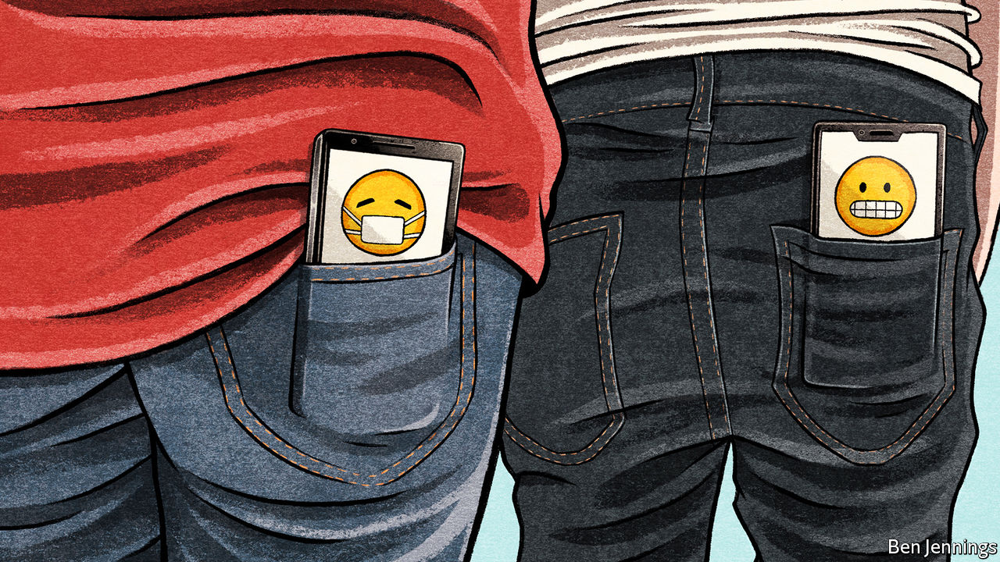

## Covid-19

# App-based contact tracing may help countries get out of lockdown

> But only as part of a bigger system

> Apr 16th 2020

Editor’s note: The Economist is making some of its most important coverage of the covid-19 pandemic freely available to readers of The Economist Today, our daily newsletter. To receive it, register [here](https://www.economist.com//newslettersignup). For our coronavirus tracker and more coverage, see our [hub](https://www.economist.com//coronavirus)

ON APRIL 10TH Apple and Google did something unusual: they announced plans to work together. These two firms exert varying degrees of control over almost every operational smartphone on Earth—Apple through its production of both iPhones and the software that runs them, and Google thanks to a range of programs found in nearly all of the iPhone’s Android-powered rivals. As a result, the two companies have access to a planet-spanning network of sensors and computing power some 3.5bn devices strong. Their plan is to combine their assets to assist the tracking of the covid-19 pandemic.

Normally, collaboration between two such oligopolists would raise eyebrows to the roof. But these are not normal times. Tracing who is infected is essential to controlling the transmission of SARS-CoV-2, the virus causing the pandemic—and the ubiquity of mobile phones makes them plausible agents for doing so. The two firms’ networks will be joined together by a unifying update to their Bluetooth short-range wireless protocols. Bluetooth lets nearby devices communicate. The unification means it will be easier for others to build contact-tracing apps that work, without modification, on either platform.

America, Britain, Germany, Ireland and many other countries were already building apps to track infection. They will now rewrite their software to take advantage of this new arrangement. These apps will work by broadcasting, from each phone they are installed on, a string of numbers and letters unique to that handset. These broadcasts will be detectable by any other phone within Bluetooth range (about nine metres) that has the same app installed. An app will also, simultaneously, listen for strings that other phones are broadcasting. Each phone carrying such an app will record all the character strings it hears, and thus all the phones it has been close to. For reasons of security (and because Apple’s and Google’s underlying cryptographic protocols demand it), the string of characters a phone broadcasts will change every 15 minutes. Also, at least to start with, the records of strings received will be stored only on the receiving phone. That makes hacking or abusing the system hard.

If, however, a phone-user develops symptoms and then tests positive for covid-19, this arrangement changes. Different strings of characters—one for each day that the person in question was potentially infectious—are now broadcast by the authorities to every other app in the network. These strings, which Apple calls diagnosis keys, command all apps so contacted to search records collected since that person’s putative time of infection for signs of proximity to the infected individual’s phone.

What happens when a match is found is up to whoever deployed the app. A good response, though, would be to notify the person of interest, and ask him or her to get in touch and arrange to be tested. This way, infections will be detected quickly, and infected individuals offered suitable advice—and possibly quarantined.

It all sounds like high-tech wizardry. And it is. But it is important not to get carried away. Smartphone contact-tracing is just one part of a broader infrastructure that must be built to track down SARS-CoV-2 faster than it can spread through the population. It will not, for instance, be worth much unless ways of testing and diagnosing people en masse are also rolled out. Without these, there will be no information to feed back into the app network about who may be spreading the virus.

Ideally, such infrastructure will be built around testing stations that people can visit to have their noses and throats swabbed. Countries would in any case be well advised to construct these facilities, even if they do not deploy contact-tracing apps. Indeed, one option for ending the lockdowns many places are experiencing is to be able to test everyone so frequently that the authorities could be sure the virus was not spreading. This would be expensive, though, and deeply unpleasant (think having a Q-tip shoved up your nose once a week for the next two years). Contact-tracing helps to direct testing more precisely at those likely to be infected. Using apps helps speed this up.

But only, though, if phone users are willing to adopt the app. Here, Singapore’s experience is salutary. Its government rolled out a contact-tracing app, TraceTogether, on March 20th. So far, however, this has been downloaded by only a sixth of the country’s population—barely a quarter of the 60% epidemiologists reckon is needed if it is to be effective in breaking the local epidemic. Perhaps the most used contact-tracing app in the world is that deployed by Iceland. Yet Rakning C-19 (“Rakning” is Icelandic for “tracking”) is used by only 40% of the country’s 364,000 people. If such a small, homogenous place cannot reach the required 60% download rate, what hope is there for large, diverse ones like America?

If tracing apps are to be widely adopted, they must make people want to use them, says Ciro Cattuto, an epidemiologist at the University of Turin, in Italy. “People need to feel like they are contributing to a common good,” he observes. “They need to feel empowered.” Maintaining public trust will be crucial. Since any such app will need to be updated as the situation develops, that trust can be maintained only by extreme transparency, Dr Cattuto says. This means no function creep.

It is also important not to invest too much in the idea that automation is everything. Apps and phones can certainly provide location and proximity data, but only human tracers can bring human intelligence to bear on the matter. For example, in late January Taiwan’s contact-tracing team successfully used a mixture of data from the country’s national-health-insurance system and its mobile-phone firms to track down the source of infection for the island’s first covid-19 death—the unlucky taxi driver had picked up a Chinese businessman at the airport. They did this without resort to Bluetooth tracking apps, albeit that their ability to scrutinise the data they needed required the invocation of national-emergency powers.

As well as developing high-tech networks for tracking infection, information-technology firms should therefore also be writing software that improves the productivity of human contact-tracers like Taiwan’s. Interview forms for potential contacts, visualisation dashboards for relevant data, telemedicine for remote diagnostics—all these would be useful. Apps built using Apple’s and Google’s new protocol ought to focus on providing information to technologically empowered human contact-tracing teams, not on automating the whole process. ■

Dig deeper:For our latest coverage of the covid-19 pandemic, register for The Economist Today, our daily [newsletter](https://www.economist.com//newslettersignup), or visit our [coronavirus tracker and story hub](https://www.economist.com//coronavirus)