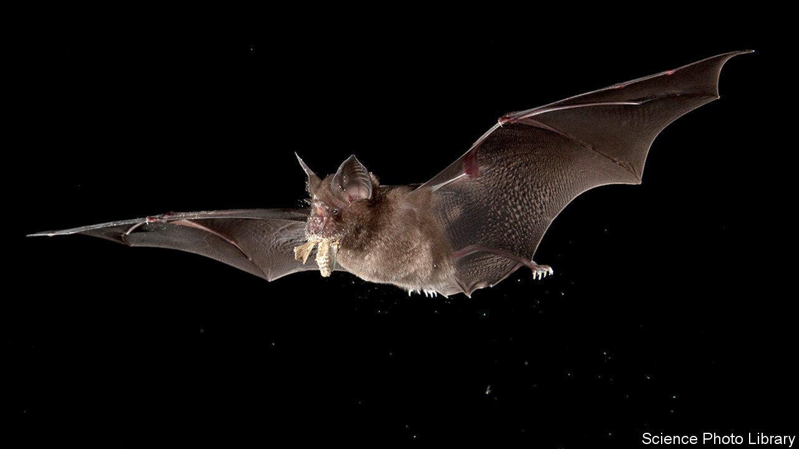

## Disease transmission

# Bats spread viruses

> But they are no worse in this respect than other species

> Apr 18th 2020

Editor’s note: The Economist is making some of its most important coverage of the covid-19 pandemic freely available to readers of The Economist Today, our daily newsletter. To receive it, register [here](https://www.economist.com//newslettersignup). For our coronavirus tracker and more coverage, see our [hub](https://www.economist.com//coronavirus)

WHICH ANIMAL SARS-CoV-2 leapt from to infect human beings remains unknown. But the evidence suggests that bats were involved at some point—perhaps not as the immediate source of the virus, but probably as the reservoir from which it ultimately came.

Almost certainly that was true of the virus which caused the original SARS outbreak, in 2002. Though this was transmitted to people by palm civets, they probably caught it from horseshoe bats (pictured). MERS, another coronavirus, is similarly suspected of starting in bats, though the immediate source of human infection is camels. Bats are also reckoned to be behind the spread of Ebola and Marburg fevers, which are viral infections as well, though not caused by coronaviruses. And vampire bats famously carry another virus, rabies.

The idea that this may not be a coincidence has led people to ask if there is something special about bats which encourages the evolution within them of viruses predisposed to jump the species barrier and infect other sorts of animals. At the moment, the evidence is mixed.

In favour of the idea is an experiment conducted recently by Cara Brook of the University of California, Berkeley, and published in February in eLIFE. This suggests a possible mechanism. Some bats have unusual immune systems, in which an antiviral process known as the interferon pathway is always active, rather than being switched on in response to infection. Dr Brook and her colleagues conducted experiments on cells from bats that have this arrangement and on others which do not (and also on cells from monkeys, as a control). They concluded that always-on interferon pathways probably do speed up viral evolution. That would make bats more abundant sources of virulent new viruses than other groups of mammals.

Against the idea, however, is work published this week in the Proceedings of the National Academy of Sciences by Nardus Mollentze and Daniel Streicker of the University of Glasgow. Dr Mollentze and Dr Streicker found that the number of viruses which have passed to people from 11 orders of mammals and birds is pretty much proportional to the number of species in each order. Bats are the second-most diverse mammalian order, after rodents. “It is therefore not surprising”, Dr Mollentze observes, “that as a group they are associated with a large number of viruses.” Although bat immune systems do indeed have the unusual features that interested Dr Brook and her colleagues, Dr Mollentze and Dr Streicker found no evidence these caused bat-associated viruses to be more numerous or more prone to infect people than viruses associated with other animal groups.

This study is in line with work done specifically on coronaviruses by Tracey Goldstein of University of California, Davis. In 2017 she and her colleagues published a piece of research in which they had tested for coronaviruses in bats, rodents and primates (including people) in 20 countries in Africa, South America and Asia. Individual bat species normally had between one and five types of coronavirus. (For comparison, human beings have seven, including the newly emerged SARS-CoV-2.) Scale that up for the 1,400 different species of the animals and it means there are potentially more than 3,000 coronaviruses circulating in bats. This certainly increases the odds that bats will be responsible for generating a coronavirus dangerous to people. But only because there are lots of them.■

Dig deeper:For our latest coverage of the covid-19 pandemic, register for The Economist Today, our daily [newsletter](https://www.economist.com//newslettersignup), or visit our [coronavirus tracker and story hub](https://www.economist.com//coronavirus)