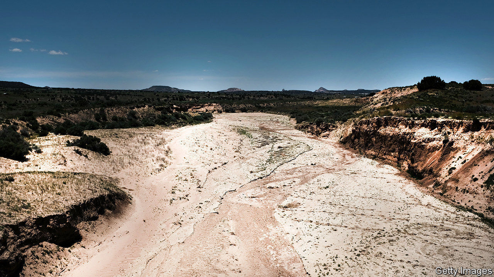
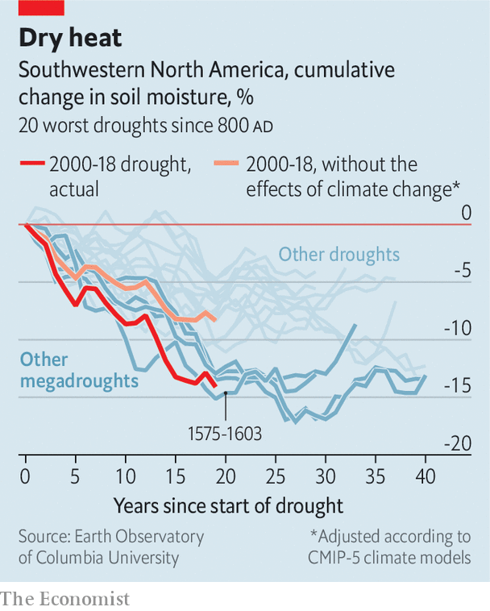

## Climate change

# The American west’s drought is its second-worst for 12 centuries

> People are partly to blame

> Apr 18th 2020

THE SOUTH-WEST of the United States, together with adjacent parts of Mexico across the Rio Grande, is one of the driest parts of the North American continent. But, over the past two decades, even that expected dryness has been taken to the limit. According to Park Williams, who works at Columbia University’s Lamont-Doherty Earth Observatory, the current lack of rainfall in the area constitutes a megadrought of a magnitude seen on only four other occasions in the past 1,200 years.

Dr Williams and his collaborators studied the annual growth rings of 1,586 ancient trees from Oregon and Montana all the way down to the northern reaches of Mexico, in order to reconstruct soil-moisture patterns going back to 800AD. During warm, wet years trees grow fast, producing wide rings. During cold, dry ones they grow more slowly, producing narrow rings. During a drought, a tree might not grow much at all.

As they describe in this week’s Science, the team identified dozens of droughts over the centuries in question. But four stood out: those of the late 800s, mid 1100s, 1200s and late 1500s. They then took the mean soil-moisture value for the current drought (which has lasted 19 years so far) and compared it with sequential 19-year averages from the previous four, one of which lasted nearly a century. This showed that the region is already drier than it was during the first three of the previous megadroughts, and is on a par with the event of 1575-1603.

In a world where human actions are driving temperatures up, Dr Williams and his colleagues wondered how much people are to blame for this state of affairs. To estimate that, they turned to climate modelling.

Climate models are able to re-run the past with and without the warming effects of human activity, offering a way to compare what actually happened with what might have done. In their simulated world in which anthropogenic emissions had not ramped up the greenhouse-gas effect, the team found that a drought did indeed still engulf the western reaches of North America during the first two decades of the 21st century. But this fictitious dry spell was considerably less severe than the real one—ranking 11th rather than 2nd in the period under study (see chart).

Worse still for those who live in the area, Dr Williams's research also confirmed suspicions that the area’s water-management policies, which govern abstraction rates from its rivers and aquifers, and which are mostly set on the assumption that 20th-century rainfall levels represent historical normality, are actually out of kilter. He found that, compared with most of the previous millennium, the 20th century was a period of abundant moisture. With nature providing less water than usual, and people taking more than seems wise, the future of the region looks parched indeed.

Correction (April 23rd 2020): A previous version of this article mistakenly referred to Park Williams of the Lamont-Doherty Earth Observatory in New York state as “Dr Parker”. Apologies both to readers and to the man himself.

Sign up to our fortnightly climate-change newsletter [here](https://www.economist.com//theclimateissue/)