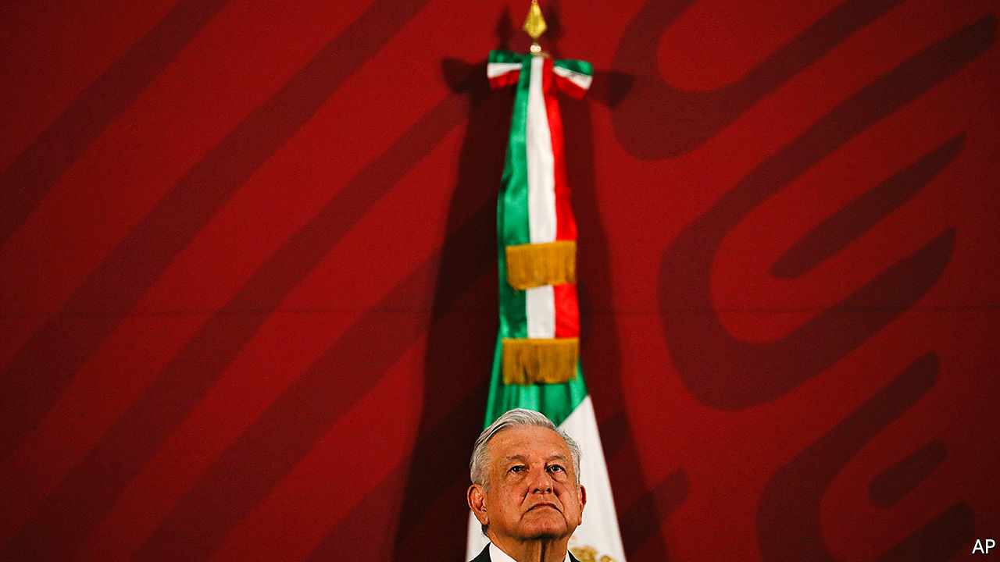

## Shoestring king

# Mexico’s bazooka-shy president

> Andrés Manuel López Obrador is reluctant to spend money to fight a recession

> Apr 16th 2020MEXICO CITY

NO ONE CAN accuse Andrés Manuel López Obrador of panicking. As covid-19 sickened people and ravaged economies across the globe, Mexico’s president snapped selfies with supporters. Now that the cost to Mexico’s economy is becoming clear, he is sticking with the idiosyncratic mix of populism and austerity that has guided policy since he became president in December 2018. His stubbornness may worsen what could be Mexico’s deepest recession in almost a century. That could wreck the popularity of a leader whose approval ratings have been among the world’s highest and end his dream of a pro-poor “fourth transformation” of Mexico.

The country’s economy, which shrank by 0.1% last year, is among the most vulnerable in Latin America. It depends on trade with and remittances from the United States, tourism and exports of oil, all of which are being battered by covid-19. In the four weeks to April 6th Mexico lost 347,000 formal jobs, more than the total created in 2019. The IMF expects GDP to contract by 6.6% this year. In Latin America only Venezuela’s economy will shrink more.

Governments the world over are fighting recessions with fiscal bazookas. Mr López Obrador, usually known as AMLO, has resisted. Although his plans for transforming Mexico call for lavishing money on infrastructure and the poor, he has been committed to maintaining fiscal stability. The finance ministry, which had aimed for a surplus before interest payments this year, now expects a smallish deficit of 0.4% of GDP. AMLO said it was too pessimistic.

To combat recession, he has deployed a peashooter. Mexico’s Congress set up a fund worth 0.7% of GDP to fight the health and economic crises. The government has created a rainy-day kitty worth 250bn pesos ($10bn), 1% of GDP, by putting together existing funds. AMLO has not said how much of these resources he will spend. Peru, by contrast, has announced a spending plan worth 7% of GDP, according to the IMF, and Brazil’s measures are worth 2.9%. To compensate for his extravagance, AMLO plans to cut further his own salary and that of senior bureaucrats. (He slashed his salary in half at the start of his term, which forced other top salaries down.)

AMLO’s reasons for being bazooka-shy are complex. The left-wing president fears that large debts would give bond buyers (or perhaps the IMF) a hold over Mexico. He has sound reasons for avoiding a Mexican version of rich-country governments’ schemes to replace the salaries of furloughed private-sector workers. More than half of workers are in the informal sector. Most earn a pittance. They would resent big payoffs to richer formal workers. But to offer those workers just the minimum wage (123 pesos a day in most of Mexico) would leave many without enough for rent.

So AMLO is asking firms, themselves reeling from recession, to take the burden. He has told them to keep paying wages and threatened to shame, and maybe fine, those that don’t. Those that lack cash will have to borrow. Nacional Financiera, the main development bank, may provide guarantees that would allow commercial banks to reduce interest rates on such loans to small and medium-sized firms (PYMEs), says Luis Niño de Rivera, president of Mexico’s banking association. The largest companies will get no extra help. The government rejected pleas from business organisations for a 90-day deferment of corporation tax, which is calculated based on the prior year’s profits.

Some businessmen, who are among AMLO’s fiercest critics, suspect his intent is to weaken them. “I understand that those who for a long time applied the policy of privatising profits and socialising losses do not share our vision of development,” he explained in defence of his cheeseparing fiscal policies. Towards microempresas, firms that have fewer than ten workers but which employ two-fifths of the workforce, the president is more generous. Their bosses are eligible for 25,000-peso ($1,000) public loans. More help is promised to the country’s 200,000 fishermen.

AMLO claims, implausibly, that his policies will create 2m new jobs during the rest of 2020. He is pressing ahead with pet projects, such as the Maya tourist train across southern Mexico. But the course he has chosen is risky. Money for microempresas will not start flowing until early May, by which time many may have shut down. Loans to PYMEs, which are more productive, will take longer. Many may not survive to jump-start an economic recovery.

This approach has alienated prosperous northern states. Four governors have called for changes to fiscal rules under which their states pay more in tax than they get in government spending. Chambers representing 20,000 firms in Tamaulipas say their members will not pay taxes. There is talk of northern separatism.

AMLO is one of the few world leaders whose approval rating has dropped during the pandemic. According to one poll, it fell to 47.5% in April from 55.7% February. An economic slump is bound to push it down further. His Morena party risks losing in congressional and state elections due next year. That will put his fourth transformation in jeopardy.■