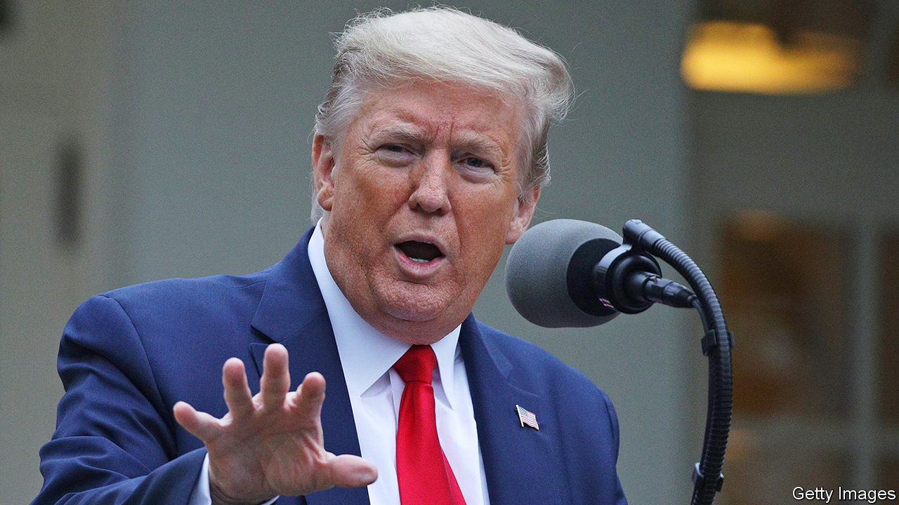
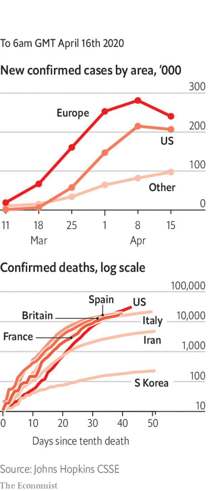

# Politics this week

> Apr 18th 2020

Donald Trump said that data suggested America was past the peak of the covid-19 outbreak, as he mooted guidelines to reopen the economy. The president created a council to look at the options, some of whose members were surprised to be included. Earlier he started a row with state governors who are trying to co-ordinate the lifting of some restrictions. He claimed they needed his permission; the constitution says they don’t. When a journalist asked Mr Trump what he had done all February to prepare for covid, he called her “disgraceful”.

Mr Trump said he would suspend American funding to the World Health Organisation, accusing it of pushing “China’s misinformation” on the coronavirus. See [article](https://www.economist.com//science-and-technology/2020/04/16/the-world-health-organisation-is-under-fire-from-americas-president).

Bernie Sanders bowed out as the sole remaining challenger to Joe Biden and endorsed his hitherto rival for president. Mr Sanders said he was endorsing Mr Biden now so they can unite the Democratic Party in trying to defeat Mr Trump in November’s election. See [article](https://www.economist.com//united-states/2020/04/18/bernie-sanderss-endorsement-of-joe-biden-leaves-democrats-in-array).

A sailor serving on the USS Theodore Roosevelt died from covid-19. More than 600 crew members have now tested positive, including the former captain, who was sacked by the navy after he asked for help. He was fired for seeking assistance outside the proper lines of communication.

South Korea went ahead with legislative elections despite the covid-19 epidemic. Turnout was high. The ruling Minjoo (Democratic) party won an outright majority in the unicameral national assembly. Before the election Minjoo had been governing in coalition with several smaller parties. See [article](https://www.economist.com//asia/2020/04/16/a-landslide-for-south-koreas-ruling-party-in-parliamentary-elections).

Migrant workers protested in Mumbai and other Indian cities as the government extended the country’s three-week-old lockdown by a further three weeks. The workers want to be able to return to their home villages, but are not able to because of the suspension of public transport. The government did relax restrictions on farming and construction work.

Bangladesh hanged Abdul Majed, one of a group of former army officers who killed the country’s founding father, Mujibur Rahman, during a military coup in 1975. Majed had been convicted of murder in absentia in 1998, and had been in hiding in India until last month. The current prime minister, Sheikh Hasina Wajed, is Mujib’s daughter.

The Saudi-led coalition fighting the Houthi rebels in Yemen began a unilateral two-week ceasefire aimed at stemming the spread of covid-19. Shortly after the move was announced, Yemen confirmed its first case of the virus (though it has carried out little testing). Years of war have devastated the country’s health system. See [article](https://www.economist.com//middle-east-and-africa/2020/04/18/saudi-arabia-looks-for-an-exit-to-the-war-in-yemen).

Despite calls for a ceasefire in Libya, fighting between the internationally recognised government and forces led by Khalifa Haftar, a rebellious general, continued. The government seized two towns, Surman and Sabratha, on the coast. But it struggled to deal with a power cut in the besieged capital of Tripoli.

Iraq’s president nominated Mustafa al-Kadhimi, the intelligence chief, as prime minister. Mr Kadhimi is the third person tapped for the job since November, when Adel Abdul-Mahdi resigned under pressure from anti-government protests. The previous two nominees failed to win enough support in parliament to create a government.

Economic shutdowns are leading to food-price inflation and shortages in several African countries including Zimbabwe, Kenya and Sudan. Aid groups such as the World Food Programme are struggling to respond because of restrictions on movement.

Efforts to contain Ebola in the Democratic Republic of Congo suffered a setback with the emergence of three new cases, the first in 54 days.

The G 20 said its member governments would suspend loan repayments from developing economies until the end of the year. It encouraged private creditors to do the same. Separately, the IMF postponed repayments from 25 countries.

A group including American anti-drug agents and Interpol arrested one of Brazil’s most wanted suspected criminals, Gilberto Aparecido dos Santos (aka Fuminho), in Maputo, Mozambique’s capital. He allegedly trafficked cocaine worldwide as a leader of First Command of the Capital, a gang based in São Paulo, and evaded capture for 20 years.

Several European countries moved to ease their lockdowns. In Spain work was allowed to restart in some factories and on construction sites, and in Italy some small shops were allowed to re-open. Germany is allowing small shops to trade and schools to open; social-distancing measures remain in place. But France and Britain extended their lockdowns into May. Death tolls continued to rise across Europe, but in almost all instances at diminishing rates. See [article](https://www.economist.com//leaders/2020/04/18/fumbling-for-the-exit-strategy).

The European Commission, stung by criticism that it has been absent during the crisis, outlined a roadmap that it hopes EU member states will follow to co-ordinate the easing of restrictions. EU ministers agreed on an aid package of up to €540bn ($590bn) for hard-hit countries. The European Central Bank had said up to €1.5trn was needed.

Boris Johnson was discharged from hospital, where he had been admitted to intensive care. The British prime minister is convalescing at Chequers, an official residence.

Taiwan reported no new coronavirus cases on April 14th, the first such interlude in more than a month. China recorded scores of new cases, including an increase caused by local infections. A cluster of cases was discovered on China’s north-east border with Russia.

Russia reported several record daily surges in new cases, bringing its total to 25,000.

New York City’s cumulative death toll soared past 10,000 as officials added 3,700 previously unrecorded deaths from the disease to the rolls. See [article](https://www.economist.com//united-states/2020/04/18/american-inequality-meets-covid-19).

America’s Supreme Court said it would hold its first-ever hearings by telephone conference, starting next month.