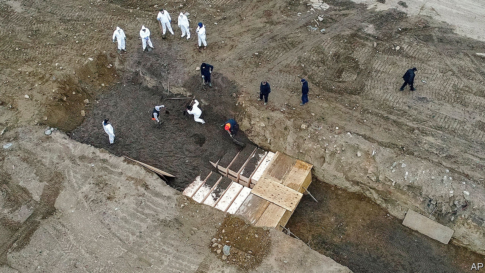
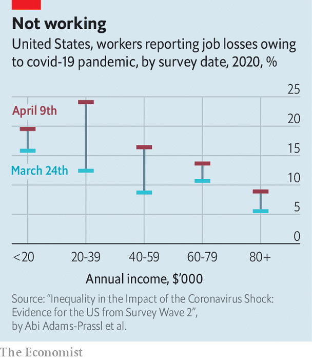

## Unequal protection

# American inequality meets covid-19

> Some already yawning gaps are being pushed farther apart by the virus

> Apr 18th 2020WASHINGTON, DC

Editor’s note: The Economist is making some of its most important coverage of the covid-19 pandemic freely available to readers of The Economist Today, our daily newsletter. To receive it, register [here](https://www.economist.com//newslettersignup). For our coronavirus tracker and more coverage, see our [hub](https://www.economist.com//coronavirus)

THE COVID-19 epidemic in America is two-pronged—a contagious sickness first, followed by an economic malaise. Despite a big stimulus programme from Congress, including the temporary introduction of something like a universal basic income that ought to benefit the poorest disproportionately, it is the least advantaged who are suffering most.

The country is now in the unenviable position of having more covid-19 cases—638,000 confirmed—and deaths (31,000) than any other in the world. At least 17m people, or more than one-tenth of the civilian workforce, have filed for unemployment benefits in the past three weeks. The official tabulations on what is happening will arrive weeks and months from now. But the best available evidence shows that the already yawning divides in American society are widening.

Roughly one in three deaths in America thus far has been in New York City. The brunt of the disease has not fallen evenly there. Data released by the city’s health department on April 6th show that black and Hispanic residents are twice as likely to die of the disease as white city dwellers. That trend has not been confined to America’s largest city. In the few states and cities that have released similar breakdowns of fatalities, an uncomfortable pattern emerges from Milwaukee to New Orleans. Black Chicagoans are five times as likely to die of covid-19 as white ones.

Exactly why this is happening is still an open question. There are elevated rates among African-Americans of chronic conditions such as high blood pressure and diabetes, which are thought to increase the chance of death. Poverty, and its attendant consequences, may also be at play: blacks (and especially Hispanics) are less likely to have health insurance, and may thus avoid seeking testing and treatment. Despite the large differences in mortality, The Economist’s analysis of zip-code level data in New York City shows that neighbourhoods with large black and Hispanic populations only have marginally more testing. Without space to self-isolate, a private car and a job that can be performed remotely, the chances of infection necessarily increase.

A team of biostatistics researchers at Harvard have pointed out that there is an alarming correlation between long-term exposure to fine particulate matter—which damages lungs—and county-level death rates from covid-19, a respiratory illness. An increase of merely one microgram per cubic metre is associated with a 15% increase in covid-19 fatalities. In America, black residents are disproportionately exposed to fine particulate matter. Even after accounting for population density, air pollution and pre-existing health factors like smoking rates and obesity levels, the same analysis shows that race is tied to covid-19 deaths nationwide. For every one standard-deviation increase in the share of Hispanic and black residents, county death rates increase by 16% and 52%, respectively.

It is also uncertain whether this racial disparity would dissipate if the virus spread beyond big cities and into rural parts of the country. If poverty, pollution, pre-existing conditions, and patchy health and social safety nets are leading to excess deaths among minority residents in American cities, then they will apply with no less force to poor whites outside them.

Adherence to social-distancing guidance also seems to differ by income and party affiliation. A recent study by a team of researchers armed with cell-phone-location data found that compliance with the new behavioural guidelines was substantially lower in counties with lower incomes, greater exposure to recent trade wars and higher rates of support for Mr Trump. The few governors who have not recommended shelter-in-place orders as of April 14th are of all Republican-led, largely rural states like Arkansas and South Dakota (where over 500 workers in a pork processing plant recently tested positive for the virus).

Although the uneven health effects of the pandemic are still being worked out, there is little doubt already about where the economic effects have been most severe. Official unemployment numbers are tabulated every month and have not yet incorporated the worst weeks of the economic downturn. When they catch up, the Peterson Institute for International Economics, a think-tank, reckons that they will show an unemployment rate of 20% by early summer—a number not seen since the Great Depression. A survey of 4,000 American workers conducted by a team of European economists found that 16.4% had already lost their job because of the viral shock. For the 20% of American workers least able to work from home, nearly 40% have lost their jobs, according to the survey results. Workers who are younger, poorer or lack a university education have disproportionately lost their source of income (see chart). For some, that has also meant losing their employer-sponsored health insurance in the middle of an epidemic.

The negative effect of these job losses on low-income and precariously employed Americans ripples through their families. Elizabeth Ananat, an economist at Barnard College, and Anna Gassman-Pines, a professor of public policy at Duke University, spent months recruiting hourly service-sector workers with young children in a big American city to study the effect of a new law limiting short-notice schedule changes. In the middle of their survey, the coronavirus hit—ruining their intended study, but providing valuable detailed information about how relatively low-paid workers in hotels and restaurants are dealing with the crisis. Of their sample, 43% had lost their jobs (half of them permanently). Of those, 23% also lost their health insurance. Measures of parental and child mental distress also shot up.

In theory, the safety net should cushion these effects. Compared with those of other rich countries, America’s is less generous, for fear of discouraging work. But now that swathes of the economy are closed off for the good of public health, these worries look less important. In its recent $2.2trn spending bill, Congress temporarily reinforced the safety net—including a $600 weekly top-up on unemployment benefits, a $1,200 cheque for most American adults and a $350bn bail-out fund for small businesses on the brink of closing.

Sensible as this seems, the time before firms and families actually benefit may be quite long. State unemployment offices are contending with extreme levels of claims and antiquated technology. The governor of New Jersey put out a call to programmers fluent in COBOL, a programming language created in 1959, to help fix its office’s back-end software. Of the unemployed service workers in Ms Ananat’s and Ms Gassman-Pines’s sample, only 46% had successfully applied for benefits. Only 4% have actually received them. And while the IRS is expected to start depositing cheques soon, those without a previous tax filing or a bank account (who presumably need the cash most) will have to wait longer.

The roll-out of the small-business bail-out scheme has been bumpy, too, with owners reporting unclear guidance and considerable paperwork. A nationwide survey of small businesses, conducted by a team of economists, found that 43% of companies had closed temporarily, shedding 40% of their employees.

Assessing the long-run effect of the last economic downturn on children, some of America’s leading scholars on poverty concluded: “The near immunity of college-educated families and the large negative consequences for less-educated families mean that the Great Recession increased the already large divide between families at the top and bottom of the income distribution.” There is little reason to doubt that the same dynamic will reappear this time.■

Dig deeper:For our latest coverage of the covid-19 pandemic, register for The Economist Today, our daily [newsletter](https://www.economist.com//newslettersignup), or visit our [coronavirus tracker and story hub](https://www.economist.com//coronavirus)

## URL

https://www.economist.com/united-states/2020/04/18/american-inequality-meets-covid-19
