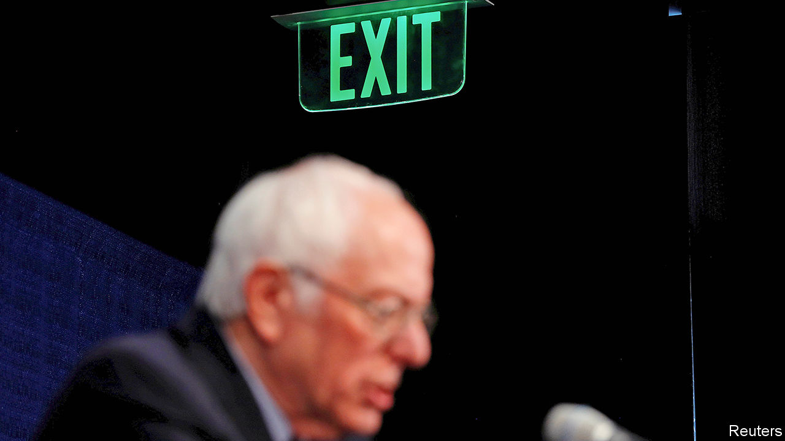

## Berning out

# Bernie Sanders’s endorsement of Joe Biden leaves Democrats in array

> The Democratic Party is not ready for a revolution quite yet

> Apr 18th 2020WASHINGTON, DC

ONE OF THE reasons why Hillary Clinton lost to Donald Trump was that around a quarter of her Democratic rival’s voters spurned her. Most of Bernie Sanders’s disaffected supporters voted for third-party no-hopers or Mr Trump in 2016. Some stayed at home. In an election settled by tiny margins—a few tens of thousands of votes in three rustbelt states where Mr Sanders was popular—it is tempting to wonder what might have happened had he tried a good deal harder to reconcile his supporters to Mrs Clinton than he did.

Having again failed to secure the Democratic ticket, Mr Sanders has sought to forestall a re-run of this scenario. In 2016 he stumped on until he had no mathematical chance of victory; he did not endorse Mrs Clinton until the eve of the party’s convention in July. This time around he did not wait. On April 13th, days after ending his campaign, he endorsed Joe Biden while appearing on a live-stream broadcast with him. “We need you in the White House,” he told the former vice-president.

This completes an astonishing turnabout for both men. Only six weeks ago—or until the votes started coming in from South Carolina—the socialist from Vermont was leading a querulous pack, Mr Biden was flailing, and the prospects of the primary being decided before this year’s convention seemed remote. Now Mr Biden is the presumptive nominee after what has turned out to be the shortest Democratic primary since 2004. The party appears to be unified: Elizabeth Warren, the other tribune of the left, also endorsed Mr Biden this week. So did Barack Obama, in a speech that included almost as much praise for Mr Sanders (“an American original”) as Mr Biden. And because of the pandemic there may be no convention.

The virus is also behind Mr Sanders’s timely concession, Mr Trump’s response to it having renewed Democrats’ dread of disunity and another defeat to him. That is not something Mr Sanders, who at 78 will almost certainly not run again, would want to be laid on him. His endorsement, he told Mr Biden, was intended to help him beat “the most dangerous president in the modern history of this country.”

Mr Biden also deserves some credit. The former vice-president is a poor campaigner—always verbose and now increasingly doddery—who will keep Democrats’ hearts in their mouths to the end. Yet he has a gift for being liked, to which even ornery Mr Sanders is susceptible. He resented Mrs Clinton yet calls Mr Biden a friend. The former vice-president’s political skills are correspondingly far silkier and more effective at building consensus than Mrs Clinton’s were. That is apparent in the show he is now making of deferring to Mr Sanders on aspects of policy.

Mr Biden welcomed Mr Sanders’s support by saying he needed him “not just to win the campaign but to govern.” He also credited him with leading the Democratic drive for a $15 federal minimum wage, which Mr Biden supports. The two men said they would set up joint policy task-forces. This will probably result in some sops to Sandernistas in the forthcoming Democratic platform, perhaps on energy or education policy. That looks like sensible party management. It does not represent a big concession to the left.

Party platforms rarely come to much. And though Mr Biden is running on more left-wing promises than Mrs Clinton, especially on health-care and climate-change policy, he was the most unambiguously moderate contender in the primary and far to the right of Mr Sanders. Though Democrats have generally moved to the left, most do not consider Mr Sanders’s statist vision credible, even where desirable. That is one of the two main reasons why he lost.

The angry response his concession drew from diehard Sandernistas illustrated the other one. “I don’t endorse Joe Biden,” announced the senator’s former press secretary, Briahna Joy Gray, to her quarter of a million Twitter followers. Notwithstanding his well-judged climb-down, Mr Sanders, an independent who has never joined the Democratic Party, has encouraged that insurgent spirit. “I’ve got news for the Democratic establishment. They can’t stop us,” he tweeted after winning in Nevada, at what would prove to be the high point of his campaign. He was probably right, but ordinary Democratic voters, who mostly like their party and don’t want to see it threatened, could and did.

Their drift to the left mirrors a course already taken by their right-wing opponents. Yet Democratic primary voters remain less angry, suspicious of authority and unwilling to compromise than Republicans are. That is why Mr Sanders’s effort to launch a Democratic Tea Party fell flat.

For all the heat and light he has generated over the past five years, this is not a great record. Mr Sanders has not converted Democrats to his pet causes, including above all Medicare-for-all. He has not swollen the party’s vote, by bringing in a promised horde of young and working-class voters. He has not expanded its hard-left faction, representing around a third of the party, from which he drew his support.

His more modest achievement is to have focused and energised that base on a set of issues, vigorously championed by the activist leaders he has inspired. In an interview with the New York Times this week, the most prominent, Congresswoman Alexandra Ocasio-Cortez, sounded almost as reconciled to Mr Biden’s victory as Mr Sanders. She said she would support him though knew she could not change him: “There are limits to what Biden will do and that’s understandable—he didn’t run as a progressive candidate.” She also signalled how temporary this truce will be.

The hard-left does not feel beaten: it never will. Yet with Mr Trump in its sights, it seems to be making its peace with Mr Biden in a way it never did with Mrs Clinton. That is excellent for Democrats and potentially awful for the president.■

Dig deeper: