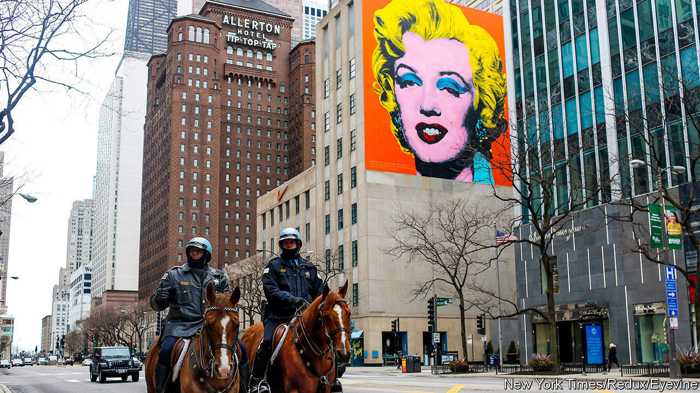
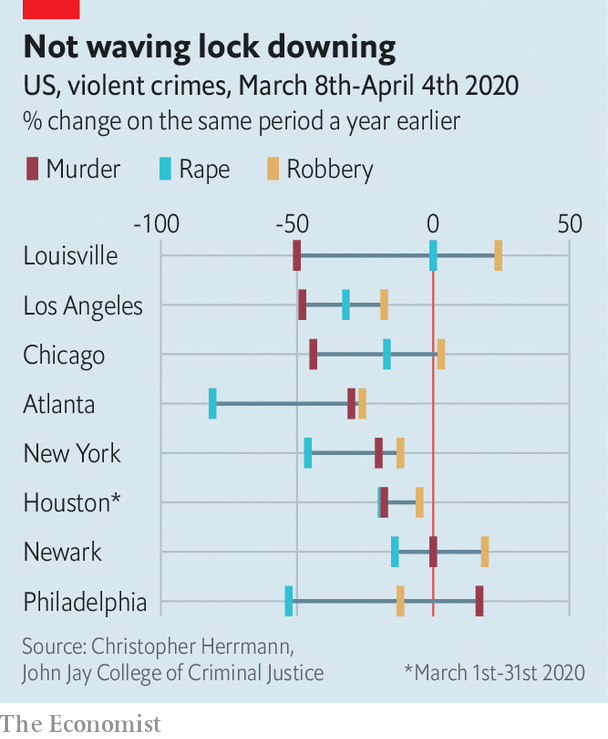

## The crime decline

# Could America’s slump in crime be the beginning of something?

> Police departments in violent cities have long talked of making a firebreak. Now they have one

> Apr 16th 2020CHICAGO

Editor’s note: The Economist is making some of its most important coverage of the covid-19 pandemic freely available to readers of The Economist Today, our daily newsletter. To receive it, register [here](https://www.economist.com//newslettersignup). For our coronavirus tracker and more coverage, see our [hub](https://www.economist.com//coronavirus)

FOR YEARS, activists, police and others hoping to reduce gun violence in cities have asked if creating a temporary firebreak—a way to pause tit-for-tat killings—could help in the long term. In troubled neighbourhoods in Chicago, for example, “interrupters” who are often former gangsters themselves have tried dissuading young gunmen from seeking revenge immediately after a shooting. The idea is to let hot heads cool, so preventing a cycle of deadly feuding.

Courtesy of covid-19, a chance might now exist to test the firebreak idea. Stay-at-home orders are keeping many potential perpetrators and victims off the streets. That has led to a remarkable fall in violence, including murders, rapes, robberies and assault. Data on crimes recorded by a dozen cities’ police departments, collected this week for The Economist by Christopher Herrmann at the John Jay College of Criminal Justice, show a deep slump in the 28-day period to early April, from a year earlier (see chart for a selection). In some New York neighbourhoods, he says, crime is down by two-thirds.

The reductions are widespread, if not entirely unexpected. Mr Herrmann used to analyse crime statistics for New York’s Police Department. He notes periods of heavy snowfall or big storms can also keep people indoors and cause dips in crime. Temporary closures of subway stations can do the same at a local level. Warm weather or school holidays that send more youngsters on to the streets tend to drive rates up. The last pandemic in America, the Spanish flu of 1918, also seemed to have an effect. Leigh Bienen, who runs a project tracking homicides in Chicago since 1870, notes that 130 people were shot dead there in 1918, a noticeable drop from 159 the year before. Gun killings then rose fast as the pandemic petered out.

The scale of the crime downturn now is unprecedented, says Mr Herrmann. Cities are seeing sharp falls even as police patrol less—as they too fall sick with covid-19. And unlike a storm, the lockdown in most places has already lasted for weeks. Were that to extend to three months, says a crime analyst in Chicago, some young-guns might change habits. An older man who was imprisoned for murder agrees that a long-enough hiatus could help. Being locked down, he says, is a “moment to breathe, stop, think—there’s something to be said for that in the chaos.”

Could the pandemic-induced firebreak have a longer-lasting effect? Where shootings are mostly by gangs fighting over control of drug sales, say, a quick return to old levels of violence could be expected. But police in Chicago, at least, liken some shootings to a game of tag played with firearms. Young, ill-educated teenagers, with too-easy access to guns, fall into feuding almost as a deadly sport. Some grudges are then held for years and are even passed between generations.

Those involved in such shootings could be the most susceptible to change. A group called READI, run by Eddie Bocanegra in Chicago, has for the past 20 months been giving frequent sessions of behavioural therapy and counselling to 700 young men judged likeliest to perpetrate the next killings (or be the next victims). Mr Bocanegra’s team works on despite the pandemic, though phone and video sessions have replaced personal meetings. He believes some cycles of violence are being broken.

Still, the idea of a firebreak bringing benefits after de facto curfews are lifted does not convince everyone. Lockdowns do generally seem to reduce crimes in public but they can also result in more violence indoors. It is likely that domestic abuse is becoming more common. In Houston cases of assault leapt in March, mostly because of attacks within the home. And another crime analyst, in Chicago, says being exposed to abuse at home is a strong predictor that someone will get involved in other violence later.

Nor can anyone be sure how other pandemic-related changes under way will affect longer-term crime rates. Early releases of prisoners, police making fewer arrests, an 85% surge in national gun sales in March and record increases in unemployment could all return crime to levels seen before the lockdowns. Trying to make use of the firebreak makes sense. But keeping crime lower will prove difficult indeed. ■

Dig deeper:For our latest coverage of the covid-19 pandemic, register for The Economist Today, our daily [newsletter](https://www.economist.com//newslettersignup), or visit our [coronavirus tracker and story hub](https://www.economist.com//coronavirus)

## URL

https://www.economist.com/united-states/2020/04/16/could-americas-slump-in-crime-be-the-beginning-of-something
