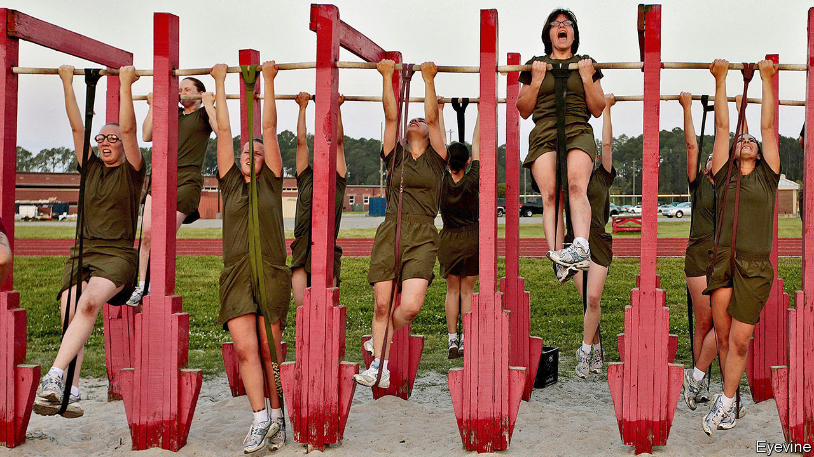

## Social climbing

# Recruits to America’s armed forces are not what they used to be

> Once a ladder into the middle class, military service has gone upscale

> Apr 18th 2020

“FOR POOR blacks and poor whites there was simply nothing like the Army,” wrote Charles Moskos, a military sociologist, in 1986, over a decade on from the abolition of the draft. The stereotypical grunt was proletarian cannon fodder: an unskilled young man, from the impoverished boondocks or inner city, driven to the recruiting office by desperation and the promise of self-betterment. “Take a look at the Marines—what you see is black faces, from the ghettos,” said Noam Chomsky in 1989. “Sometime in the Seventies, the American army shifted to a traditional mercenary army of the poor.”

If there was once some truth to that, it is now a myth, according to a new paper* published in the Journal of Strategic Studies. Its authors compared data from the National Longitudinal Surveys of Youth from 1979 (those born between 1957 and 1964) and 1997 (born 1980-84), which involved thousands of subjects interviewed regularly year after year. In the first cohort, who came of age in the aftermath of Vietnam, those who enlisted did indeed have lower parental income and wealth than equivalent civilians.

But for the millennial soldiers, reared in an age of American swagger, the opposite is true. Their median family income is more than $73,000, compared with $66,000 for civilians, and recruits are most likely to come from families in the middle of the wealth distribution, with median wealth of $87,000, almost $10,000 more than civilians. Blacks, overrepresented among the poor, and a disproportionately large veteran presence in the 1979 cohort, as Mr Chomsky noted, have dwindled as a share of recruits. Separately, as the armed forces shrank in size and grew choosier, recruits tended to be cleverer (measured by a cognitive skills test) than their civilian peers. Indeed, among the poorest recruits it is the cleverest—not the drop-outs or deadbeats—who are likeliest to sign up.

In short, soldiering has become a middle-income business. “The widespread belief among academics, the American public and lawmakers that those fighting America’s wars come mostly from the poorest groups is probably a product of trends from the past,” conclude the authors, who note that their findings are robust across the army, navy, air force and marines, and apply to officers and enlisted personnel alike.

Since the strongest correlate of enlistment is proximity to a military base, these trends may reflect recruitment from the upwardly mobile offspring of serving personnel and their communities, says Kori Schake of the American Enterprise Institute, a think-tank. Technology plays a role too, say the authors. Modern warfare relies less on hordes of expendable infantry and more on sophisticated platforms. Today’s military personnel include cyber-attackers, satellite controllers and software engineers. As America’s enemies have acquired better arms of their own, tactics have also grown more complex and demanding. All of that requires skill.

This military gentrification has political consequences. Some political scientists once reckoned that elites might be happier to wage war if a disenfranchised underclass would bear the brunt. In fact, the data show that “men and women who serve are likely to embody the values and culture of the median voters.” But if the armed forces skim off the better-educated and better-skilled, they may no longer serve as the vehicles of upward social mobility they once were. The very poorest Americans may be spared foreign battlefields—but they may also be spared college degrees.■

* Andrea Asoni, Andrea Gilli, Mauro Gilli and Tino Sanandaji, “A mercenary army of the poor? Technological change and the demographic composition of the post-9/11 U.S. military” (2020) Journal of Strategic Studies

## URL

https://www.economist.com/united-states/2020/04/18/recruits-to-americas-armed-forces-are-not-what-they-used-to-be
