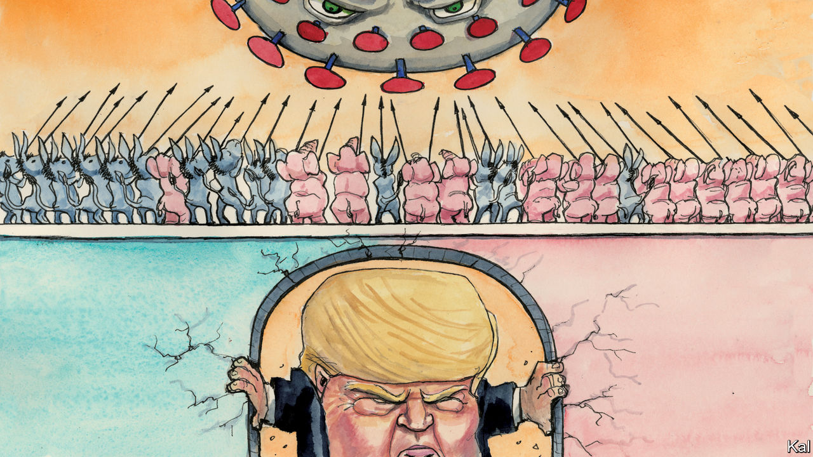

## Lexington

# The paradox of the pandemic

> Covid-19 is bringing Americans together locally even as it exposes their divisions

> Apr 16th 2020

Editor’s note: The Economist is making some of its most important coverage of the covid-19 pandemic freely available to readers of The Economist Today, our daily newsletter. To receive it, register [here](https://www.economist.com//newslettersignup). For our coronavirus tracker and more coverage, see our [hub](https://www.economist.com//coronavirus)

THE FACT that British and American politics have been heading in the same direction in recent years—towards populism and rancour—makes their sudden divergence all the more striking. Boris Johnson, fresh out of intensive care, is preaching his country’s secular faith, love for the National Health Service, and seeing his ratings soar. Indeed almost every Western leader, including Giuseppe Conte, Emmanuel Macron and Angela Merkel, has received similar or bigger double-digit boosts as their voters rally around the flag in this time of peril. America is a different case.

After a small jump in the first weeks of the crisis, Donald Trump’s ratings are back to their pre-pandemic lows. Most Republicans are with him, most others loathe him, and his handling of the coronavirus is viewed accordingly. Squinting past his vacillation and incompetence, the president’s supporters say he is doing well; almost everyone else disagrees. The coronavirus has killed 31,000 Americans, but it has not broken their partisan spirit.

This is hardly surprising. America was divided long before Mr Trump launched himself on it as a human wedge. The exceptionally bitter 2000 presidential election, which both parties claim to have won, looks like a watershed moment, as perhaps the last decided by persuadable voters. Each subsequent poll has been won by whichever party did best at mobilising its supporters—or, to put that emotively, by whichever felt angriest on the day. Surveys point to Republicans and Democrats becoming increasingly unable to empathise and reluctant to socialise with one another. Even before Mr Trump made factionalism a governing strategy, it was hard to imagine a president wrapping his arms around his crisis-stricken country, as George W. Bush did after 9/11, and rallying it to him.

And of all imaginable crises, the coronavirus has shown a unique power to accentuate political differences. Though more devastating than any foreign attack, it is hard to figure as the sort of common enemy Osama bin Laden was. Notwithstanding Mr Trump’s effort to give it a Chinese face (he reverted this week to calling it the “Wuhan virus”) it is spread by Americans. That has created an extra layer of suspicion, especially as Republicans, taking their cue from Mr Trump, were slower to adopt social distancing. Yet the virus is mainly accentuating partisanship because Republicans and Democrats are experiencing it differently.

At the time of writing, over half of America’s 638,000 known infections were in New York and three neighbouring states, all solidly Democratic. So is every other major hotspot, including Chicago, Detroit and New Orleans. Infectious diseases like density, which is one of the most reliable predictors of Democratic support there is. More sparsely populated Republican areas have seen only scattered tragedies, typically in care homes, where almost a quarter of Texas’s 391 deaths have occurred. This makes Republicans more receptive than Democrats to Mr Trump’s call for a reopening of the economy: an issue that—by pitting the certain tragedy of 17m unemployed workers against the likelihood of additional infections—could scarcely be more polarising.

America’s gravest political differences were already matters of life and death—and the pandemic has deepened them specifically. For Democrats, it has vindicated their overriding demand for better, cheaper health care. Republican states including Texas and Ohio have meanwhile used the lockdown to try to ban abortions, even as cultural warriors such as William Barr, the attorney-general, rail against its implications for religious liberty. The best explanation for the recent implacability of American partisanship is that many pre-existing, not necessarily partisan, differences, concerning race, region, expertise and so forth, have become starkly aligned with partisan identity. Covid-19, a disease that disproportionately hurts urban-dwelling non-whites and demands rigorously science-based action has worked with the grain of that alignment. Yet these depressing facts are not the whole story.

Even as their national politics has taken yet another downwards lurch, Americans are feeling much the same sense of solidarity as locked-down Asians or Europeans. A survey by More in Common, a group that studies polarisation, finds that almost half say America is more united than it was before the pandemic. The portion that believes it is “very divided” has dropped from 62% to 22%. Over 90% of Americans believe “we’re all in it together”, compared with 63% before the virus hit. And though there remain partisan differences in how seriously Americans view the virus, they have narrowed a lot. Republicans and Democrats alike are afraid of it, for the sake of their country, as well as their family and communities. Despite the partisan squabbling, this suggests most people are quietly minimising their differences and pulling together.

The main explanation for this apparent contradiction is that politics is local. In America’s system, state and local governments are the front line against the pandemic. And most state governors are duly enjoying the same ratings boosts as European prime ministers or presidents—even in fiercely contested states. Andy Beshear of Kentucky, a Democrat who was elected by a mere 5,000 votes last November, has an approval rating of 81%. The main exceptions are the governors most tied to national politics, such as Ron DeSantis of Florida, a Trump proxy with ratings to match.

This suggests America is fundamentally the same country of concerned, good-hearted citizens it ever was. Even when its national politics is seized by demagogues, responsibility and accountability matter in everyday governance. The unhappier flip-side is that this divergence helps explain why Americans can bear to put up with, and thereby sustain, such dreadful national politics. It plays a much smaller role in their lives than the apparent momentousness of its life-and-death issues might suggest. In the current catastrophe, that is a consolation. But it also stands in the way of the political renewal America so badly needs.■

Dig deeper:For our latest coverage of the covid-19 pandemic, register for The Economist Today, our daily [newsletter](https://www.economist.com//newslettersignup), or visit our [coronavirus tracker and story hub](https://www.economist.com//coronavirus)