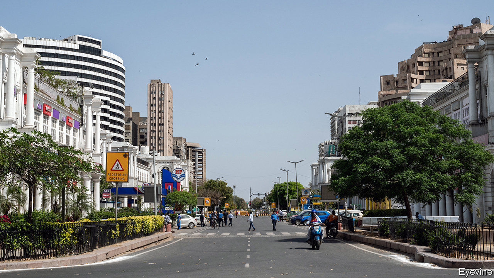

## Impossible sums

# India’s lockdown has brought unexpected benefits

> And dizzying costs

> Apr 23rd 2020DELHI

Editor’s note: The Economist is making some of its most important coverage of the covid-19 pandemic freely available to readers of The Economist Today, our daily newsletter. To receive it, register [here](https://www.economist.com//newslettersignup). For our coronavirus tracker and more coverage, see our [hub](https://www.economist.com//coronavirus)

REPORTERS IN INDIA’S capital recently discovered hundreds of stranded migrants, their jobs lost in the coronavirus lockdown, living under a bridge on the banks of the Yamuna river. Even though the scene was tragic, the surroundings were much more pleasant than usual. In the current dry season the river is normally a fetid, inky sewer. At the moment, however, it is miraculously clean. The closure of industries upstream, says the city’s water board, means that for the first time in years the Yamuna has enough oxygen to sustain life.

With more than 20,000 confirmed cases and close to 700 dead, India is not yet one of the worst-hit countries. That distinction may still come, but the strict lockdown imposed since March 25th has slowed the spread of the virus markedly. Without it, some half a million Indians would now have the disease, reckons Jayaprakash Muliyil, an epidemiologist. By mid-June, he surmises, covid-19 could have killed 2.5m people, about as many as would normally die from all causes over the period. From doubling every three days, the number of active cases is now doubling every eight. V.K. Paul, a government health expert, says that by May that rate should drop to every ten days. “We have bought time,” says a weary doctor in Mumbai, India’s hardest-hit city, describing efforts to build up medical capacity. “We started with a broken bicycle, but we’ve got a wobbly motorbike going now, and might even bang together a workable auto-rickshaw.”

It is not just to the potential victims of covid-19 that the lockdown has brought a reprieve. In ordinary times, air pollution kills at least 1.2m Indians a year. That is more than it kills in China, where research by Marshall Burke, an environmental scientist at Stanford University, suggests that cleaner air during its own covid-19 lockdown may have saved 17 times more lives than the (official) number lost to the virus. Another study in China, measuring the effect on health of Beijing’s curbs on pollution during the 2008 Olympics, reckons that every 10% fall in pollution led to an 8% drop in deaths from all causes. The plunge in air pollution in India has been no less dramatic. At one monitoring station in central Delhi, levels of nitrogen dioxide are 85% lower than in recent years. NASA, America’s space agency, says that across India levels of suspended aerosols are lower than at any time since it started measuring them twenty years ago.

Then again, the lockdown has had a crippling effect on many Indians’ livelihoods. Unemployment has shot up shockingly, from 8% at the beginning of March to 26% in mid-April, according to the Centre for Monitoring the Indian Economy, a research group. Nomura, an investment bank, has reduced its expectations for GDP growth from a limp 4.5% to a painful -0.5%. One estimate suggests an extra 100m people could fall below the World Bank’s poverty line of $3.20 a day.

Such are the contradictions of India’s battle with the epidemic. While there may well be a plunge in the 20,000 Indians who die every month in car accidents, there may also be a jump in the 30,000 who perish from tuberculosis, since the lockdown has made it much harder to get treatment. Crime has fallen dramatically; reported rapes in Delhi are down by 83%.

Indians themselves seem to think the lockdown is sensible. A poll conducted by the National Council of Applied Economic Research, a think-tank, found that 55% of respondents in Delhi had seen their incomes shrink sharply since it began, and another 30% somewhat. Yet a resounding 87% also said they still supported the government when it recently extended the controls by three weeks.

Indeed, the government may be the one unquestionable beneficiary of the policy. Before covid-19 it faced mounting discontent over the weak economy, as well as protests over policies that were seen as an assault on secularism. But then the epidemic forced protesters off the streets, and saved the government’s face when it suspended a controversial tally of citizens that might have prompted further unrest. And now, of course, all India’s economic troubles, including those resulting from bad government policies, can be blamed on a deadly virus from China. ■

Dig deeper:For our latest coverage of the covid-19 pandemic, register for The Economist Today, our daily [newsletter](https://www.economist.com//newslettersignup), or visit our [coronavirus tracker and story hub](https://www.economist.com//coronavirus)

## URL

https://www.economist.com/asia/2020/04/23/indias-lockdown-has-brought-unexpected-benefits
