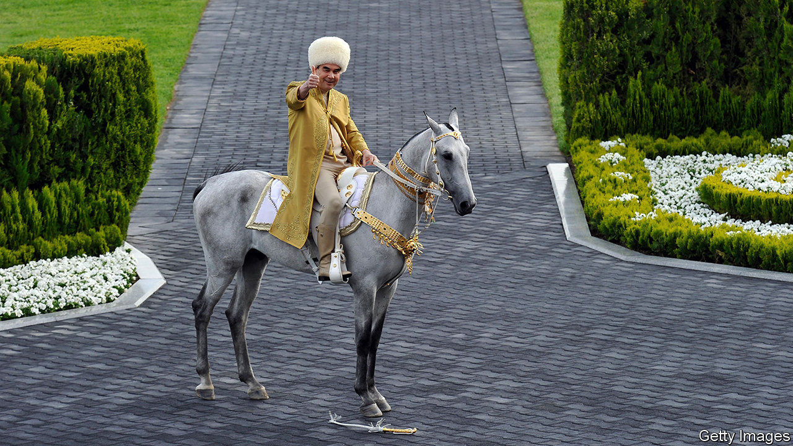

## What pandemic?

# Life carries on as usual in Tajikistan and Turkmenistan

> Both countries claim, improbably, to have suffered no cases at all of covid-19

> Apr 23rd 2020ALMATY

Editor’s note: The Economist is making some of its most important coverage of the covid-19 pandemic freely available to readers of The Economist Today, our daily newsletter. To receive it, register [here](https://www.economist.com//newslettersignup). For our coronavirus tracker and more coverage, see our [hub](https://www.economist.com//coronavirus)

IT TAKES MORE than a global pandemic to faze the sports-mad, world-record-obsessed president of Turkmenistan. Last year, at his instigation, the gas-rich desert country marked World Bicycle Day by setting a record for the longest cycling parade. This month, to celebrate World Health Day on April 7th, Gurbanguly Berdymukhamedov, who is known to Turkmenistan’s 6m citizens as Arkadag, or “the Protector”, wheeled out 7,000 cyclists for what may yet qualify as the most reckless celebration of public health ever undertaken. Even as he sent his own people to pedal in huge packs, however, the Protector was protective of his own health, whizzing around a deserted track in Ashgabat, his marble-clad capital, first in splendid isolation and then in the company of a few select officials.

Turkmenistan is one of only a handful of countries in the world that claims to have no cases of covid-19. Also present on that exclusive list is Tajikistan, another Central Asian state ruled by a narcissistic president who likes to present his country as a trouble-free paradise. In March Emomali Rahmon cocked a snook at social-distancing norms by herding thousands of his countrymen together for an all-singing, all-dancing spectacle to celebrate Nowruz, a holiday marking the spring equinox. Similar festivities had been cancelled all across the region—apart from Turkmenistan, of course. Tajikistan and Turkmenistan are also allowing football matches to continue. In Tajikistan they take place without spectators, but in Turkmenistan hundreds of fans crowded into a stadium in Ashgabat when the season resumed last weekend after a brief covid-related hiatus.

Turkmenistan is not in complete denial: it has closed its borders to foreigners (they were never that open in the first place) and quarantined returning travellers, in some cases in tents in the desert. Tajikistan has also isolated travellers and conducted thousands of tests, all of which have officially returned negative results. It admits there has been a spike in respiratory ailments, but says that the cause is bad weather, not the coronavirus. One particular death that had been the subject of rumours was the result of swine flu and pneumonia, it insists.

Mr Rahmon has suggested that Tajiks’ high standards of hygiene will stand them in good stead in the battle against the coronavirus, should it ever arrive in their country. The panoply of prophylactics recommended by Mr Berdymukhamedov, a former health minister who has written a book on folk remedies, includes fumigation with yuzarlik, a local herb which he touts as impregnable armour against infectious disease. It is for insights like these that Turkmenistan “loves you with all its heart”, as a poet called Gozel Shagulyyeva put it in a new ode to the president recently published by local media.

Elsewhere in Central Asia normal life has come to a standstill since the first coronavirus cases were detected in mid-March. Kazakhstan, Kyrgyzstan and Uzbekistan have closed public places, restricted internal travel and ordered citizens to leave home only to buy essential provisions from nearby shops. (Residents of the Uzbek city of Namangan are supposed to stray no farther than 100 metres from their homes). Kazakhstan, which is using drones to enforce its lockdown, has banned family gatherings and told those over 65 or under 18 to remain indoors at all times. In some Kazakh cities residents are allowed outside only once every two days, a measure policed with colour-coded cards. Enforcement is draconian by Western standards: Kazakhstan has detained more than 5,000 people and jailed more than 1,600 for violations of the new rules.

Turkmenistan, meanwhile, is gearing up for another sporting event: Horse Day on April 26th, which celebrates the Akhal-Teke, a local breed. The Protector has been known to join in the fun by competing in horse races. He will presumably think twice about rubbing shoulders with the other jockeys this year. Then again, he is such a gifted rider that he always wins by a big margin—a form of social distancing. ■

Dig deeper:For our latest coverage of the covid-19 pandemic, register for The Economist Today, our daily [newsletter](https://www.economist.com//newslettersignup), or visit our [coronavirus tracker and story hub](https://www.economist.com//coronavirus)