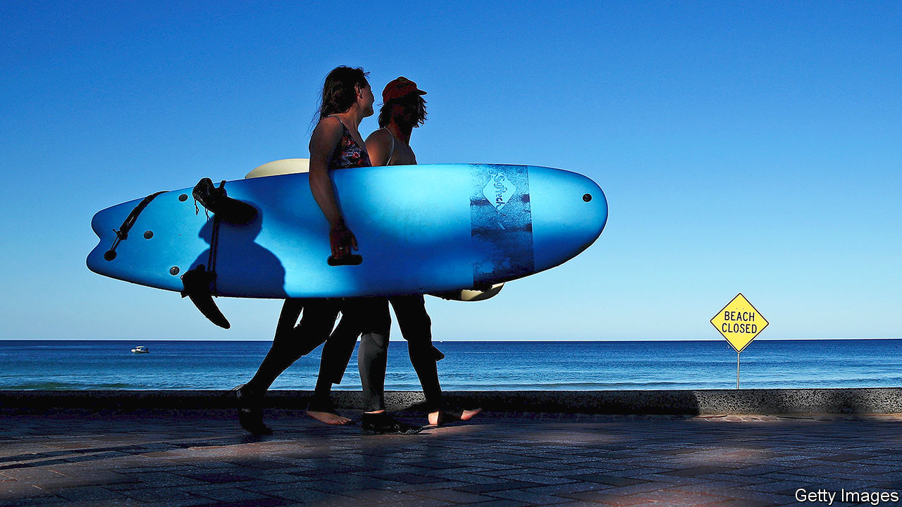

## A process of elimination

# What next for countries that are nearly covid-free?

> Australia, New Zealand, South Korea and Taiwan contemplate life beyond the virus

> Apr 23rd 2020NELSON, NEW ZEALAND

Editor’s note: The Economist is making some of its most important coverage of the covid-19 pandemic freely available to readers of The Economist Today, our daily newsletter. To receive it, register [here](https://www.economist.com//newslettersignup). For our coronavirus tracker and more coverage, see our [hub](https://www.economist.com//coronavirus)

OF ALL THE new rules police in Australia and New Zealand have found themselves trying to enforce in recent weeks, one of the trickiest has been preventing surfing. Officers have had, on occasion, to wade into the water to remonstrate with wave-catching scofflaws, many of whom scaled fences or clambered down cliffs to ride the breakers. Deliverance is at hand, however—in more than one sense. Restrictions on surfing are being eased, since the new coronavirus appears to be under control in both countries.

In New Zealand, a country of 5m people, new cases have been in the single digits for most of the past week. Australia reported just seven new infections on April 23rd. That puts the pair in the very small group of countries that seem to have vanquished covid-19, including South Korea and, barring a fresh wave of infections from a recent outbreak on a naval vessel, Taiwan. Australia has already reopened some popular beaches (for swimming and surfing only) and will soon resume elective surgeries, dental care and fertility treatment. South Korea is allowing domestic tourism, although one county cut down fields of tulips to avoid attracting the usual crowds of sightseers. Taiwan, remarkably, never shut all schools, restaurants or bars.

In all four places officials caution that life is not going back to normal yet. For one thing, there can be no letting down their guard. The authorities have warned that a second wave of the virus may hit in winter. To ward that off, South Korea intends to keep up extensive testing and vigorous contact-tracing using security-camera footage, credit-card statements and mobile-phone location data. The movements of confirmed cases are made public, worrying privacy activists and adulterers alike. Australia, too, promises “aggressive suppression” using contact-tracing and one of the highest rates of testing in the world. New Zealand is going one step further. It has set itself the goal of eliminating the virus entirely from its shores.

The benefits of elimination are clear. Whereas many countries risk a debilitating cycle of lockdowns, gradual reopenings and then fresh restrictions as the outbreak waxes and wanes, New Zealand’s government believes it may soon be able to send Kiwis young and old back to work without fear that the number of cases might start to surge again. “The recovery could be smoother and less hampered than in other places,” says Shamubeel Eaqub, an economist. Schools, shops and restaurants could operate without special social-distancing requirements. The rugby season could begin, with matches in front of live audiences (to the relief of bored sports fans around the world).

All this would in theory provide the sort of clarity for businesses which seems like a pipe-dream elsewhere. Hiring and investment would presumably revive much more quickly if the fear of a future resurgence of covid-19 could be dispelled. “The worst thing we can do for our country is yo-yo between levels [of lockdown],” says Jacinda Ardern, the prime minister.

Yet finding every last case of the virus will be difficult. “It’s a needle-in-a-haystack phenomenon,” says Ayesha Verrall of Otago University. The current random testing of workers in risky jobs, regardless of symptoms, will need to be expanded. Contact-tracing will also need to be made more watertight. Initially, the government had trouble reaching 40% of people it thought might have been exposed to the disease.

Moreover, elimination will entail the strictest border controls. At present, almost all foreigners are barred from entering the country, while returning citizens are placed in quarantine for 14 days in monitored hotels. Arrivals have slowed to a trickle: on April 22nd not a single person entered the country.

Ports are tightly controlled, too. Stevedores at Auckland’s work in small, isolated teams, each with their own toilet, to reduce the risk of an infection spreading widely. The crews of arriving ships are not allowed to disembark and can interact with only three port workers, who are distinguished by pink high-visibility vests, not to mention face masks.

The government’s economic models assume New Zealand will have to stay closed to foreigners for a year. But some doubt it is feasible, or worthwhile, to keep the borders sealed. Steven Joyce, a former finance minister, says eliminating the virus is “pie in the sky”. Australia’s Chief Medical Officer, Brendan Murphy, says that although elimination is desirable, “We’re pretty doubtful that could be maintained for the long term given the incredible border measures you would need to have.”

Even if elimination succeeds, many big industries in New Zealand cannot hope to return to normal. A halt to international tourism, most notably, will knock about 5% off GDP and put some 100,000 people out of work. Border closures will hit farmers, too. Each year New Zealand and Australia bring in hundreds of thousands of backpackers and seasonal workers to pick fruit and prune grape vines. With borders closed, wineries and farms are short-staffed. Mike Chapman of Horticulture New Zealand, a lobby group, worries that it will be difficult to tempt unemployed urbanites up ladders to pick apples.

Exporters are struggling to find space on the few planes still leaving the country. Before the crisis 80% of New Zealand’s air freight was carried on passenger planes. Air New Zealand, the national carrier, has cut 95% of its international passenger flights. Crayfish farmers beat tomato-growers to some of the scarce outbound capacity, Mr Chapman notes ruefully.

In the meantime, in pursuit of elimination, Ms Ardern recently announced a five-day extension of New Zealand’s strict lockdown. The extra short-term cost, she says, will give “much greater long-term health and economic returns”.

Others are managing borders differently. South Korea still admits foreigners, provided they remain in quarantine for 14 days. A few can even evade quarantine, including some business people on short trips. They are tested on arrival and, if negative, can travel widely on the condition that they answer when called by health workers and diligently record any symptoms in an app. Taiwan is permitting some business visitors, too, subject to quarantine rules.

Yet New Zealand’s elimination plan has widespread public support. A poll in early April found that 84% of New Zealanders approve of the government’s response to the pandemic—30 percentage points higher than the average in the G7. There is even hope that other countries may be able to join its putative virus-free zone. The deputy prime minister, Winston Peters, has raised the prospect of a “trans-Tasman bubble” once both Australia and New Zealand have the virus tightly under control. That could also include some Pacific countries—provided it does not burst. ■

Dig deeper:For our latest coverage of the covid-19 pandemic, register for The Economist Today, our daily [newsletter](https://www.economist.com//newslettersignup), or visit our [coronavirus tracker and story hub](https://www.economist.com//coronavirus)