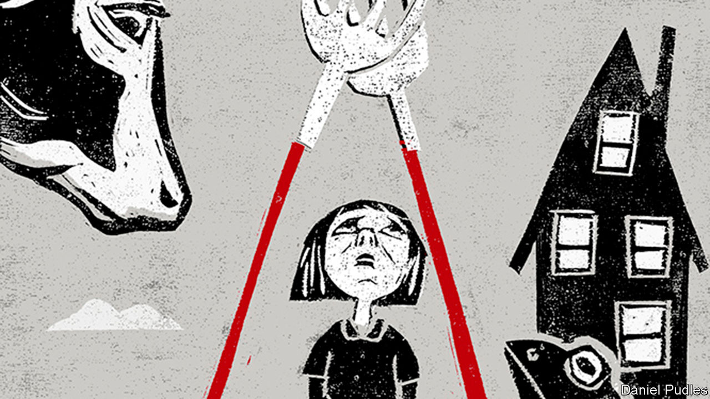

## Cold comfort farm

# A prizewinning poet’s haunting debut novel

> In “The Discomfort of Evening”, a Dutch farming family is struck by tragedy

> Apr 23rd 2020

The Discomfort of Evening. By Marieke Lucas Rijneveld. Translated by Michele Hutchison. Faber & Faber; 296 pages; £12.99. To be published in America by Graywolf Press in September; $16.

THE 29-YEAR-OLD author of this impressive Dutch debut, Marieke Lucas Rijneveld, grew up on a dairy farm in North Brabant. Cows, in this telling, are sensitive creatures; sick cows are the sweetest kind. “You could stroke them gently without them suddenly kicking back at you.” The meagre comfort in “The Discomfort of Evening” comes from these beasts; the humans in this searing novel, shortlisted for the International Booker prize, are too numb with pain to be able to console anyone.

Ten-year-old Jas, the narrator, and her devout family live on a small farm in rural Holland. Theirs is a stern God rather than a loving one. When the family vet arrives at the homestead just before Christmas to report that Jas’s oldest brother has drowned, having fallen through the ice on a skating trip, Jas’s mother believes God is punishing her for being a bad parent. The Christmas tree is taken down, the decorations put away. The adults turn inward; the children face their grief on their own. “We are growing up with the Word, but words are lacking more and more frequently at the farm.”

Jas and her two surviving siblings embark on a series of rituals to try to hold the family together. She keeps two toads in a pail, hoping that if the animals can somehow be induced to mate, her parents will love one another again. After the farm is overwhelmed by foot-and-mouth disease, though, and the family herd has to be destroyed, the story takes an even darker turn.

The author, a prizewinning poet, is deft with words. “Kissing with tongues”, the narrator reflects, “always makes me think of those slimy, purplish-red cooking pears that Mum makes.” Out in the farmyard, “Two forks lie with their teeth through each other…like hands praying.” It is the strange, haunting observations through which the child, Jas, tries to make sense of the grown-up world that give this novel of grief its particular power. A book to read—and to remember.

## URL

https://www.economist.com/books-and-arts/2020/04/23/a-prizewinning-poets-haunting-debut-novel
