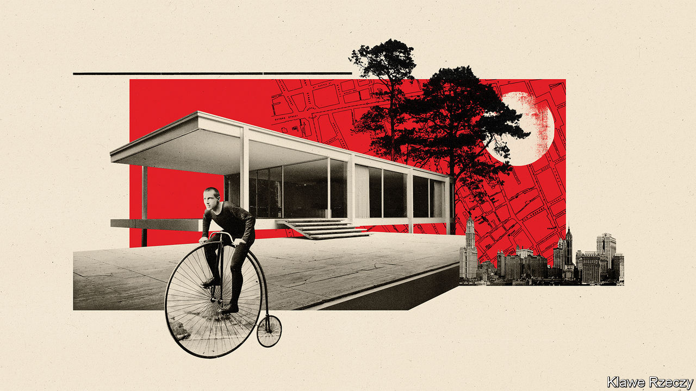

## Perspectives

# Covid-19 might not change cities as much as previous pandemics

> Plague, cholera and tuberculosis have all left marks on urban architecture

> Apr 25th 2020

Editor’s note: The Economist is making some of its most important coverage of the covid-19 pandemic freely available to readers of The Economist Today, our daily newsletter. To receive it, register [here](https://www.economist.com//newslettersignup). For our coronavirus tracker and more coverage, see our [hub](https://www.economist.com//coronavirus)

APART FROM the occasional wailing siren, New York City is eerily quiet—so quiet that you may be woken by birdsong, says Beatriz Colomina, an architectural historian. The city looks different, too. Pedestrians have taken to the roads, which are almost empty of moving cars. Those widely spaced walkers can look up and see things that they missed before. For Ms Colomina, it is an ideal time to appreciate buildings. 

New York is an excellent place for that, both in terms of aesthetics and of history. Not only does it contain much fine architecture. It also displays the scars of previous contagions, some of them far deadlier than covid-19. From the tenements of the Lower East Side to Central Park to the subway system, New York has been shaped by disease and attempts to contain it.

The “city of living death”, as one commentator dubbed it in the early 20th century, is not the only one so affected. Some of the other cities hardest hit by covid-19, such as London and Milan, previously battled plague, cholera and tuberculosis, and changed as a result. In all sorts of places architecture has been shaped by disease. Looking at the history of urban contagions makes it a little easier to predict how covid-19 will change cities. Past experience suggests that the pandemic will have only a short-lived impact—briefer than some people now hope. 

Until about a century ago many cities levied such a heavy “mortality penalty” on their inhabitants that they would have shrunk had migrants not kept pouring into them. In 1847 a Scottish doctor, Hector Gavin, estimated that Londoners gave up eight years of life compared with the English average, whereas the inhabitants of Liverpool lost 19. This was probably an underestimate, he added. 

Cities were deadly, Gavin went on to explain, because their air was so bad. He did not mean the coal and wood smoke that hung over them. “The poison which causes death is not a gas,” he said, “but a sort of atmosphere of organic particles, undergoing incessant transformations.” Gavin was reiterating the centuries-old orthodoxy that bad air, or “miasma”, caused a host of diseases. This theory dominated secular thinking about disease from the Middle Ages to the second half of the 19th century, when it was gradually displaced by germ theory. Miasmas explained why cities, with their narrow alleys, fetid streams and stinking piles of animal waste, were so much sicker than villages. 

If you believe that disease is caused by such miasmas, you naturally try to purify the air. During outbreaks of plague, which periodically ravaged European cities from the 14th to the 18th centuries, urban officials cleared the streets of rotting rubbish, lit bonfires and even fired guns. Walled cities stopped travellers and burned soft goods that might harbour miasma. Plague victims were shut in their homes, lest their emanations infect others. Their doors were marked with crosses, as a protection and a warning. 

A few tried to do more. By the 15th century the great Italian cities were creating “lazzaretti”, or pesthouses, to quarantine the sick during epidemics. Milan’s could hold 16,000 people, packed into small rooms with chimneys to vent noxious emanations. Conditions there were dreadful. In 1629 a public-health official “went into a dead faint for the stinking smells that came forth from all those bodies and those little rooms”. The complex was demolished in the late 19th century and replaced with homes. But its church remains, and the outline of the lazzaretto can still be seen in the city’s street plan.

Not all cities followed suit. In the 1660s a Parliamentary bill that would have forced English parishes to build pesthouses was defeated in the House of Lords, their lordships not being keen on plague victims massing near their mansions. Pestilence did, however, encourage people to upgrade their homes. In 1652 the London bricklayers argued, self-interestedly, that plague could be held off by replacing wooden structures. They reasoned that wooden houses with overhanging storeys stifle the air, contributing to miasma—but also, in an argument that modern science would approve, that brick homes are less verminous. 

In the early 19th century the cities of Europe and America faced for the first time a disease long familiar in Asia: cholera. City officials responded by deploying the old anti-plague techniques—clearing the streets of rubbish and carting people off to pesthouses. This time the popular reaction was swift and violent. Many cities, including Paris, rioted. In 1831 a furious crowd invaded a St Petersburg hospital, killed a doctor and liberated the people who had been taken there. Sir Richard Evans, a historian who has studied these episodes, argues that the authorities were so spooked by the violent reaction to their measures that they hesitated to use them again. Instead they began to think differently. To break the cycle of disease and disorder, they would have to make cities healthier. 

In France an official report written in 1834 noted that cholera had struck the poor hardest, and argued that was partly a result of their environment. Disease was festering in Paris’s narrow streets and alleys; to prevent it from erupting again, wider streets and public squares with trees were needed. These would “finally spread light and life in those obscure quarters where half the population vegetates so sadly, where dirt is so widespread, the air so infected”. The wide boulevards of the Second Empire were for grandeur and social control, but also for the control of disease. 

In Europe and America sewers and drinking fountains proliferated. So did large parks—which were viewed not merely as desirable urban amenities but as machines for purifying air and water. In New York the competition to design Central Park was won in 1858 by Frederick Law Olmsted and Calvert Vaux. Wanting to create a “mechanically improved” park on what was then marshland, they turned to George Waring, an expert on farm drainage and a firm believer in the miasma theory of disease. Waring brought in huge quantities of earth to raise the low-lying areas and laid an enormous network of underground pipes to ensure that the grass would drain freely. 

Ideally, Olmsted thought, urbanites would not merely have access to parks but would live in places that resembled them. “It is an established conclusion”, he wrote to landowners near Chicago in 1868, that “the mere proximity of dwellings which characterises all strictly urban neighbourhoods, is a prolific source of morbid conditions of the body and mind”. Only low-density suburbs, with winding roads and lots of green space, could keep people safe. 

Others were reaching the same conclusion. By the late 19th century American urban reformers were focused on the densely packed rooming-houses known as tenements. These were regarded as breeding grounds for cholera and, especially, tuberculosis—a disease that by the 1880s was known to be caused by a bacterium. New York insisted on the construction of air shafts, which led to buildings that were wide in front, facing the street, and wide at the back, but narrow in the middle—known as dumbbells. The law tightened in 1901, when builders were obliged to create large courtyards. They responded by building higher, especially on corner plots. All this can still be seen in Manhattan’s old residential neighbourhoods. 

It was not enough for the reformers. In 1908 an exhibit known as the “Congestion Show” toured New York’s museums. This aimed to persuade the authorities that overcrowding itself was facilitating the spread of tuberculosis; it seems to have convinced the state governor, who declared himself “oppressed and depressed”. Plans for an extensive subway system were accelerated. Within a decade New York was covered by a zoning plan, which ensured that the fast-growing suburbs of Brooklyn and Queens would never quite resemble Manhattan’s human anthills. 

In Europe tuberculosis had a still greater, though indirect, effect on buildings. Ms Colomina’s book “X-ray Architecture” shows that modernist architects were influenced by the sanatoriums that had sprung up in towns like Davos, in Switzerland. These had white walls and floor-to-ceiling windows to maximise light, which was known to kill germs (as the popular saying went, “thirty years in the dark but thirty seconds in the sun”). They also had flat roofs, mostly to prevent ice from falling and hitting people below. White paint, glass walls, flat roofs—all became features of modernist architecture. 

The Finnish architect Alvar Aalto designed a celebrated sanatorium in Paimio, then went on to create libraries, churches and apartment buildings. Others, like Le Corbusier and Ludwig Mies van der Rohe, borrowed the sanatorium aesthetic. One of Mies’s masterpieces, the Farnsworth house in Illinois, was described by one occupier as “transparent, like an X-ray… There is already the local rumour that it’s a tuberculosis sanatorium.” Modernist architecture has sometimes been called sterile. It is supposed to be. 

Some observers now predict, or hope, that covid-19 will transform cities. Cycling advocates point to roads that have been closed to cars and argue that they should stay that way. Joel Kotkin, an urbanist at Chapman University in California, believes the coronavirus will speed “the end of the megacity era”. He argues that germy cities like New York will lose their appeal. 

History suggests that it is foolish to bet against big cities. Repeated terrible outbreaks of plague and cholera barely delayed the growth of London or Paris. Richard Florida, an urbanist at the University of Toronto, points out that the flu pandemic of 1918-19 did not interrupt the ascendancy of Chicago, New York or Philadelphia. Covid-19 is not only less deadly than these pandemics; it is also notably wayward in its aim. It has hit some large, dense cities. But it has also struck ski resorts and suburban care homes. 

If covid-19 can be run to ground in a couple of years, the urban fabric might not change much. Plague, cholera and tuberculosis worked on cities slowly. They forced change because people believed they would return or never leave. By contrast, many people hope that coronavirus will be defeated fairly quickly. In the first country it attacked, some urban adaptations have already been undone. In China many apartment blocks acquired shelves where delivery drivers could leave food and other goods. Almost as soon as the lockdowns lifted, they were taken down. ■

Dig deeper:For our latest coverage of the covid-19 pandemic, register for The Economist Today, our daily [newsletter](https://www.economist.com//newslettersignup), or visit our [coronavirus tracker and story hub](https://www.economist.com//coronavirus)