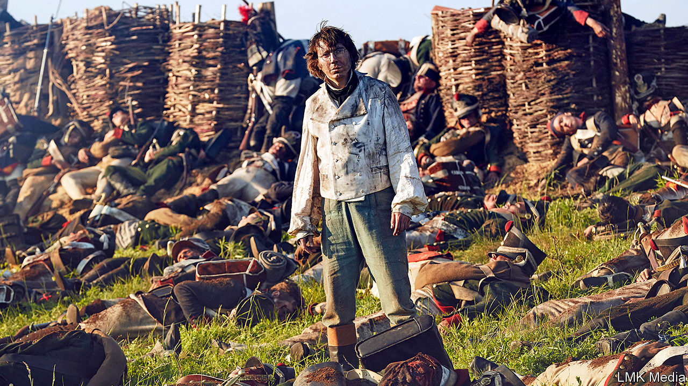

## Unhappy in the same way

# Readers across the world are finding solace in “War and Peace”

> The rhythm of the epic novel is eerily suited to life in lockdown

> Apr 25th 2020SAN FRANCISCO AND TWITTER

Editor’s note: The Economist is making some of its most important coverage of the covid-19 pandemic freely available to readers of The Economist Today, our daily newsletter. To receive it, register [here](https://www.economist.com//newslettersignup). For our coronavirus tracker and more coverage, see our [hub](https://www.economist.com//coronavirus)

OVER THE past 15 years Yiyun Li, a Chinese-American author, has read “War and Peace” at least a dozen times. Her hardback copy of Leo Tolstoy’s 1,200-page saga bristles with coloured notes, like some exotic lizard’s spine. The novel is not just a masterclass in fiction, Ms Li believes, but a remedy for distress. At the most difficult times in her life, she says, she has turned to it again and again, reassured by its “solidity” in the face of uncertainty.

“War and Peace”—originally titled “The Year 1805”—is widely considered the world’s greatest novel. It is also among the most daunting, acknowledged Richard Pevear, one of its translators, “as vast as Russia itself”. Its huge canvas encompasses not just Napoleon’s wars against the Russian and Austro-Hungarian empires from 1805 to 1812, but a cast whose actions and emotions span the breadth of human consciousness. As James Wood, a literary critic, has noted, Tolstoy is the supreme novelist of human contradiction. His epic is an unparalleled examination of how people respond to the pressures of both war and ordinary life.

So large is Tolstoy’s world, Ms Li reckoned, that there could be no better companion for people trapped in isolation. She conceived of a virtual book club to sustain readers through the lockdown. Participants around the globe would plough through this doorstopper together and share their thoughts on social media. With Brigid Hughes of “A Public Space”, a literary review based in Brooklyn, she christened the project #TolstoyTogether. It would be an anchor in unsettling times. To their amazement, when it began in mid-March 3,000 people on six continents signed up.

Other book clubs have sprung up to discuss great literature during the pandemic. Some are reading Boccaccio’s “Decameron”, a story cycle set amid the Black Death; others, “The Plague”, an allegorical tale by Albert Camus. But Tolstoy’s novel reflects the atmosphere of life in quarantine better, if more obliquely. Its alternating structure, toggling between battlefields and the salons of Russian high society, mirrors the disorienting split in readers’ own attention—between their own personal, stilled states and the calamity unfolding outside. Those who have begun the book before might have skimmed the war sections; now they seize the foreground, the main and awful action which, like the news from Wuhan, Bergamo and New York, overshadows the drawing-room intrigues.

Parallels with today’s crisis are inescapable. On the very first page, Anna Pavlovna, a St Petersburg hostess, comes down with “la grippe”—a flu—but holds her soirée nonetheless. Amid talk of Napoleon and war, she exclaims: “Can one be calm in times like these if one has any feeling?” Pauline Holdsworth, a reader in Toronto, shared the quote on Twitter, noting drily that it cut “a bit close to the bone”.

The rhythm of the readathon, too, is analogous to the woozy movement of epidemic time. At a prescribed 30 minutes a day (some 12 to 15 pages), readers move at a peculiar, slowed pace through battles and duels, deaths and marriage proposals and balls. If, as Ms Li claims, the book “contains everything about life”, it also mimics the temporal experience of real lives. There are none of the leaps and flashbacks that many modern novelists go in for. “Everything just goes on,” she explains, “time just goes on, exactly like how we live.” She has planned the readings to last for three months. And though the endpoint of the fictional action may be distant, it is still somehow plausible, like the eventual lifting of the lockdown.

Most strikingly, readers have instantly recognised themselves in the seesawing emotions that course through all Tolstoy’s characters. None is ever really stable: Prince Andrei Bolkonsky swings abruptly between arrogance and euphoria; Pierre Bezukhov is forever thinking one thing and saying another; young Nikolai Rostov, enamoured of the tsar, is eager to die, then bolts away like a terrified hare.

“The amplified extremities of emotion during extreme times,” tweeted Kristin Boldon, a reader in Minneapolis. “I can relate.” Tolstoy’s genius is to capture these confused internal battles, which are never more evident than amid the cabin fever of quarantine—the oscillating closeness and exasperation with loved ones, claustrophobia jostling with odd hints of liberation. “He shows us we can be many things at once,” says Ms Hughes, who compiles the observations of Ms Li and others into a weekly newsletter. People are always complicated, Tolstoy insists; all must constantly find new footing in a shifting world.

As great art can, the novel is helping its readers adjust to their own uncertain reality. As George Saunders, another American novelist, puts it, Tolstoy observes humankind “the way God sees us”, with empathy and forgiveness, implicitly encouraging readers to view themselves with the same generosity. The book club itself embodies the common humanity that the coronavirus has pointed up: a paradoxically rich connection with strangers who are widely dispersed yet linked by their predicaments and imaginations.

Whether listening to an audiobook while walking or curling up at the end of an exhausting homeschooling day, thousands of isolated souls are on the same page (as a side-benefit, struggling bookshops have seen a welcome run on the novel). The readers are an entertaining, highly literate bunch, weighing in every day with erudite analyses and favourite quotes. There are line-by-line comparisons of different translations, and revelations about Tolstoy and his miserable marriage to Sofia, who while bearing and bringing up several children edited the manuscript seven times. There are selfies with the book, photos of pets with the book, a bowl of borscht with the book, links to films and paintings and poems, even a Tolstoy tattoo featuring the comet of 1812. It is not too late to start: there are still hundreds of pages to go.

Art imitates life and life responds in kind. One reader tweeted the famous chart made by Charles Minard of Napoleon’s losses in his campaign of 1812—the same chart to which, a day later, a critical-care doctor in New York referred to illustrate the winnowing of hospital supplies as the pandemic struck. Another reader shared a line from a letter that Vasily Grossman, sometimes called “the Soviet Tolstoy”, wrote to his daughter from the battle of Stalingrad. “Bombers. Shelling. Hellish thunder,” Grossman reported. “It’s impossible to read anything except ‘War and Peace’.” ■

Dig deeper:[An interview with Yiyun Li, from our sister magazine, 1843](https://www.economist.com/https://www.1843magazine.com/design/my-life-in-six-objects/yiyun-li-my-life-in-six-objects)

For our latest coverage of the covid-19 pandemic, register for The Economist Today, our daily [newsletter](https://www.economist.com//newslettersignup), or visit our [coronavirus tracker and story hub](https://www.economist.com//coronavirus)