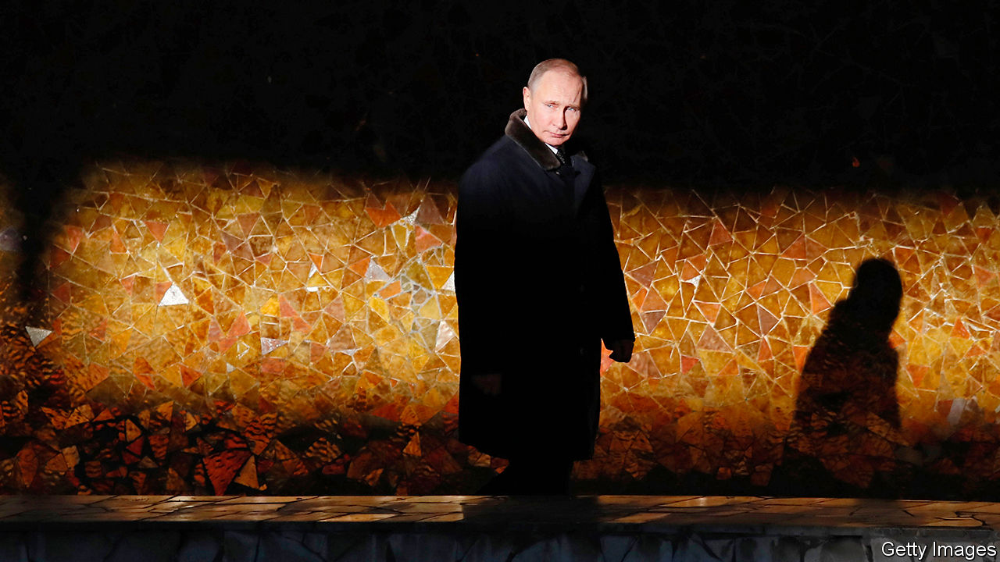

## Made men

# The enduring grip of the men—and mindset—of the KGB

> A meticulous account of Vladimir Putin’s consolidation of power in Russia

> Apr 23rd 2020

Putin’s People. By Catherine Belton. Farrar, Straus and Giroux; 640 pages; $35. William Collins; £21.99.

WHEN A BEDRAGGLED Russian phoenix emerged from the Soviet ashes, Western pundits were divided. Would the new creature sink into chaos, as often seemed inevitable; or, with Western help, would it resurface as a diminished but coherent state? A decade later, when an energetic Vladimir Putin succeeded an ailing Boris Yeltsin, Russia-watchers were seduced by a different false binary. Some thought Mr Putin would press on with creating a law-based, outward-looking market system. Others expected corruption and criminality to keep Russia poor and weak.

Such debates often say more about the biases of futurologists than about the future. As Catherine Belton’s powerful and meticulously reported new book shows, the apparent anarchy of the post-Soviet world has instead given way to a massive concentration of wealth and power, which is used by the new Russian elite to quash dissent at home and project force abroad.

Her subtitle is blunt and revealing: “How the KGB Took Back Russia and then Took on the West.” It also raises questions. For starters, what exactly is the KGB? Literally the “Committee for State Security”, one of the two pillars (with the Communist Party) of the Soviet state, whose successor agencies, above all the FSB, which focuses on domestic security, have been ever more dominant. More broadly, Russia’s intelligence community includes military espionage—and shadowy individuals who have grown rich through their proximity to this spooky world.

But as Ms Belton shows, the continuity between the Soviet agency that nurtured Mr Putin as a young officer, and the security-based behemoths that bestride today’s Russia lies less in institutions than in mentality. It is a mindset that believes anybody can be turned; that advantage can be sought in any situation, including anarchy; and that collaboration on ever-shifting terms is possible with any partner, from organised crime to Christian clergy.

Drawing on many interviews and diligent perusal of documents, Ms Belton, formerly a Moscow correspondent for the Financial Times, traces the links between Mr Putin’s formation in the KGB world, his early career as a cold warrior in East Germany and his increasingly open confrontation with the West. Instead of exhorting Russia to take its liberal medicine, many Westerners now worry about protecting their own politics from Russian subversion.

The book charts the milestones of this process, including the string of lethal bombings that coincided with Mr Putin’s ascent in 1999; later acts of terror in the Caucasus and Moscow; the crash of 2008 that hit Russia hard; Mr Putin’s re-election in 2012; and the intervention in Ukraine in 2014 and ensuing sanctions. In a narrative tour de force, Ms Belton explains how these developments affected the Russian elite. The pivotal event, she thinks, was the downfall in 2003 of Mikhail Khodorkovsky, boss of the Yukos oil company. She recounts his trial, and the appropriation of his assets, with passionate precision.

As she shows, Russia’s masters covered these seizures in a cloak of legal procedure which, in its sheer complexity, helped transform the Russian judiciary into an organ of the superstate. Those masters also thought (rightly) that Western objections could be parried by offering investors some nuggets from the energy giant they were creating. Indeed, all the current or former insiders in this book assume that, beneath a thin layer of democratic bluster, Western elites are biddable and buyable.

For all her insights into ruthless minds, Ms Belton does at least raise the possibility that some of those who surrounded Mr Putin in his early years in office sincerely believed in something: that the capitalist model of the 1990s had conceded too much to a hostile West. One who stands out is Sergei Pugachev, a businessman and erstwhile adviser, who claims credit for guiding the switch to state capitalism with a nationalist tinge. He fell foul of the authorities after 2012 but makes no apology for his previous role. Only his efforts to turn Mr Putin into a sincere Christian were a waste of breath, he tellingly concludes. ■