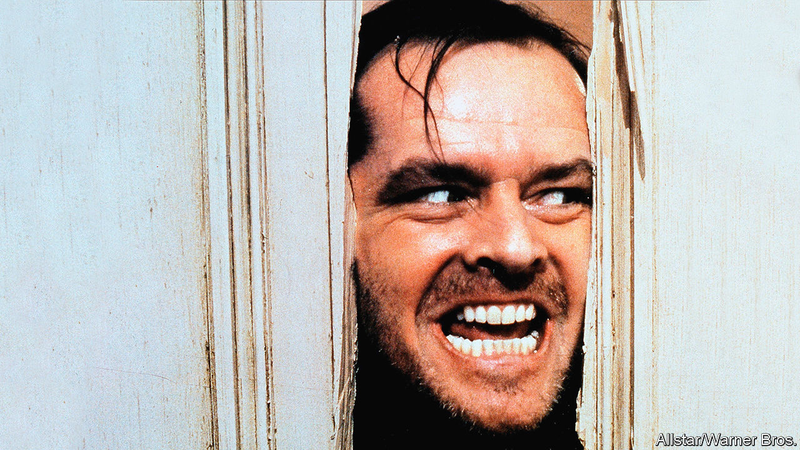

## Home Entertainment

# “The Shining” is perfect quarantine viewing

> Not least because you will never work out what it means

> Apr 25th 2020

Editor’s note: The Economist is making some of its most important coverage of the covid-19 pandemic freely available to readers of The Economist Today, our daily newsletter. To receive it, register [here](https://www.economist.com//newslettersignup). For our coronavirus tracker and more coverage, see our [hub](https://www.economist.com//coronavirus)

IN STANLEY KUBRICK’S horror classic, “The Shining”, Jack Torrance (Jack Nicholson) is hired as the winter caretaker of the cavernous Overlook Hotel, miles from anywhere in the Colorado Rockies. “Physically it’s not a very demanding job,” the manager tells him before the start of what is supposed to be a five-month stint. “The only thing that can get a bit trying up here during the winter is a tremendous sense of isolation.” Adapted from Stephen King’s bestseller, “The Shining” was released 40 years ago in May, but it is spookily relevant to the world’s predicament today.

Jack dismisses the manager’s warning. When he is left alone in the Overlook with his wife, Wendy (Shelley Duvall), and their son, Danny (Danny Lloyd), he is elated: he plans to knock out a novel in the peace and quiet. But like so many people who imagine that they will tick off a long-postponed project or two during the lockdown, Jack is mistaken. As far removed as “The Shining” is from Kubrick’s philosophical science-fiction masterpiece, “2001: A Space Odyssey”, the message of both films is that if three people are stuck in a confined space in the middle of nowhere, one of them will go mad and try to murder the others.

In 1980 “The Shining” was not as well received as “2001” had been in 1968; Mr King himself was unimpressed. But the film’s reputation improved with age. You need not have seen it to be aware of its brightly nightmarish images: the phantom sisters in blue dresses; the tidal wave of blood gushing from the lifts. The carpet pattern of red, orange and brown hexagons was reproduced in the foyer of the Design Museum in London for its Kubrick retrospective last year. No other floor covering in cinema history is so recognisable.

Famous imagery aside, the film is revered now for the same reason it was initially criticised: it refuses to spell out its themes or explain its plot twists. Is Danny summoning ghosts with his psychic powers? Is Jack insane before he comes to the Overlook? Is he the reincarnation of someone who was there 60 years earlier? And how come the vast hotel stays so gleamingly clean when nobody ever dusts?

Kubrick is known as an obsessive perfectionist, and so some fans believe that he answers all those questions and more in the movie—it is just that they can’t agree on what the answers are. A documentary released in 2012, “Room 237”, compiles some of the more imaginative interpretations, from the plausible (it’s about the slaughter of Native Americans) to the eyebrow-raising (it’s a cryptic confession that Kubrick faked the Apollo Moon landings).

That is why “The Shining” is ideal viewing now. Not only is the Torrances’ tremendous sense of isolation a gothic caricature of the lockdown, but you can watch the film again and again without ever working out what it all means. ■

Dig deeper:For our latest coverage of the covid-19 pandemic, register for The Economist Today, our daily [newsletter](https://www.economist.com//newslettersignup), or visit our [coronavirus tracker and story hub](https://www.economist.com//coronavirus)

## URL

https://www.economist.com/books-and-arts/2020/04/25/the-shining-is-perfect-quarantine-viewing
