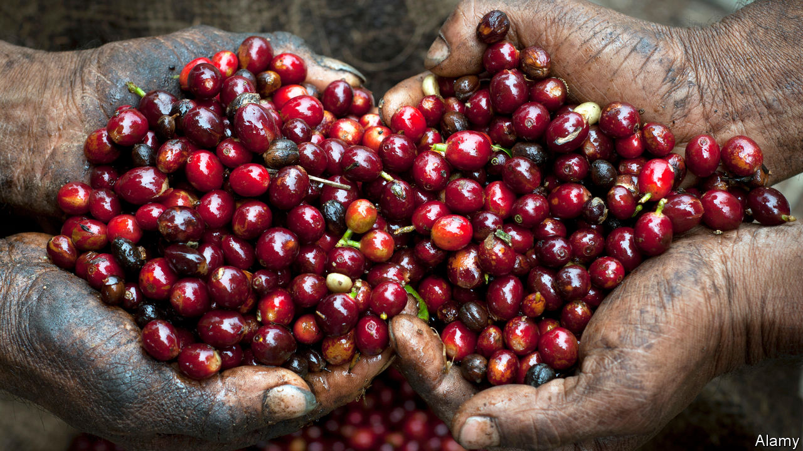

## The big grind

# The story of coffee is a parable of global capitalism

> In “Coffeeland”, Augustine Sedgewick focuses on a single plantation in El Salvador

> Apr 23rd 2020

Coffeeland. By Augustine Sedgewick.Penguin; 444 pages; $30 and £25.

WHAT BEGAN as an obscure berry from the highlands of Ethiopia is now, five centuries later, a ubiquitous global necessity. Coffee has changed the world along the way. A “wakefull and civill drink”, its pep as a stimulant awoke Europe from an alcoholic stupor and “improved useful knowledge very much”, as a 17th-century observer put it, helping fuel the ensuing scientific and financial revolutions. Coffeehouses, an idea that travelled with the refreshment from the Arab world, became information exchanges and centres of collaboration; coffee remains the default drink of personal networking to this day.

The focus of Augustine Sedgewick’s book is not coffee’s effect on drinkers but its role in the story of global capitalism, as a commodity that links producers in poor countries with consumers in rich ones. Coffee does more than merely reflect this divide, he argues—it has played a central role in shaping it. It is, he notes, “the commodity we use more than any other to think about how the world economy works and what to do about it”.

To illuminate this history, and the web of connections between workers on plantations and coffee-sipping consumers, Mr Sedgewick focuses on a single planter in one country: James Hill, a British emigrant who by the 1920s had established himself as “the coffee king of El Salvador”. By telling the story of El Salvador’s emergence as the world’s most intensive coffee economy, and following coffee beans from Hill’s plantation to American consumers’ cups, Mr Sedgewick painstakingly shows how shifts in the global coffee market have affected conditions for workers on the ground. The result is a portrait of the political and economic consequences of the world’s addiction to coffee.

He tucks many fascinating details into his narrative. Contrary to popular belief, for example, it was not the Boston Tea Party that led to tea’s dethronement as America’s favourite hot drink: it was the abolition of tariffs on coffee imports in the early 19th century, as the United States sought to build trade ties and buy influence across Latin America. Imports doubled every decade between 1800 and 1850; during the civil war the average Union soldier consumed five cups of coffee a day. By the turn of the 20th century consumption per person in America was roughly double the level in France and ten times that in Italy. Most of this coffee came from Latin America.

A secondary theme is the relationship between food and labour, and the effort to measure human food consumption and energy output. Hill applied ideas from industrial Manchester, the city of his birth, to wring as much work as possible from his team. By paying mostly in food, and removing all other sources of it (such as wild fruit trees), he could manipulate the degree of hunger among local workers, and thus the availability of labour. The resulting coffee was then used to optimise the efficiency of workers in America, as bosses realised that formal coffee breaks improved productivity. Both coffee producers and consumers, Mr Sedgewick scathingly implies, are mere cogs in the remorseless machinery of global capitalism.

After all this readers might expect his conclusion to be a ringing endorsement of the “fair trade” model (coffee is by far the leading fair-trade product), which adds a small premium to the price of certified coffees to fund projects to improve workers’ welfare. In fact, Mr Sedgewick thinks the arguments over fair trade obscure a more fundamental issue, which is the lack of other opportunities in places where the local economy is dominated by coffee. In El Salvador’s “dictatorship of coffee”, where coffee planters enjoyed a virtual monopoly on politics, the only alternatives were migration or revolution, leading to decades of strife during the 20th century that pitted coffee growers against their overlords.

Artfully blending together all these strands, and juggling a wide cast of characters, Mr Sedgewick’s book is a parable of how a commodity can link producers, consumers, markets and politics in unexpected ways. Like the drink it describes, it is an eye-opening, stimulating brew. ■

## URL

https://www.economist.com/books-and-arts/2020/04/23/the-story-of-coffee-is-a-parable-of-global-capitalism
