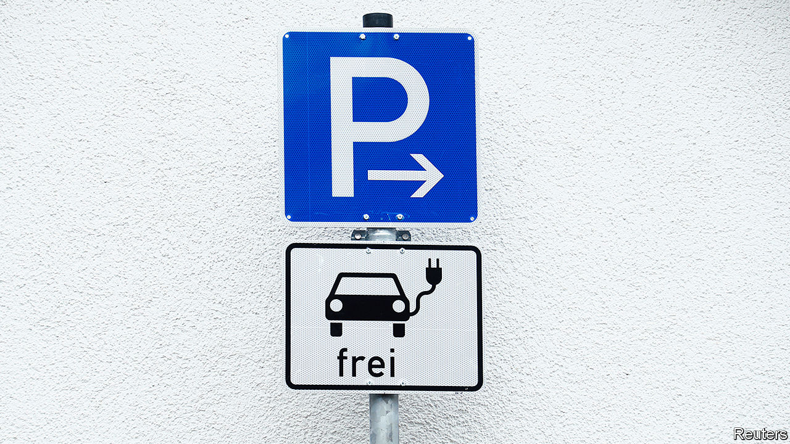
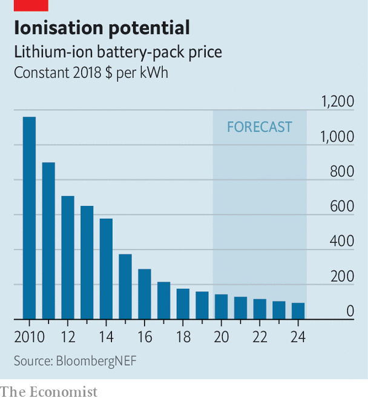

## Charging up for a long ride

# Lithium remains the car-battery material of choice

> But future designs may have double the storage

> Apr 25th 2020

WHEN, A DECADE ago, a new generation of electric vehicles (EVs) started to appear on the roads, researchers at the Georgia Institute of Technology spent a year tracking the habits of almost 500 American motorists to see how suitable such vehicles would be for them. Nearly a third, they found, could have completed most of their journeys using an EV with a range of only 100 miles (160km). On the half a dozen or so occasions that people needed to travel farther, they could have charged up en route, or hired a petrol-powered car.

These days, things are better. Many EVs are able to travel more than twice that distance on a single charge—and some big and expensive models can manage 400km or so. Still, a lot of potential buyers worry about running out of juice. The long-range batteries that would settle their nerves are coming, but a few pot-holes await.

The batteries that have made electric cars possible are composed of lithium-ion (Li-ion) cells—a design commercialised by Sony in 1991. What makes Li-ion batteries special is their high energy-storage capacity. A modern one is able to pack 200 watt-hours of electrical potential into a single kilogram of kit, for an energy density of 200Wh/kg. That is a fivefold improvement on the old lead-acid battery—and researchers are constantly fiddling to do better.

Li-ion cells get their name from the movement within them of lithium ions (lithium atoms with a missing electron, and so a positive electrical charge). When such a cell is discharging, the ions are created at one electrode, the anode. They then shuttle, via a separator which only they can pass, through a liquid electrolyte to a second electrode, the cathode. The electrons stripped away at the anode, meanwhile, travel towards the cathode along an external electrical circuit. This creates a current that can be used to power an electric motor. At the cathode, ions and electrons are re-united—and remain so until the battery is plugged into a charger and the whole process is reversed.

Handily for weight-sensitive applications like cars, Lithium is the lightest metal in the periodic table. But it is also reactive. The cells need careful construction to avoid flaws that can cause short circuits, and possibly a fire. Anodes usually consist of a carbon-rich material. The lithium in the cathode tends to be part of an oxide, typically lithium cobalt oxide. Cobalt is the costliest material in the battery and producers are trying to reduce its use. A lot of cobalt also comes from the Democratic Republic of Congo, where conditions for miners are grim. One popular way of reducing cobalt use is by replacing some of it with nickel and manganese, to produce what are known as NMC cells.

Last year China’s biggest maker of electric-car batteries, CATL, began the mass production of NMC batteries with an energy density of 240Wh/kg. Some other firms, including Tesla, hope to go further and get rid of cobalt altogether—though in Tesla’s case they are cagey about the details. Reducing the cost of materials, together with economies of scale from the huge factories that CATL, Tesla and their rivals operate, are steadily bringing down the price of batteries. In 2010, according to BloombergNEF, a research firm, that price averaged $1,160 per kWh. By 2024 it may drop below $100 (see chart). At that point EVs will be more competitive with combustion-engined cars.

As for greater range, many people in the field are pinning their hopes on batteries that have solid rather than liquid electrolytes. Lithium ions can tunnel through certain solid electrolytes. Such cells would be safer and provide the possibility of using other electrode materials for much higher energy densities. Among the latest of these solid-state proposals is a design developed at Samsung’s research laboratories in South Korea and Japan by a group led by Dongmin Im. This uses an NMC cathode, an anode made of a composite of silver and carbon, and a solid electrolyte based on a substance called argyrodite that is a compound of silver, germanium and sulphur.

According to a paper the team published in March, these cells have an energy density of 900Wh per litre. That means they have double the capacity, for a given volume, of a conventional Li-ion cell. The group estimate the cell delivers 430Wh/kg, which would power an electric car for something like 800km. And argyrodite cells do not grow damaging needle-like crystals called dendrites, which can develop while Li-ion cells charge.

This battery should be “more cost-effective” than current cells, the team reckons. Unfortunately for actual motorists, they are unable to say when or how it could be mass-produced. This is a common problem with such devices. Arumugam Manthiram, a battery expert at the University of Texas at Austin, points to two main obstacles in the way of solid-state batteries.

First, two solids placed face to face have only limited points of contact through which ions can pass between electrode and electrolyte. Contact between a liquid and a solid is, by contrast, continuous. One way to overcome this is to use a polymer electrolyte that is flexible enough to conform itself to the surface of a solid electrode. Alas, as Dr Manthiram observes, “We do not yet have a good polymer electrolyte.”

The second problem is manufacturing. Many solid electrolytes are ceramics, and so brittle. That makes them tricky to produce in large sheets. Polymers avoid this. But they face the original problem.

Moreover, newish though it is, the Li-ion technology is well established enough for vested interests to exist. Shifting from liquid to solid electrolytes would mean building a lot of expensive new plant. Developing better liquid electrolytes, and new electrodes to match them, may be the surest route towards safer, more powerful Li-ion batteries. ■

## URL

https://www.economist.com/briefing/2020/04/25/lithium-remains-the-car-battery-material-of-choice
