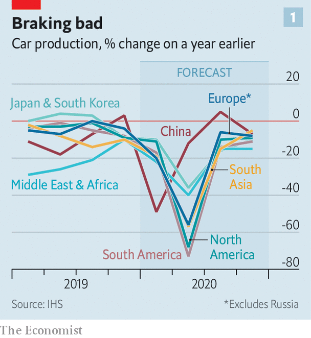
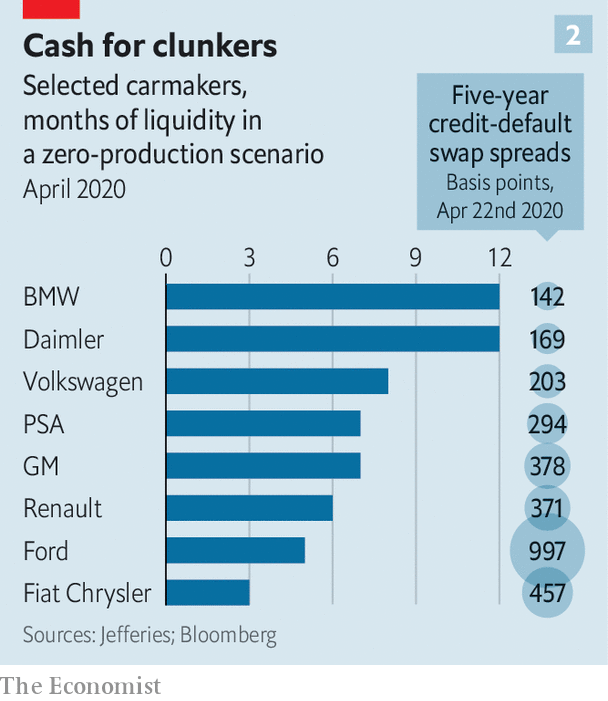

## From 60 to zero

# The world’s car giants need to move fast and break things

> They have dawdled for too long

> Apr 25th 2020

WHEN CARMAKERS sold 95m cars and commercial vehicles in 2017 the 100m mark seemed just around the corner. After a disappointing 2018 and 2019, this year was forecast to be a turning point. And it will be—in the wrong direction. As governments around the world have ordered factories to close and locked-down buyers put off purchases, car sales are expected to plummet by a fifth (see chart 1), to a level last seen in the depths of the global financial crisis of 2007-09. A feared second wave of covid-19 makes prospects for 2021 uncertain. The industry, already facing a precarious and colossally expensive shift to electric cars, will emerge from the pandemic transformed—not necessarily for the better.

Most carmakers were fitter going into this crisis than the last recession a decade ago. Back then America’s General Motors (GM) and Chrysler entered bankruptcy and needed bail-outs. This time balance-sheets looked stronger, costs had been tamed and firms had restructured to concentrate on profitable businesses. Nothing, though, prepared them for the coronavirus. First China and then the world went into lockdown. Car firms, parts suppliers, showrooms and repair shops shut.

The immediate concern is survival. Firms are tapping old and new credit lines despite high borrowing costs. Ford, an American firm, is paying a punishing 9% interest on its newly issued bonds. The price of insuring its debt against default has soared since December. Other companies, too, have seen their creditworthiness increasingly questioned.

They have no choice but to borrow. Credit Suisse, a bank, expects GM and Ford to burn through $10bn and $14bn of cash, respectively, in the first half of 2020. France’s PSA Group, which reported first-quarter results on April 21st, and enjoyed record profitability before production stopped, used up €4bn ($4.4bn) of cash between January and March, leaving it with gross liquidity of €19bn. Analysts at Jefferies, a bank, estimate that the eight biggest carmakers in Europe and America could, in all, burn over $50bn of cash in the second quarter. At that rate, they may run out of money by the end of the year (see chart 2).

Companies are cancelling dividends and begging governments for assistance. Across the rich world governments will pay furloughed workers, whose wages eat up around 15% of car firms’ revenues, according to Morgan Stanley, a bank. In Germany Volkswagen, BMW and Daimler will use a videoconference with Angela Merkel on May 5th to implore the chancellor to revive a “cash-for-clunkers” scheme like the one introduced after the financial crisis.

At least factories are opening after having been shut for weeks. Those in China are already up and running. Chinese dealerships are, too. Early signs offer some encouragement. Chinese sales collapsed by 80% in February, year on year, according to the China Passenger Car Association, an industry body. In March they were down by two-fifths—still dismal but less so. April promises to be better. In the first 19 days of the month sales were down by just 7% from the same period last year.

Even if sales recover, scars will remain. Capacity utilisation in Chinese factories was already low by global standards, at 75%. It is surely even lower now—possibly below the 65% that, according to an industry rule of thumb, carmakers need to break even. Social distancing is hard on an assembly line, where even highly automated procedures, such as robotically attaching windscreens, require half a dozen workers in attendance.

Labour shortages caused by illness, the need for more deep-cleaning and other safety measures will be a drag on firms’ productivity for a while. VW, one of several European firms that will slowly restart from April 27th, will use experience from reopening 32 of its 33 plants in China. Its 100-point plan will safeguard workers’ health—but make their jobs harder.

Bigger question-marks hang over the supply chain. Natural disasters such as a devastating earthquake and tsunami in Japan in 2011 taught car companies to diversify their suppliers and have alternatives to fall back on. But not all parts can be sourced from several parts-makers. As Matteo Fini of IHS Markit explains, bulky ones like door panels tend to be made close to factories, where you are unlikely to find multiple producers. Doubling up capacity for those that require pricey tooling, such as dashboards, is prohibitively expensive.

Suppliers are also financially feebler than the carmakers they serve. AlixPartners, a consultancy, finds that nearly a quarter of 400-odd stockmarket-listed parts-makers face immediate cash shortfalls. Continental, a German producer of everything automotive from electronics to tyres, which itself supplies carmakers, warned that dozens of its suppliers are on the brink. Without parts and people, factories cannot run at full steam.

The depressing mix of stifled production and uncertain future sales will crimp profits. Margins were under pressure before the pandemic slump, in part owing to investments in electric vehicles (EVs), particularly in Europe, where emissions targets are tightening. Now capital spending and research-and-development budgets are under review. The thorny question of what resources to allocate to EVs and other future technologies has gained new urgency.

In the words of Dan Levy of Credit Suisse, the industry is running on “two clocks”. The first marks time in the near term, when investment in fossil-fuelled vehicles, which provide the bulk of profits, has to continue, not least to ensure that firms have money to invest in electric ones (as well as self-driving cars and mobility services). On this clock companies will keep selling EVs at a loss for several years. On the second, longer-term clock, battery prices will fall enough to ensure profitability (see [article](https://www.economist.com//briefing/2020/04/25/lithium-remains-the-car-battery-material-of-choice)). But margins on EVs may not match those of conventional automobiles for a while, if ever.

Herbert Diess, VW’s boss, alluded to the complicated equation when he said in January that the car industry would have to “slaughter some sacred cows”. VW has made a start with the industry’s biggest bet on the future, vowing to plough €60bn into EVs and other new technologies over the next five years.

The question is whether motorists are interested. The take-up of electric cars has been slow except in China, where the government has lavished subsidies on the technology to turn its carmakers into world leaders. In Europe, where consumers worry about range, charging infrastructure and cost, only two in every 100 cars sold last year ran on pure battery power.

Carmakers have not (yet) asked for relief from Europe’s tougher emissions rules, so the proportion of EV sales will have to rise (it may not in America, however, where emissions standards were recently relaxed). But buyers will be pulled in two directions, says Andrew Bergbaum of AlixPartners. The pleasure of breathing cleaner city air during lockdowns may persuade some to go for EVs. Many others will hold on to older petrol cars for longer—especially with falling oil prices, a glut of cheap second-hand cars foreclosed from unpaid leases and fewer incentives from cash-strapped governments to buy electric.

Covid-19 may, then, slow electrification—but will not derail it. Car firms must sooner or later press ahead with efforts to make EVs profitable. Some are pooling resources in areas where profits are highest. GM’s decision to sell its loss-making Opel unit to PSA in 2017 and get out of Europe was an early example. The mega-merger announced last year between PSA, which has turned a profit at Opel by wrapping it in its larger European business, and Fiat Chrysler is still on track. (The chairman of Fiat Chrysler, John Elkann, sits on the board of The Economist’s parent company.)

More consolidation looks certain, though perhaps not through full mergers, which have a mixed record in carmaking. Investors would welcome efforts to reduce the duplication of investment, which has long depressed returns. They can expect more alliances to pool scarce resources, such as one announced last year by BMW and Jaguar Land Rover to jointly develop EVs. Another between Ford and VW to share electrification costs could become more intimate. Morgan Stanley sees “no limit” to their collaboration. Patrick Hummel of UBS thinks that even joint development of next-generation petrol engines may make sense. Alliances, though, are complicated. The biggest, between Renault and two Japanese firms, Nissan and Mitsubishi, may finally snap under the strain of coronavirus.

The pandemic will not hurt everyone equally. Tesla in particular has had a good crisis. The electric-carmaker enjoys a big backlog of orders, enough liquidity to see it through the downturn—and no petrol-engine legacy to shed. Its share price has regained ground since a dip in March. Only Toyota has a higher market capitalisation.

The Japanese giant and VW, which make roughly 10m cars each annually, should weather the storm. Chinese companies may look for cheap bargains abroad. Two of them, Geely and BAIC, already hold big stakes in Daimler (maker of Mercedes cars), which does not have strategic shareholders of the sort that protect VW and BMW from takeover. Mass-market firms, mostly operating on wafer-thin margins, will struggle. Taxpayers look likely to prop up some weaklings, like Renault.

The biggest concern may be that the virus changes attitudes to cars. On the one hand, fear of infection may put commuters off trains, buses or ride-hailing, and into automobiles. On the other, more home-working may reduce commuting of any kind, including with your own set of wheels. A prolonged recession could damage sales for good. Carmakers of the future may yet look back nostalgically to 2017 as their industry’s peak. ■

## URL

https://www.economist.com/briefing/2020/04/25/the-worlds-car-giants-need-to-move-fast-and-break-things
