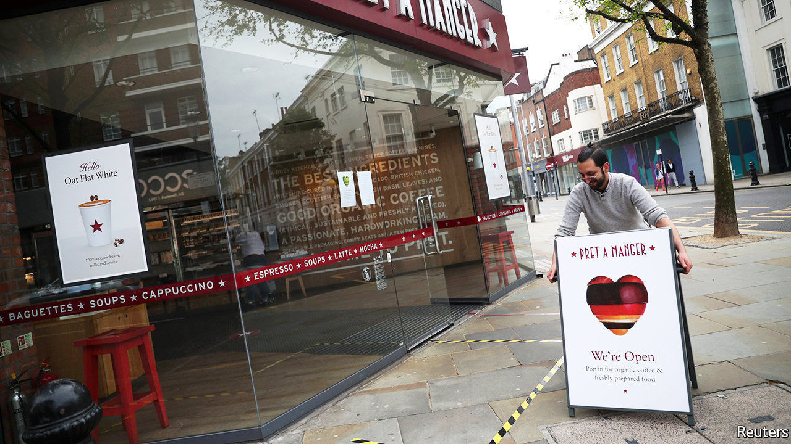

## Pret A Ouvrir

# British fast-food chains are slowly restarting business

> How they operate in the new world offers a preview of the long, slow reopening that awaits

> Apr 25th 2020

Editor’s note: The Economist is making some of its most important coverage of the covid-19 pandemic freely available to readers of The Economist Today, our daily newsletter. To receive it, register [here](https://www.economist.com//newslettersignup). For our coronavirus tracker and more coverage, see our [hub](https://www.economist.com//coronavirus)

GONE ARE the crowds, the conviviality and the smashed avo on gluten-free bread. At the Warren Street branch of Pret A Manger, a purveyor of sandwiches and salads, they have been replaced by six-people-at-a-time rules, plastic screens separating customers from cashiers, and a reduced menu. It’s Pret, but not as we know it.

Over the past few days, a handful of fast-food chains have begun to restart operations. Pret has opened ten branches out of more than 400, and only for half the day. Some 15 KFCs are back. And Burger King has opened four branches, chosen for their large kitchens and drive-through facilities. At a time when the government is refusing to lay out its plans for ending the lockdown, the private sector offers a glimpse of how the economy may begin to open up.

The first problem is the pause itself. Stopping and starting a business is tricky, especially when suppliers are going under. “If you lose one ingredient, you might lose three dishes,” says Sarah Humphreys of Deloitte, a consultancy. Even in normal circumstances supply chains are delicate. In 2018 KFC switched logistics companies and managed to run out of chicken.

Once supply chains have been restarted, the next task is to overhaul processes that have been carefully calibrated over years, perhaps decades. Commercial kitchens are frantic, tightly-packed places. No more. The Warren Street Pret would once have had six to eight people preparing food. Now it has just two. Staff used to scurry back and forth between the tills and the kitchen; now that is one person’s job.

With new processes in place, a third problem remains, one that chief executives can do little about: the attitude of the public. Even if all businesses were to open tomorrow, people may be unwilling to risk their health and that of their families for a burger, no matter how delicious. “I think you will see people less keen to do anything where there is unnecessary contact” says Paula MacKenzie, KFC’s boss in Britain. People may not want to queue up, or to use the touchscreen menus now common in fast-food restaurants. Such concerns apply as much to public transport and bustling city centres as they do to casual dining.

The rules around Britain’s lockdown have been less restrictive than elsewhere in Europe, allowing many independent restaurants and cafés to choose whether to remain open for takeaway and delivery. But consumers expect different things from small businesses than they do from big chains whose primary offering is consistency. Many of these concerns are particularly pressing in Britain, which has far greater population density and less of a drive-through culture than America.

Bosses seem resigned to scaling down their ambitions. Alasdair Murdoch of Burger King fears this may be the “death knell” for the high street, with deliveries replacing eating out. Still, they are also hopeful. Restarting “gives us the opportunity to look at things much more holistically”, says Pano Christou, Pret’s chief executive. “I think our operating model will have to change…we are going to have to be very nimble.” As the country negotiates a changed landscape in the months to come, it will have to do the same. ■

Dig deeper:

The Economist Today

[newsletter](https://www.economist.com//newslettersignup)

[coronavirus tracker and story hub](https://www.economist.com//coronavirus)

## URL

https://www.economist.com/britain/2020/04/25/british-fast-food-chains-are-slowly-restarting-business
