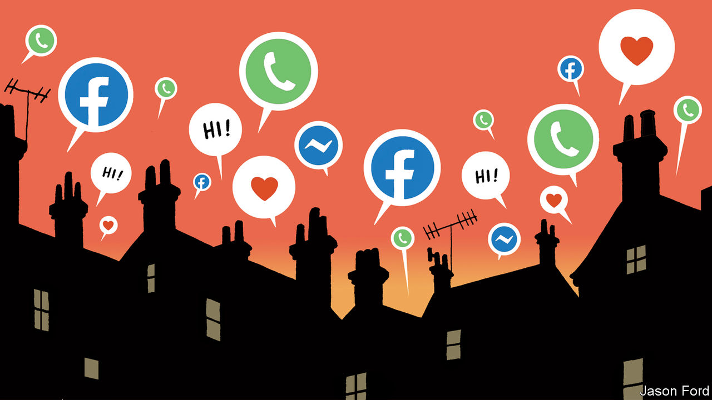

## The new neighbourhood watch

# Official data suggest Britons are learning to help each other

> But even in an age of civic-mindedness, some are left out

> Apr 25th 2020

Editor’s note: The Economist is making some of its most important coverage of the covid-19 pandemic freely available to readers of The Economist Today, our daily newsletter. To receive it, register [here](https://www.economist.com//newslettersignup). For our coronavirus tracker and more coverage, see our [hub](https://www.economist.com//coronavirus)

WHEN THE rest of Britain was ordered to stay at home on March 23rd, Jane Kinder-Williams was already growing accustomed to isolation. The 66-year-old, who lives on her own in a Buckinghamshire village, was doing her best to avoid others after treatment for cancer. But, with everyone at home, this new form of lockdown is different. Friends and family are in touch even more, via apps like Houseparty, WhatsApp and Zoom. And her street’s WhatsApp group buzzes with endless offers to help. Neighbours have done all her shopping for the past month. “Everybody is making far more of an effort towards each other,” says Ms Kinder-Williams. “We’ve realised how vulnerable we can be.”

This outbreak of neighbourliness is widespread. Official statistics show that 22% of Britons now belong to some form of community support group, with more than a third of them joining since covid-19 began to spread. About 2m people have joined local support networks on Facebook and the number of daily users of Nextdoor, a hyperlocal social network, has risen by 90% during the crisis. All kinds of wheezes, like national street parties and befriending schemes, have tried to induce such fellow feeling, says Harry Hobson, director of Neighbourly Lab, a think-tank. “A crisis accelerates it much more than well-meaning interventions,” he reckons.

Take Chapel-en-le-Frith, a small town in the Peak District. An eighth of its 8,000 residents belong to a covid-19 Facebook group, set up by a dozen volunteers just before the lockdown began. They collect shopping for vulnerable locals but also raise each others’ spirits. Some organised a virtual pub quiz; others put soft toys in their windows so that young children could treat their daily exercise as a “teddy-bear hunt”. Charles Lawley, who helped to set up the group, hopes it will rekindle a neighbourhood spirit left behind as the town has grown. In Warwickshire, Molly Bufton Stear, a recent university graduate, has enlisted an army of volunteers to cook free meals for 30 elderly locals every day. “They write me little notes and I write them things back,” she says.

Such groups have their limitations. Many vulnerable Britons, especially the elderly, are also the most likely to struggle with the internet and smartphones. And neighbourhood groups may not reach the neediest. Polling by Onward, a think-tank, suggests people are most willing to help their neighbours in places where they already feel they can trust each other. Will Tanner, its director, worries about “a virtuous circle in already relatively cohesive and integrated areas”, leaving behind places without such a social fabric. Mr Hobson spoke to a woman who had meticulously checked off all the households on her street to ensure they had the help they needed, but had not leafleted the housing estate over the road.

Others are sceptical that this civic-mindedness will outlast the pandemic. Despite much hype at the time, the London Olympics in 2012 did little to inspire a legacy of volunteering. The bonhomie of street parties is tricky to sustain once the final cupcake has been wolfed down. But, says Mr Hobson, neighbourliness is best thought of as a ratchet. “Once you meet someone, you can’t unmeet them.” Conversation is easier once you know your neighbour’s name. Paradoxically, social distancing and isolation may be just what is needed to bring people together. ■

Dig deeper:For our latest coverage of the covid-19 pandemic, register for The Economist Today, our daily [newsletter](https://www.economist.com//newslettersignup), or visit our [coronavirus tracker and story hub](https://www.economist.com//coronavirus)