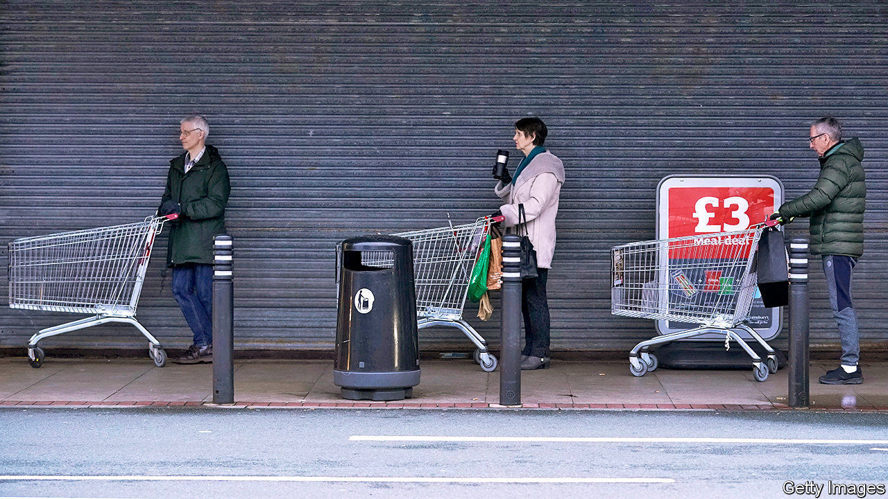

## The price isn’t right

# The impossibility of measuring inflation in a pandemic

> Inaccurate data is not just a problem for economists

> Apr 25th 2020

Editor’s note: The Economist is making some of its most important coverage of the covid-19 pandemic freely available to readers of The Economist Today, our daily newsletter. To receive it, register [here](https://www.economist.com//newslettersignup). For our coronavirus tracker and more coverage, see our [hub](https://www.economist.com//coronavirus)

PEOPLE CAN tolerate their central heating failing in summer. They tend to miss it rather more when it goes in the depths of winter. Accurate and timely economic statistics are similar: British economists have long grown used to the Office for National Statistics (ONS) providing reliable data; now, at the time of greatest need, the data are about to become considerably dodgier. On April 22nd the ONS reported that consumer-price inflation fell to 1.5% in March, down from 1.7% in February. The numbers over the next few months will bear less relation to reality.

To measure inflation the ONS tracks the prices of goods (including booze and shoes) and services (including haircuts and car repairs) in a basket of items thought to resemble the spending of a “typical consumer”. The data for March were mostly collected by the middle of the month, and are thus relatively free of pandemic-related disruption. The same will not be true next month, however. Nearly half the data are collected by physically visiting stores in 140 places across Britain, many of which have shut as a result of the lockdown. Even in March, empty shelves meant estimates of the prices of flour, pasta and eggs were based on fewer than half the number of observations made the month before.

The ONS will try to circumvent the problem by making more use of online data and information given to them directly by retailers. A bigger problem may be the weighting of the basket itself. Spending on restaurants and hotels, for example, accounts for 12% of the current basket; recreational and cultural activities for 17%. But nowadays eating in a restaurant is impossible and few people are rushing to book their summer holidays. When restaurants and hotels open again they are likely to have lower prices than before the lockdown, which will drag down official inflation measures.

A further problem comes from how the ONS handles bulk-buying discounts. At the moment, buy-one-get-one-free offers are excluded from the calculations on the assumption that their use by retailers doesn’t vary much. That assumption no longer holds: supermarkets have been dropping such offers at an unprecedented pace, branding them “irresponsible” as they may encourage hoarding. Tesco, Britain’s largest supermarket chain, cut the number of promotions by 14% in March. By not taking their disappearance into account, future inflation measures will understate price rises. A paper published in 2009 found that poor households tend to benefit more than rich ones from such offers.

This will have long-term ramifications for government policy. In April 2021 consumer-price inflation from this autumn will be used to adjust tax thresholds and benefit payments. Measured inflation, dragged down by factors like the high weighting for social activities and holidays, is likely to understate the cost-of-living increases, particularly those faced by people at the bottom of the income distribution. Poor households may thus end up facing a double whammy: a more expensive weekly shop, followed by less government support to pay for it. ■Dig deeper:For our latest coverage of the covid-19 pandemic, register for The Economist Today, our daily [newsletter](https://www.economist.com//newslettersignup), or visit our [coronavirus tracker and story hub](https://www.economist.com//coronavirus)