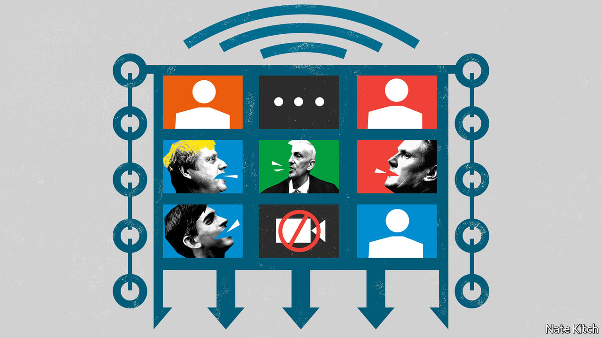

## Bagehot

# The Virtual Parliament brings a welcome return to scrutiny

> It comes just as the government is losing its halo

> Apr 25th 2020

Editor’s note: The Economist is making some of its most important coverage of the covid-19 pandemic freely available to readers of The Economist Today, our daily newsletter. To receive it, register [here](https://www.economist.com//newslettersignup). For our coronavirus tracker and more coverage, see our [hub](https://www.economist.com//coronavirus)

IN THE 17TH CENTURY parliaments gloried in names such as the Blessed Parliament, the Addled Parliament, the Happy Parliament and the Useless Parliament. The British have long since dropped the habit of naming parliaments—perhaps because too many deserved the sobriquet “useless”—but there is surely a case for reviving it to commemorate the institution’s first collision with cyberspace. The parliament which met on April 21st could be known as the Zoom Parliament or the Virtual Parliament or, to be strictly accurate, the Hybrid Parliament.

The returning parliament is like no other. The Speaker, Sir Lindsay Hoyle, presides over a sepulchral chamber. Only 50 MPs are allowed in at any one time. Giant screens hang from the empty galleries. Ministers and other politicians have a choice over whether to appear in person or virtually. In the first Prime Minister’s Questions (PMQs) of the new age on April 22nd, both Dominic Raab, standing in for Boris Johnson, and Sir Keir Starmer, making his debut appearance as leader of the opposition, turned up in person. Along with most questioners, Ian Blackford, leader of the Scottish National Party in Westminster, chose to Zoom in.

There will inevitably be technological glitches with the new system. Screens will freeze. MPs will forget to press the mute button. Speakers will drone on for too long (there is nothing like the virtual floor to put wind into the windbag). The screens will encourage viewers to become obsessed with trivia. Which MPs seem to have employed professional barbers during the lockdown? Which Tories are burnishing their northern credentials by displaying copies of Viz magazine on the shelves behind them?

The unique atmosphere of British politics has been lost. Parliament is designed to create as much pressure as possible: the government and the opposition face each other just two sword blades apart; there are more MPs than available seats; the noise shakes the rafters. The pressure is particularly high at PMQs when the most powerful person in the country is subjected to mob mauling. Good government types like to deride PMQs as Punch-and-Judy politics. But some of Britain’s most powerful prime ministers, including Tony Blair and Margaret Thatcher, have been humbled by clever questions. This week’s were tame by comparison.

Still, even a parliament without the blood and noise is better than none. For the past month Britain has witnessed some of the most dramatic events in peacetime without any parliamentary scrutiny whatsoever. In Parliament’s absence a daily press conference has filled the scrutiny void. But these conferences have been more about messaging than public accountability. Journalists lack the most important tools in MPs’ armouries: the power to ask written questions which the relevant ministers are obliged to answer; a detailed knowledge of their local constituencies; and, above all, the ability to speak on behalf of voters.

The evidence from the one bit of Parliament that has continued over the long Easter break is positive. The select committees have subjected both ministers and experts to highly effective virtual grilling. Greg Clark, chairman of the science committee, questioned witnesses on why they had not learned from other country’s successes, particularly South Korea’s approach to testing. Jeremy Hunt, chairman of the health committee, focused on why Britain has been slow to introduce track-and-trace. It is regrettable that the most important of the select committees, the Liaison Committee, which has the power to call the prime minister and ask questions that cut across ministerial fiefs, is not sitting because the government has infuriated Parliament by trying to impose its own man, Sir Bernard Jenkin, as chairman.

The arrival of the Virtual Parliament is part of a general return of scrutiny to British politics. The government is losing the halo that naturally surrounded it in the early days of the crisis. The Labour opposition is at last a force to be reckoned with now that Jeremy Corbyn has stood down and the party’s interminable leadership election has been resolved. The number of urgent questions that people want answered has increased during the period of parliamentary inactivity. Why did Mr Johnson fail to preside over the first five COBRA meetings? Why didn’t the government respond to initial news of the virus in China by buying tests and kit on the global market? And—the one Sir Keir focused on at PMQs—why has Britain been so slow to introduce mass testing?

This is all to be welcomed on the condition that scrutiny does not degenerate into gotcha-style condemnation. The case for scrutiny of the government—particularly during a crisis—is not that it gives people a chance to vent their collective fury. Bashing the government is as idiotic as grovelling before it. It is that it gives the government a chance to adjust its behaviour in the light of new evidence. MPs are particularly well equipped to bring this evidence to light for both obvious reasons (they represent people in every corner of the country) and less obvious ones (they bring a wide variety of experiences to bear). Several MPs, including Labour’s Rosena Allin-Khan, an A&E doctor, are working on the front line in the National Health Service.

With that proviso, Parliament needs to do everything it can to increase its powers of scrutiny. Laura Kuenssberg, the BBC’s political editor, talks of Parliament putting its “digital toe” in the water. The rest of the body needs to follow. The Liaison Committee should get to work quickly under an independent chairman. Government ministers have enjoyed some big successes during this crisis. Most important, the NHS has not collapsed under the weight of the epidemic despite predictions to the contrary. But they have also made some unnecessary mistakes. Better scrutiny, whether physical or virtual, should improve ministers’ chances of avoiding more mistakes or, if they can’t avoid them, their chances of correcting course as quickly as possible. ■

Dig deeper:For our latest coverage of the covid-19 pandemic, register for The Economist Today, our daily [newsletter](https://www.economist.com//newslettersignup), or visit our [coronavirus tracker and story hub](https://www.economist.com//coronavirus)

## URL

https://www.economist.com/britain/2020/04/25/the-virtual-parliament-brings-a-welcome-return-to-scrutiny
