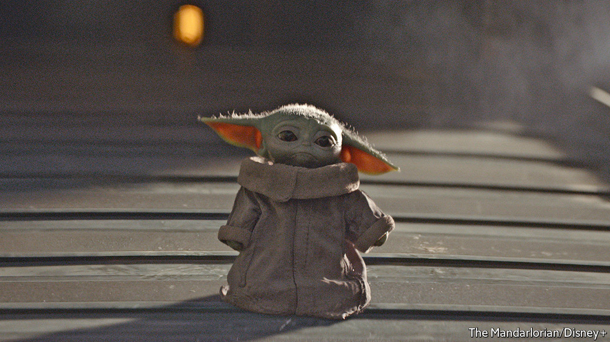
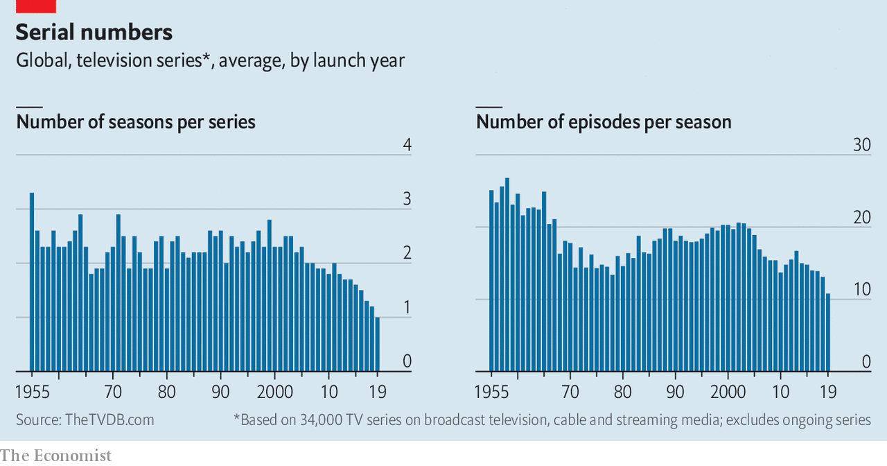

## Medium and message

# How technology shapes TV shows’ narrative arcs

> Streaming is only the latest technology and business model to influence what television looks like

> Apr 23rd 2020LOS ANGELES

“LES AMOURS de la reine Élisabeth” (The Loves of Queen Elizabeth), starring Sarah Bernhardt, had four acts. So do many dramas—but in this case the narrative arc was partly dictated by pedestrian concerns. When the film opened in New York’s Lyceum theatre in 1912 it came in four reels. Projector operators needed intervals to switch from one to the next. In the past century technology and business models have helped shape the message in moving pictures—nowhere more so than in television. Online streaming is no different. 

 As TV conquered Western homes in the 1950s shows came in two main durations: half-an-hour and an hour. In America this gave producers 20-odd or 40-odd minutes to play with after setting aside time for ads; of the 173 episodes of “Seinfeld”, a sitcom that ran from 1989 to 1998, all but the two-episode finale were 22 or 23 minutes long. Commercial breaks, for their part, shaped episode cadence: you could expect a mini-cliffhanger ahead of one. Like HBO and other pay-TV channels, most streaming services earn money from subscriptions, not ads, so creators enjoy more artistic licence to determine episode length and structure, says Jonathan Dunn of McKinsey, a consultancy. “Tiger King”, Netflix’s latest hit true-crime series, about exotic-cat breeding, comes in chunks lasting anywhere between 40 minutes and 48 minutes.

 The medium also determines the structure and number of shows’ seasons. As the number of American commercial TV stations increased from fewer than 600 in 1965 to 1,600 in 2000, they needed more shows to fill schedules. Since new ones are risky bets, broadcasters preferred to stick to existing programmes. Episode counts went up, boosted by syndication contracts, which generally stipulated that after a show had aired for a certain number of episodes, usually 88 (or four seasons), the rights to air it could be sold to third parties.

Streaming services like Netflix take the opposite tack to syndication, luring viewers with fresh content that cannot be found elsewhere (see [article](https://www.economist.com//business/2020/04/23/netflix-will-remain-a-blockbuster-hit-beyond-the-covid-19-era)). Many of the 10m people who signed up for Disney’s new streaming platform by its first day last November probably did so to watch “The Mandalorian”, a Star Wars spin-off. In the first nine months of 2019 seven of Netflix’s ten most-watched original shows were in their debut season. Unless a show is a mega-hit like HBO’s “Game of Thrones”, explains Leigh Brecheen, an entertainment lawyer in Hollywood, it now makes more financial sense to produce something new rather than renew something old. 

The upshot of the shift away from syndication and towards streaming has been a decline in the average number of episodes per season. Based on figures for 34,000 TV shows worldwide that debuted between 1955 and 2018, compiled by the TVDB, a website, this fell from over 20 to under 11 (see chart). The number of seasons per series dropped, too, by nearly 70%. 

Many actors, producers and writers love these abridged runs because they give them the flexibility to take other jobs. Creators also no longer need to worry that their shows will one day be aired sporadically through syndication, so are free to let plots unspool over multiple episodes. Sitcom episodes remain mostly self-contained but serialised drama is “uniquely suited” for streaming, says Sandra Stern of Lionsgate, a production company. The internet has also enabled “binge-watching”, which Netflix pioneered with the release of the entire first season of “House of Cards”, a political thriller, on February 1st 2013. Binge-friendly platforms allow viewers to skip the opening and final credits—and encourage creators to start with a bigger bang and end hanging on a steeper cliff. ■