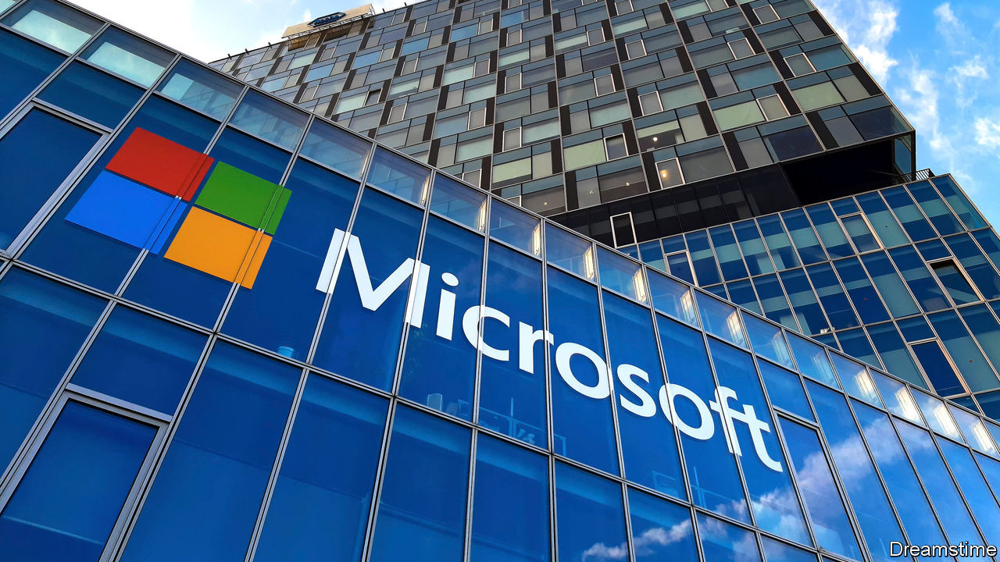

## Tear down this wall

# Microsoft embraces big data

> Once a walled garden, the world’s biggest tech firm wants to liberate digital information

> Apr 23rd 2020SAN FRANCISCO

TWO DECADES ago Microsoft was a byword for a technological walled garden. One of its bosses called free open-source programs a “cancer”. That was then. On April 21st the world’s most valuable tech firm joined a fledgling movement to liberate the world’s data. The company plans to launch 20 data-sharing groups by 2022 and give away some of its digital information, including data it has gathered on covid-19.

Microsoft is not alone in its newfound fondness for sharing in the age of the coronavirus. “The world has faced pandemics before, but this time we have a new superpower: the ability to gather and share data for good,” Mark Zuckerberg, the boss of Facebook, a social-media giant, wrote in the Washington Post on April 20th. Despite the EU’s strict privacy rules, some Eurocrats now argue that data-sharing could speed up efforts to fight the virus.

The case for sharing data predates the pandemic. The OECD, a club mostly of rich countries, reckons that if data were more widely exchanged, many states could enjoy gains worth 1-2.5% of GDP. The estimate is based on heroic assumptions (such as putting a number on opportunities for startups). But economists agree that readier access to data is broadly beneficial, because data are “non-rivalrous”: unlike oil, say, they can be used and re-used without being depleted, to power various artificial-intelligence algorithms at once, for example.

Many governments have recognised the potential. Cities from Berlin to San Francisco have “open data” initiatives. Companies have been cagier, says Stefaan Verhulst, who heads the Governance Lab at New York University, which studies such schemes. Firms fear losing intellectual property, imperilling users’ privacy and hitting technical obstacles. Standard data formats (eg, JPEG images) can be shared easily, but much that a Facebook’s software collects would be meaningless to a Microsoft, even after reformatting. Less than half of the 113 “data collaboratives” identified by the lab involve corporations. Those that do, including initiatives by BBVA, a Spanish bank, and GlaxoSmithKline, a British drugmaker, have been small or limited in scope.

Microsoft’s campaign is the most consequential by far. Besides encouraging non-commercial sharing, the firm is developing software, licences and (with the Governance Lab and others) rules frameworks to let firms trade data or provide access without losing control. Optimists believe that the giant’s move could be to data what IBM’s embrace in the late 1990s of the Linux operating system was to open-source software. Linux went on to become a rival to Microsoft’s own Windows and today underpins Google’s Android mobile software and much of cloud-computing.

Brad Smith, Microsoft’s president, notes that fewer than 100 firms collect more than half of all data generated online. More sharing would, in his view, counteract the concentration of economic—and political—power. Bridging the “data divide”, as he calls it, won’t be easy. Data are more complex than code. Most programmers speak the same language and open-source collectives mainly solve technical problems. People in charge of data often come from different industries without a common vocabulary and talk business.

Indeed, like IBM before it, Microsoft has reasons other than altruism to champion open data. It makes most of its money not by extracting value from hoarded data through targeted advertising, like Alphabet or Facebook, but by selling services and software to help others process digital information. The more data that are shared, the better for Microsoft. Mr Smith argues that this makes his firm the perfect campaigner for open data. “If you want to know who to trust”, he says, “you should look at the company’s business model.”

That may be so. But this also points to a bigger hurdle. Even if technical and legal barriers to sharing could be removed, many data-rich firms will be reluctant to loosen their lucrative grip on user information. Mr Zuckerberg’s declarations notwithstanding, don’t expect Facebook to follow Microsoft’s lead any time soon.■

## URL

https://www.economist.com/business/2020/04/23/microsoft-embraces-big-data
