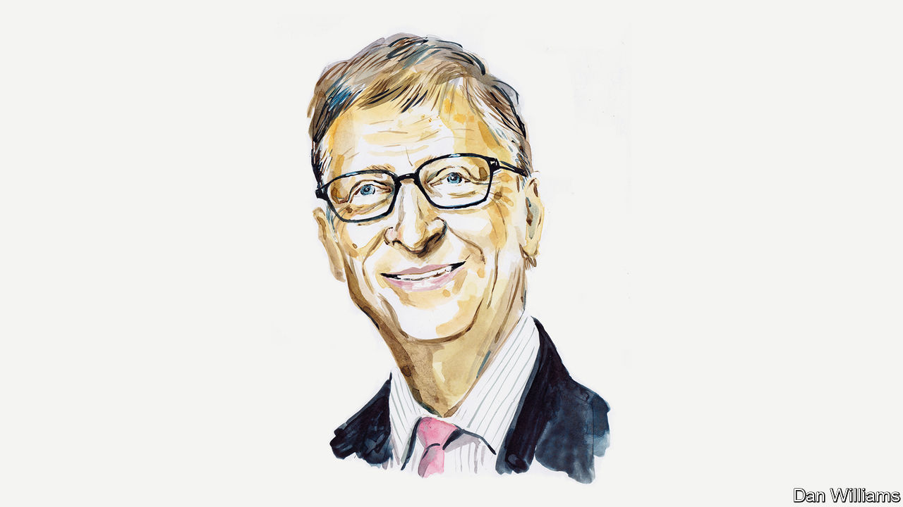

## The world after covid-19

# Bill Gates on how to fight future pandemics

> The coronavirus will hasten three big medical breakthroughs. That is just a start

> Apr 23rd 2020by Bill Gates

Editor’s note: The Economist is making some of its most important coverage of the covid-19 pandemic freely available to readers of The Economist Today, our daily newsletter. To receive it, register [here](https://www.economist.com//newslettersignup). For our coronavirus tracker and more coverage, see our [hub](https://www.economist.com//coronavirus)

WHEN HISTORIANS write the book on the covid-19 pandemic, what we’ve lived through so far will probably take up only the first third or so. The bulk of the story will be what happens next.

In most of Europe, East Asia and North America the peak of the pandemic will probably have passed by the end of this month. In a few weeks’ time, many hope, things will return to the way they were in December. Unfortunately, that won’t happen.

I believe that humanity will beat this pandemic, but only when most of the population is vaccinated. Until then, life will not return to normal. Even if governments lift shelter-in-place orders and businesses reopen their doors, humans have a natural aversion to exposing themselves to disease. Airports won’t have large crowds. Sports will be played in basically empty stadiums. And the world economy will be depressed because demand will stay low and people will spend more conservatively.

As the pandemic slows in developed nations, it will accelerate in developing ones. Their experience, however, will be worse. In poorer countries, where fewer jobs can be done remotely, distancing measures won’t work as well. The virus will spread quickly, and health systems won’t be able to care for the infected. Covid-19 overwhelmed cities like New York, but the data suggest that even a single Manhattan hospital has more intensive-care beds than most African countries. Millions could die.

Wealthy nations can help, for example, by making sure critical supplies don’t just go to the highest bidder. But people in rich and poor places alike will be safe only once we have an effective medical solution for this virus, which means a vaccine.

Over the next year, medical researchers will be among the most important people in the world. Fortunately, even before this pandemic, they were making giant leaps in vaccinology. Conventional vaccines teach your body to recognise the shape of a pathogen, usually by introducing a dead or weakened form of the virus. But there’s also a new kind of immunisation that doesn’t require researchers to spend time growing large volumes of pathogens. These mRNA vaccines use genetic code to give your cells instructions for how to mount an immune response. They can probably be produced faster than traditional vaccines.

My hope is that, by the second half of 2021, facilities around the world will be manufacturing a vaccine. If that’s the case, it will be a history-making achievement: the fastest humankind has ever gone from recognising a new disease to immunising against it.

Apart from this progress in vaccines, two other big medical breakthroughs will emerge from the pandemic. One will be in the field of diagnostics. The next time a novel virus crops up, people will probably be able to test for it at home in the same way they test for pregnancy. Instead of peeing on a stick, though, they’ll swab their nostrils. Researchers could have such a test ready within a few months of identifying a new disease.

The third breakthrough will be in antiviral drugs. These have been an underinvested branch of science. We haven’t been as effective at developing drugs to fight viruses as we have those to fight bacteria. But that will change. Researchers will develop large, diverse libraries of antivirals, which they’ll be able to scan through and quickly find effective treatments for novel viruses.

All three technologies will prepare us for the next pandemic by allowing us to intervene early, when the number of cases is still very low. But the underlying research will also assist us in fighting existing infectious diseases—and even help advance cures for cancer. (Scientists have long thought mRNA vaccines could lead to an eventual cancer vaccine. Until covid-19, though, there wasn’t much research into how they could be produced en masse at even somewhat affordable prices.)

Our progress won’t be in science alone. It will also be in our ability to make sure everyone benefits from that science. In the years after 2021, I think we’ll learn from the years after 1945. With the end of the second world war, leaders built international institutions like the UN to prevent more conflicts. After covid-19, leaders will prepare institutions to prevent the next pandemic.

These will be a mix of national, regional and global organisations. I expect they will participate in regular “germ games” in the same way as armed forces take part in war games. These will keep us ready for the next time a novel virus jumps from bats or birds to humans. They will also prepare us should a bad actor create an infectious disease in a home-made lab and try to weaponise it. By practising for a pandemic, the world will also be defending itself against an act of bioterrorism.

I hope wealthy nations include poorer ones in these preparations, especially by devoting more foreign aid to building up their primary health-care systems. Even the most self-interested person—or isolationist government—should agree with this by now. This pandemic has shown us that viruses don’t obey border laws and that we are all connected biologically by a network of microscopic germs, whether we like it or not. If a novel virus appears in a poor country, we want its doctors to have the ability to spot it and contain it as soon as possible.

None of this is inevitable. History doesn’t follow a set course. People choose which direction to take, and may make the wrong turn. The years after 2021 may resemble the years after 1945. But the best analogy for today might be November 10th 1942. Britain had just won its first land victory of the war, and Winston Churchill declared in a speech: “This is not the end. It is not even the beginning of the end. But it is, perhaps, the end of the beginning.” ■

Bill Gates is the co-founder of Microsoft and co-chair of the Bill & Melinda Gates Foundation. This is part of a series on the world after covid-19 which can be found at [Economist.com/coronavirus](https://www.economist.com/http://Economist.com/coronavirus)

Dig deeper:For our latest coverage of the covid-19 pandemic, register for The Economist Today, our daily [newsletter](https://www.economist.com//newslettersignup), or visit our [coronavirus tracker and story hub](https://www.economist.com//coronavirus)