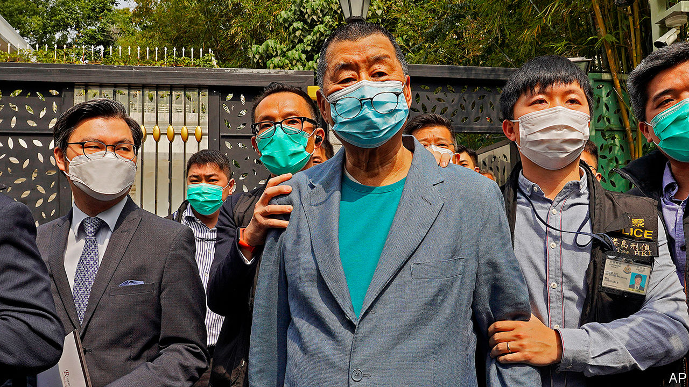

## The long arm of Beijing

# China moves to squeeze Hong Kong’s freedoms

> Democrats are detained; the Basic Law is punctured

> Apr 23rd 2020HONG KONG

ANNOUNCING THE biggest shake-up of her cabinet since an explosion of unrest last year, Hong Kong’s leader, Carrie Lam, tried to sound confident. A major goal of the reshuffle on April 22nd, she said, was to “help Hong Kong get out of this difficult situation as soon as possible”.

She was referring to the economic crisis caused by covid-19. But Hong Kongers have political worries, too. In recent days several prominent democrats have been arrested, and the central government has rejected what had been widely regarded as a constitutional restraint on its behaviour in Hong Kong. Political turmoil—which had appeared to ebb in recent weeks—looks set to flare anew. The changes to Ms Lam’s team will not reduce tensions.

Since June 2019, when protests erupted over a since-abandoned extradition law, more than 7,000 people have been arrested for taking part in the riots and unauthorised demonstrations that roiled the territory for the rest of the year. But no round-up by the police has caused as much shock as the one on April 18th, during which 15 of Hong Kong’s best-known campaigners for democracy were charged with promoting, organising and joining illegal demonstrations. Among them were Martin Lee, a barrister and former legislator who is often called the “father” of Hong Kong’s pro-democracy movement, and Jimmy Lai (pictured), the publisher of Apple Daily, a popular pro-democracy tabloid.

Last year’s protests mainly involved young people acting without any formal leadership. Some of them turned to violence, throwing petrol bombs and vandalising property. Mr Lee, however, is 81 and a moderate who, like many veteran democrats, largely remained aloof from the unrest—sympathising with the protesters’ motives but not encouraging their confrontations with the police. If peaceful old men like him are being arrested, many Hong Kongers worry, the Communist Party must be pressing the territory’s government to cast the net wider. Mr Lee has been an outspoken critic of the party since long before the British withdrawal in 1997.

After being freed on bail, Mr Lee said he was proud. “Over the months and years, I’ve felt bad to see so many outstanding youngsters being arrested and prosecuted, but I was not charged,” he told reporters. Mr Lee and Margaret Ng, another elderly barrister and former legislator, were among nine who have been accused of “organising” and “knowingly participating in” a huge illegal march on August 18th. Police had given approval, but only for a small rally in a park. All 15 are out on bail. They are due to appear in court on May 18th.

In response to suggestions that those arrested had been singled out unfairly, Hong Kong’s security bureau insisted that everyone was “equal before the law”. But the simultaneous targeting of so many well-known figures, including several other former legislators, showed that this was an unusual operation. Some, like Mr Lee and Ms Ng, had never been charged before.

The protests have died down since January, not least as a result of covid-19. But, with the number of new infections down to a handful of imported cases each day, the authorities worry about the possibility of renewed unrest as normal life resumes. The arrests will not help them maintain calm. Neither will the controversy of the past few days related to the central government’s latest assault—as many Hong Kongers see it—on the “high degree of autonomy” that the territory is supposed to enjoy.

It began on April 14th when the central government’s Liaison Office in Hong Kong, along with the Hong Kong and Macau Affairs Office, which is based in Beijing, accused opposition legislators of abusing their oaths of office by using “malicious filibustering” to “paralyse” the Legislative Council. Their complaints relate to the work of a committee that decides on the timing of debates about bills. It is presided over by Dennis Kwok, a democratic legislator who is accused of wanting to block laws that the Communist Party may use to tighten its control in Hong Kong. One would allow the jailing of people for insulting the national anthem. Another, not yet drafted, would outlaw “secession” and “subversion”—new concepts in local law. On April 15th Luo Huining, the head of the Liaison Office, urged Hong Kong to get on with passing such a law. Indeed, Article 23 of the Basic Law, Hong Kong’s mini-constitution, requires it to do so.

But Article 22 of the Basic Law says that no central-government department may “interfere” in matters that Hong Kong has a right to administer on its own (the central government is supposed to run only the territory’s foreign affairs and defence). When democrats accused the Liaison Office of meddling, it retorted that Article 22 did not apply to it. This contradicted what Hong Kong’s government had been saying for years. But the local authorities, after appearing at first to stick to their guns, quickly fell in line with the new interpretation.

The central government may be mindful of Legislative Council elections that are due to be held in September. With the pro-establishment camp holding just under two-thirds of seats, now may be an opportune moment to get the anthem and security bills passed. If the democrats can repeat the success they achieved last November in district-level elections, the government may find its control in the Legislative Council considerably undermined.

It will be risky either way. In 2003, when the government last tried to pass the security legislation mandated by Article 23, objectors staged a huge protest. This led to the bill’s withdrawal and eventually the stepping down of Hong Kong’s then leader, Tung Chee-hwa. But the government may decide to ignore public opinion this time. Democrats fear that the central government may lean on Hong Kong to bar some of them even from running in September. The Liaison Office’s accusation that filibustering legislators are violating their oaths (a sackable offence) already suggests that the pressure is growing. ■