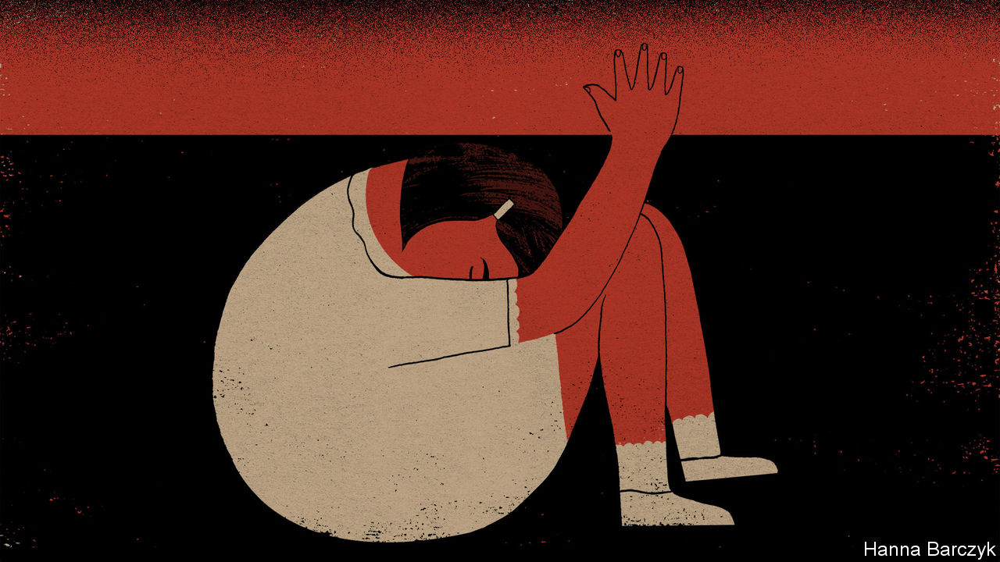

## Chaguan

# The push to raise China’s age of consent from 14

> A case of alleged child-abuse spurs debate

> Apr 23rd 2020

CHINESE SOCIETY is locked in a dispiriting argument, worthy of a more callous age. The public is debating whether a 14-year-old girl was a victim of rape by her wealthy guardian—three decades her senior—or a willing partner, trading sex for gifts and attention. Bored and fractious after weeks of quarantine, many have followed the case eagerly. With each twist in the tale, the public mood has swung. In their hundreds of millions, social-media users have condemned the accused man, a successful lawyer, and expressed disgust at police in the coastal city of Yantai, who declined to pursue rape charges despite several complaints by the girl, who also brought them semen- and blood-stained sanitary pads. On April 13th the central government responded, dispatching prosecutors and detectives to probe Yantai’s handling of the case. Three employers—an oil company, a large technology firm and a university—severed ties with the lawyer, who is on bail pending a fresh investigation. More recently the public has tut-tutted over seemingly affectionate telephone calls between the teenager and her guardian that caused some to doubt her story. Others have scorned the girl’s birth mother for handing her child to a middle-aged bachelor offering to be an unofficial foster father.

China’s news industry has not covered itself in glory. Spotting a story that stokes readers’ indignation, while skirting overtly political themes sure to draw the censors’ wrath, outlets have carried prurient interviews with the alleged rapist. He calls himself a man wronged by an ungrateful lover, and shares recorded phone calls from his accuser to back his claims. Quote-seeking reporters have hounded the teenager, now 18, though she has tried to take her own life more than once. They have visited the anonymous girl’s hometown, revealing her identity to relatives and neighbours.

Still, reformist lawyers and advocates for children’s rights wonder whether some good might emerge from this horrible tale. Notably, they hope that fresh light is being cast on the contradictory tangle of Chinese laws that regulate sexual activity and the young.

At least superficially, China is a conservative country, where rural and small-town elders still chide girls to save themselves for an eligible man. The legal age of marriage in China is high: 20 for women and 22 for men. Before 1980 it was even higher. Towards the end of the Maoist era, when the state sought total control over citizens’ bodies and minds, late marriage was used as a tool of population control. Urban couples needed permission from work units to wed. In the 1970s if a couple’s combined ages did not add up to 50 they were told to wait, or be denied housing and ration coupons needed to furnish a home. Yet since 1949, when the Communist Party took power, the effective age of sexual consent—as fixed by judicial rulings and then by the law—has been 14. The alleged assaults in Yantai began weeks after the girl reached that age.

Chinese laws do not define a stand-alone age of consent. Instead, the age is derived from rape-related laws. The tradition dates back at least 800 years, when the Southern Song dynasty deemed intercourse with a child under 10 to be statutory rape. Put another way, China’s age of consent does not reflect debate about when the young can be trusted to control their own bodies. Instead, it is based on judgments, amended many times over the centuries, about whether men who seek sex with children are always culpable or may have arguments to offer in their defence.

There is nothing new about girls facing harsh and unfair questions about why they let men, including foster fathers, assault them. China’s final imperial dynasty, the Qing, required raped women to prove that they had struggled violently throughout their assault, even at the risk of death. If they had ceased resisting at any point, women faced 80 strokes with a heavy cane for consenting to “illicit intercourse”. The Qing tolerated the use of adoption as a cover for buying young girls as brides, or for forcing them into prostitution. Even Qing laws on child rape rested on judgments about female lust. A textbook from 1878 cites a commentator opining in tones of prim approval that girls of 12 and under “have no capacity for licentiousness”. Not until 2015, after scandals involving officials assaulting under-age girls, did China’s legislature revoke a statute from 1979 that defined sex with child prostitutes as a lesser crime than child rape. The law had offered a loophole by allowing men to claim to have paid to assault children.

Guo Jianmei founded Qianqian, a law firm which is representing the victim in the Yantai case. Together with fellow lawyers she has drafted amendments to raise the age of consent, and is seeking legislators willing to help. In a country like China, where feudal morality retains some sway, she asks: “What does a girl at 14 know about sex?” China also needs a debate about coercion and abuses of power, adds Ms Guo. Chinese judges find it easy to decide rape cases involving violent attacks by strangers. But her firm sees too many cases of children sexually abused by authority figures they know well, from schoolteachers to fathers, elder brothers and uncles. The victims struggle to obtain justice.

Another public-interest lawyer, Wang Yongmei, argues for still larger reforms. She would like to see adults barred from sex with anyone under 18. Ms Wang would allow some provision for consenting sex between teenagers, for she has seen cases where angry mothers have unjustly accused their daughter’s boyfriend of rape. China needs a child-protection agency and female police trained to support rape victims, she adds.

It takes courage to accuse people in authority of sexual assault. A fledgling #MeToo movement has faced official pressure after young women challenged university professors, television presenters and other powerful men. Ms Wang sees such courage in a new generation of women who refuse to blame themselves for being assaulted. Their bravery is grounds for hope, if the law ever changes to keep up with them. ■