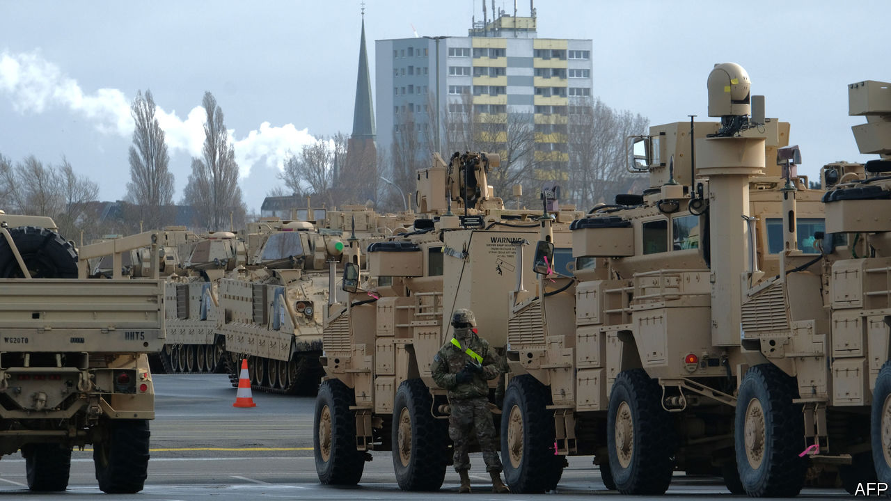

## Yankees go home

# America’s dry run to defend Europe is derailed by covid-19

> But NATO generals are figuring out how to work with the European Union

> Apr 23rd 2020

Editor’s note: The Economist is making some of its most important coverage of the covid-19 pandemic freely available to readers of The Economist Today, our daily newsletter. To receive it, register [here](https://www.economist.com//newslettersignup). For our coronavirus tracker and more coverage, see our [hub](https://www.economist.com//coronavirus)

IT WAS TO be America’s largest deployment of troops across the Atlantic since the cold war. Instead, “Defender 20”, an exercise designed to test America’s ability to move a division (20,000 or so soldiers) into and across Europe, was stricken by covid-19 and cancelled in March. But the lessons of the truncated drill are vital for Western war plans, which depend on armies being able to dash east over Europe’s disjointed road and rail system in a crisis.

After Russia’s invasion of Ukraine in 2014, a revived NATO strung 5,000 or so troops in four modest battlegroups through the Baltic states and Poland to deter more adventurism. These would slow rather than halt a Russian advance. If attacked, they would need massive reinforcement, and fast. So the allies agreed that by this year they would have 30 battalions, 30 warships and 30 air squadrons—all available to NATO within 30 days.

But shoring up the frontline depends not only on having units ready but also on whether they can get to where they are needed, something planners call military mobility. Ben Hodges, a retired general who commanded American army forces in Europe in 2014-17, says shifting troops and equipment across borders was a bureaucratic and logistical headache. It still is, according to a recent report he co-wrote, published by the International Centre for Defence and Security and the Centre for European Policy Analysis, think-tanks in Estonia and Washington respectively.

Some obstacles are procedural, like border checks on military goods. Others are to do with infrastructure. The difference in European and Baltic rail gauges requires switching trains at the Polish-Lithuanian border, for instance, while the key Poznan-Warsaw highway, like many roads in eastern Europe built to handle lighter Warsaw Pact armour, cannot take America’s M1 Abrams tanks. All told, it would take 60 days to get a heavy division from America to the Baltic region and five to six months for a corps (up to 45,000 troops), says the report. By that time, Russian invaders could be well ensconced.

General Hodges says he eventually realised that European interior ministries and border agencies were better interlocutors than his fellow generals. “I also discovered that the European Union was actually the better institution for addressing most of the challenges,” he says. While NATO had the plans, “they had the authorities and processes and money.” In recent years the EU has been working more closely with NATO. In 2018 it put the Dutch in charge of a project to improve military mobility.

Even so, under current EU rules it could still take a leisurely five days to issue “movement permissions” for most units. “Europe is in a bad place,” concludes Bruno Lété of the German Marshall Fund, another think-tank. He points out that the European Commission’s latest budget proposal suggests that funds for military mobility could shrink from €6.5bn ($7.1bn) to zero.

“Scaling back Defender 20 is really a lost opportunity to effectively test that logistical knowledge of Europe’s infrastructure,” says Mr Lété. The planning efforts “were a huge success”, insists Rear-Admiral Pete Stamatopoulos, the director of logistics for US European Command. But only 6,000 or so American troops had arrived in Europe when the plug was pulled. The fact that America was prepared to spend hundreds of millions of dollars in an election year on an exercise is a sign of commitment and a signal to the Kremlin, says General Hodges. But whether American troops could get east in a hurry remains unproven. ■

Dig deeper:For our latest coverage of the covid-19 pandemic, register for The Economist Today, our daily [newsletter](https://www.economist.com//newslettersignup), or visit our [coronavirus tracker and story hub](https://www.economist.com//coronavirus)