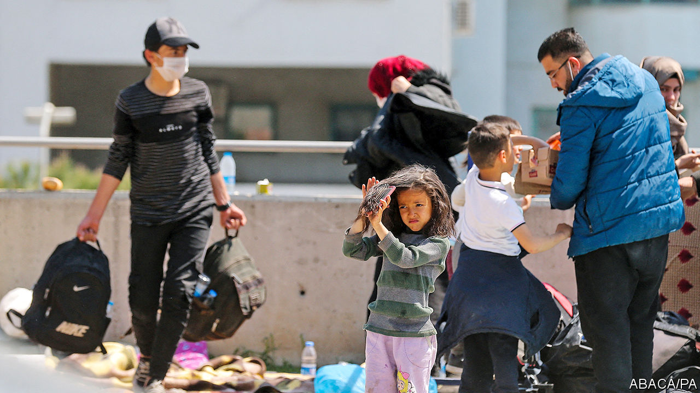

## From persecution to pandemic

# As Turkey locks down, refugees are the first to suffer

> Laid off fast and excluded from relief, many are now desperate

> Apr 23rd 2020ISTANBUL

Editor’s note: The Economist is making some of its most important coverage of the covid-19 pandemic freely available to readers of The Economist Today, our daily newsletter. To receive it, register [here](https://www.economist.com//newslettersignup). For our coronavirus tracker and more coverage, see our [hub](https://www.economist.com//coronavirus)

AT THE END of February, when Turkey’s President Recep Tayyip Erdogan announced he would open his country’s borders with Greece to migrants and refugees, Salih, an Afghan living in Istanbul, heeded the call, as did thousands of others. But the Greek side of the border was closed. For ten days, Salih waited and slept rough near the main crossing. Eventually, Turkish police drove him and a few others to a river separating the two countries and ordered the group to cross by boat, threatening them with batons. Greek guards then captured him, took his cash and phone, and sent him back. By the time he returned to Istanbul, where he had earned a living fixing windows since escaping the Taliban, the covid-19 pandemic was in full swing. His job was gone. The company he worked for had closed. Salih, who lives with his wife and two children, can no longer pay rent and faces eviction. “We ran out of money,” he says. “We have nothing left.”

Across Turkey, the pandemic is taking an increasingly heavy toll in lives and in jobs. For the second time in as many years, a recession beckons, this one more severe than the last. The IMF expects the economy to contract by 5% this year. An avalanche of lay-offs has already started to swell. It will hit the millions of migrants and refugees living in Turkey hardest, and it will hit them first.

Mr Erdogan would like to prevent mass loss of life without risking economic collapse. But he may end up with both. His government has suspended all international flights, closed schools, cancelled communal prayers at mosques, and ordered people above 65 and below 20 to remain at home. But it has also kept the economy running, albeit in low gear.

This piecemeal approach is starting to backfire. On April 10th the government imposed a weekend curfew in the country’s biggest cities with only two hours’ notice. Within minutes, hundreds of thousands of people stormed supermarkets and bakeries to stock up on food. Turkey’s infection rate was already rising rapidly. In the first three weeks of April, confirmed cases spiked from under 16,000 to over 90,000. The botched curfew will have made things even worse.

The economy, which rebounded late last year, is reeling again. Exports in March were down by 18% compared with the same period in 2019. Tourism, which generated $35bn last year, is bracing for a lost summer. The central bank, having burned through billions of dollars to prop up the Turkish lira, has nearly run out of foreign reserves. The currency is sliding, placing yet more pressure on companies with foreign-currency debt.

No one is more vulnerable than the migrants and refugees who have made Turkey their home over the past decade. Some 70% of the 3.7m Syrians in Turkey are poor or nearly poor. The vast majority work informally, which makes them ineligible for compensation or unemployment benefits. A recent survey revealed that only 3% of employed Syrians had official work permits. “They were hired for being the cheapest labour and they will be the most disposable ones,” says Omar Kadkoy, a researcher at TEPAV, a think-tank in Ankara.

Scores have already been sacked. Maysarah, an Egyptian who worked at a stall selling dried fruit in Istanbul’s once bustling Grand Bazaar, says his bosses fired him and dozens of other migrants when the bazaar closed in March. Waseem, a Syrian who drives a food-delivery truck, says he managed to hold on to his job. Four of his five Syrian flatmates have lost theirs. Because refugees generally work off the books, there is no telling how many have been laid off since the start of the crisis. The jobless rate is 14%, but that figure dates back to January. Economists fear it will easily pass 20% by the summer.

The government has tried to help the economy weather the storm with a 100bn- lira ($15bn) stimulus package, which allows affected businesses to defer loan and tax payments and offers support to households in need. Parliament has also passed a law banning companies from sacking workers over the coming three months and offering those forced to take unpaid leave roughly $6 a day. None of this applies to migrants or refugees.

Turkey may soon turn to a familiar source for additional funding. In 2015 the EU offered Turkey $6bn if it agreed to look after the refugees and prevent them from crossing to Greece. Mr Erdogan deserves no reward for playing with their hopes to put pressure on European governments. But the migrants and refugees knocking on Europe’s doors do deserve better. Against the approaching storm, many of them are defenceless. Once again, the EU will probably be obliged to clench its teeth, loosen its purse-strings and entrust Turkey’s leader with lots more money. ■

Dig deeper:For our latest coverage of the covid-19 pandemic, register for The Economist Today, our daily [newsletter](https://www.economist.com//newslettersignup), or visit our [coronavirus tracker and story hub](https://www.economist.com//coronavirus)