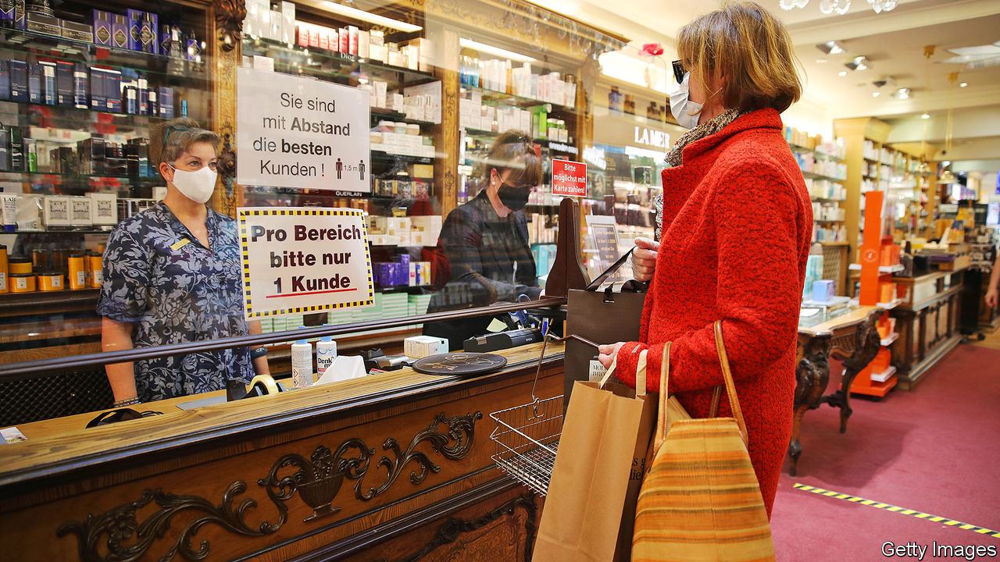
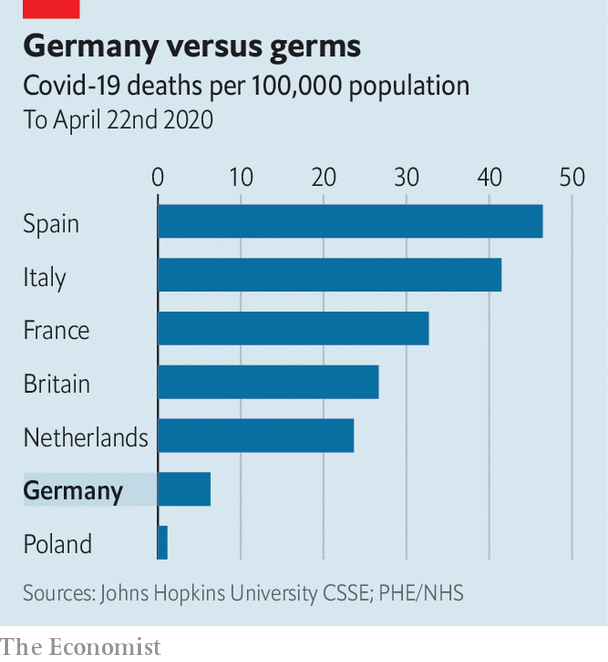

## Top of the covid class?

# Germany excels among its European peers

> But the chancellor, Angela Merkel, still faces some tricky obstacles

> Apr 25th 2020BERLIN

Editor’s note: The Economist is making some of its most important coverage of the covid-19 pandemic freely available to readers of The Economist Today, our daily newsletter. To receive it, register [here](https://www.economist.com//newslettersignup). For our coronavirus tracker and more coverage, see our [hub](https://www.economist.com//coronavirus)

IF ANY BIG European country can be said to have so far had a good corona crisis, it is Germany. Deaths are fewer than in other countries, the state helps ailing firms and workers and the politicians seem level-headed and competent. Places with more erratic leadership have noted the contrast. British journalists ask their politicians why they can’t emulate Germany’s testing rates. American television networks urge Jens Spahn, the health minister, to reveal Germany’s secrets. One columnist even mused that Angela Merkel, the chancellor, might serve as Joe Biden’s running-mate.

The true picture is more complicated. “We can’t say we’re perfect and everything was planned,” says Jonas Schmidt-Chanasit, a virologist at the University of Hamburg. Testing was crucial, but relied on an existing network of nearly 200 private and public laboratories that ramped up capacity after a Berlin hospital developed a test in January, before politicians knew a crisis was coming. “Other countries had to build labs, we already have them,” says Evangelos Kotsopoulos, the boss of the German arm of Sonic Healthcare, a private lab network. Germany now conducts 350,000 tests a week, and could do many more.

Second, while national politicians and health officials dithered, local authorities acted quickly to close public places and track contacts of the infected when early outbreaks were detected in parts of Bavaria and the Rhineland. Germany was also lucky, says Karl Lauterbach, an MP and epidemiologist. It received an “early warning” from Italy, and many of the first to be infected were young, which kept hospitalisations and deaths down (though they are now climbing). Germany used the time this bought to flatten the curve of infections.

Building on its early success in isolating cases will be crucial as Germany moves to the next stage of the crisis. Mrs Merkel wants to track every chain of infection. That means yet more tests—reportedly up to 4.5m a week if supply constraints can be overcome—and rigorously chasing contacts of the newly infected. Apps may help, notwithstanding privacy worries (see [article](https://www.economist.com//europe/2020/04/23/privacy-in-a-pandemic)), but most work will be done by thousands of “containment scouts” in Germany’s 400-odd overworked and underfunded public-health offices.

The fiscal response also builds on old foundations. To protect workers’ income, Germany has ramped up Kurzarbeitergeld (money for short-time work), an established system under which the state covers 60-87% of the forgone wages of workers whose hours are cut. It has pledged hundreds of billions in guarantees for bridging loans, and set up a €50bn ($54bn) fund for freelancers and small companies. After a few hiccups, implementation has been largely smooth. Yet as recession bites, more is needed. On April 22nd the cabinet agreed a further €10bn stimulus package.

The measures smash Germany’s hallowed no-deficit rule. But for Olaf Scholz, the finance minister, this is a feature, not a bug: Germany can spend in bad times because it saved in good. The size of its response, says Oliver Rakau at the Oxford Economics consultancy, means Germany may muddle through better than other EU countries. And though its car industry ceased production for a while (see [article](https://www.economist.com//briefing/2020/04/25/the-worlds-car-giants-need-to-move-fast-and-break-things)), sectors like chemicals and steel kept working. Electricity usage and mobility data suggest the slowdown has been less acute than in France, Spain or Italy. Still, the Bundesbank expects a “severe” recession and the IMF forecasts a 7% contraction this year, deeper than in 2009. The openness of its economy leaves Germany especially vulnerable to severed supply chains and slumping foreign demand, even once domestic consumption resumes.

The pace of recovery will also depend on how quickly restrictions are eased. With the number of recorded infections now rising by only 1-2% each day Germany is tentatively opening up, starting with smaller shops, and classes for children facing exams. By European standards the lockdown was late and lenient. But perhaps because Germany was less affected than its neighbours, the consensus behind it is crumbling. Larger retailers are chafing. So are working parents facing kindergarten closures that may last for months. Such rows play out in the fractious negotiations Mrs Merkel must conduct with the leaders of Germany’s 16 states. This week she was reported to have lamented the “orgies” of debate over who may open when, fearing they cloud the risks of fresh waves of infection.

The chancellor, a scientist fluent in the argot of reproduction rates and risk management, is “perfect” for this situation, says Karin Prien, a minister in the state of Schleswig-Holstein and a party colleague. Mrs Merkel’s approval ratings are nudging 80% and her Christian Democratic Union is soaring in the polls; some quietly hope she may break her pledge to stand down at next year’s election. Yet, notes Thorsten Benner of the Global Public Policy Institute, a think-tank, her talents may have been better suited to the first stage of the crisis, which demanded calm competence, rather than the awkward trade-offs of the next. Unlike Sebastian Kurz, chancellor of Austria, which locked down early and hard and is now easing more quickly, she has not found a vision of recovery to leaven her message of caution.

There have been wobbles as well as wins. The government has struggled to step up production of face-masks, for example, although all 16 states now mandate their use. And the cross-party consensus forged in adversity is now starting to crack. Yet Germany’s successes in managing the outbreak are undeniable. The fact that it is now arguing vigorously about what comes next is not the least among them. ■

Dig deeper:For our latest coverage of the covid-19 pandemic, register for The Economist Today, our daily [newsletter](https://www.economist.com//newslettersignup), or visit our [coronavirus tracker and story hub](https://www.economist.com//coronavirus)

## URL

https://www.economist.com/europe/2020/04/25/germany-excels-among-its-european-peers
