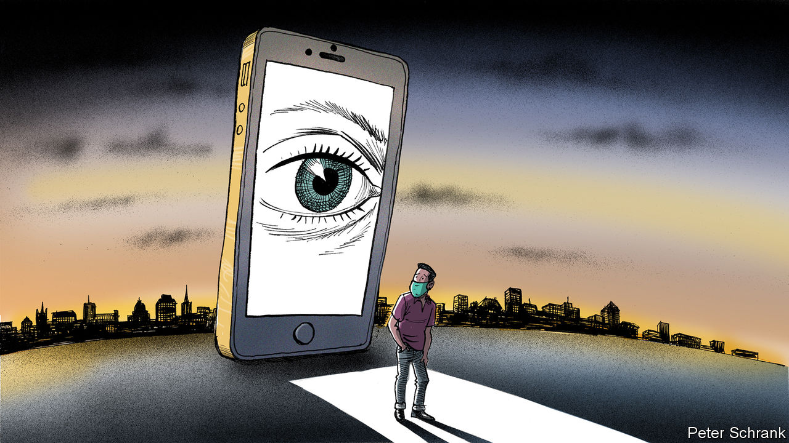

## Charlemagne

# Privacy in a pandemic

> Coronavirus is the first trial of the EU’s unofficial religion

> Apr 23rd 2020

Editor’s note: The Economist is making some of its most important coverage of the covid-19 pandemic freely available to readers of The Economist Today, our daily newsletter. To receive it, register [here](https://www.economist.com//newslettersignup). For our coronavirus tracker and more coverage, see our [hub](https://www.economist.com//coronavirus)

IF THE EU had an official religion, it would be privacy. A devout priesthood of EU officials and politicians preach that only their privacy laws can lead to salvation. Holy texts, such as the General Data Protection Regulation or the ePrivacy Directive, are held up as wisdom the whole world would be better off following. Such is the regulatory clout of Brussels that much of it often does. Those who break such strictures are smitten (or whacked with fines of up to 4% of global turnover). In an age of coronavirus, as policymakers ponder ways of ending the lockdown, this belief is being tested.

A crisis of faith has taken root among once-true believers. “It is a trade-off,” warned Austria’s right-wing chancellor, Sebastian Kurz. “What is more important to us? Data protection or that people can return to normal? Data protection or saving lives?” Even German politicians, hitherto the high priests of the faithful, have joined in. Jens Spahn, the German health minister, suggested tracking people’s phones in order to contain the virus, before backing down after an outcry. It is as if the pope began a sermon by admitting that perhaps Martin Luther had a point.

Countries full of privacy heathens have enthusiastically put the state’s surveillance capacity to use. In Hong Kong, new arrivals can be required to wear a tracking bracelet. Israel has enlisted its intelligence agencies to track people who may have the virus. In South Korea officials root through everything from taxi receipts to credit-card records to hunt for those infected. Now the EU is mulling where to draw the line between safety and surveillance.

Whether Europe veers from its righteous path is a political question, rather than a legal one. Though its laws are strict, exemptions for public-health crises are written into EU rules on, say, data protection. But these are far from a carte blanche. Any use of data must be proportionate and fall away once the crisis has passed. When it comes to pandemics, Europe’s privacy laws are a seatbelt rather than a handbrake, says Eduardo Ustaran, a lawyer at Hogan Lovells, a British-American law firm. Governments can still get where they need to go, but they experience less chance of a catastrophic accident—such as an entire country’s medical data being sprayed onto the internet—on the way.

It is Europe’s citizens, not its lawyers, who will decide how much intrusion they are willing to bear. Most European governments are toying with tracing apps, where smartphones would tell users whether they interacted with someone who had covid-19. But such apps work well only when large proportions of the population download them. No matter how technically ingenious a solution may appear, it is little use without mass consent. Other governments have gone further. Poland, for instance, enforces a quarantine of those suffering from covid-19 with the aid of an app. (Those under quarantine must submit regular selfies to prove they are staying at home.) For the bulk of EU citizens, covid-19 is the first time that the EU’s piety on privacy could come with a cost borne by themselves rather than by business. During the pandemic, people have willingly—and occasionally grudgingly—sat at home for weeks on end, surrendering their freedom in the process. Sacrificing privacy for the sake of liberty may appeal after a long enough period of de facto house arrest.

Such choices have not been put to voters before. In the EU privacy has long been a top-down pursuit, waged against fierce opposition from gigantic corporations by politicians and bureaucrats who do not have to worry about security, but tend to believe that citizens will love them for protecting their privacy. Enthusiasm for the topic in Brussels is also boosted by two not entirely high-minded considerations. First, it helps the EU project power externally. Strict standards combined with the EU’s enormous market are enough to bully even the largest global business into following Brussels’s rules, a phenomenon known as the “Brussels effect”. Rather than operating to different standards globally, big companies save themselves the bother and work to the EU’s usually higher standard. Second, it gives Brussels more power internally, too. When the EU limited itself to the nitty-gritty of business, the rulings of the EU’s Court of Justice in Luxembourg carried little interest for ordinary citizens. Regulations on, say, chemicals affected only the chemicals industry. But issues such as data protection cut across vast swathes of people’s lives, from browsing habits to freedom of expression, and judges tend to meddle.

For most European citizens, arguments about privacy have been about as intelligible as a mass in Latin. A consequence of the coronavirus could be a more comprehensible debate. Any trade-offs between health and privacy will be subject to public scrutiny, just like the ever-shifting balance between civil liberties and counter-terrorism, argues Bruno Maçães, an author and former Europe minister of Portugal. Norms are still being settled. Data protection, the jewel in the EU’s regulatory crown, dragged the once-arcane world of privacy into the sphere of high politics. The virus provides voters with the topic’s first real public reckoning.

A nervous discourse has already started among Europe’s decision-makers, who were in a funk about the EU’s place in the world even before covid-19 devastated the bloc’s economy and left nearly 100,000 of its citizens dead, with doubtless much more disaster still to come. If other systems of governance, whether outright autocracy or “managed” democracy, are seen to handle the virus better, it could push them into a crisis of confidence. Their lofty ambitions on privacy could well be jettisoned in such circumstances. Defending a political system by ditching one of its fundamental tenets may seem self-defeating. But politics is a results business. EU governments will be judged on how quickly life returns to normal, with states that used heavy-handed surveillance the obvious comparison. If a gap emerges, even the apostles of privacy may find it hard to keep the faith. ■

Dig deeper:For our latest coverage of the covid-19 pandemic, register for The Economist Today, our daily [newsletter](https://www.economist.com//newslettersignup), or visit our [coronavirus tracker and story hub](https://www.economist.com//coronavirus)